{width=100px height=100px}

# Sostenibility
Un WebBook dedicato alla sostenibilità ambientale

## Introduzione

Il progetto Sostenibility utilizza un WebBook online per avvicinare un pubblico giovane (18-25 anni) alla sostenibilità ambientale e allo sviluppo sostenibile. Il processo di produzione prevede di scaricare da una fonte libera (WikiBooks) dei contenuti scientifici precedentemente scelti in formato Markdown tramite Python, per poi modificarlo e gestire la grafica grazie a un file YAML. Il progetto finale è hostato online tramite GitHub pages ed è accessibile tramite Web o App e condivisibile sui social. Il progetto è interattivo e punta a coinvolgere attivamente gli utenti ad essare stimolati ad imparare e diventare più responsabile dal punto di vista ambientale

## Ideazione 

### Tema

L'azienda no-profit ha richiesto un prodotto editoriale che si concentri sui temi della sostenibilità ambientale. La sostenibilità ambientale è un tema molto ampio che include numerosi argomenti come il riciclaggio dei rifiuti o lo spreco dell'acqua, di conseguenza può esssere collegato a innumerevoli temi diversi. Quello della sostenibilità ambientale è un tema che specialmente negli anni recenti ha avuto un seguito significativo come si può vedere da questo trend di ricerca basato sulle ricerche google.com negli ultimi 20 anni:

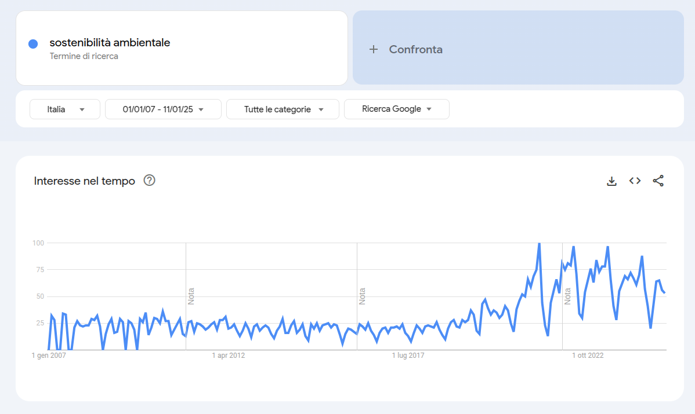{width=500px height=225px}

Questo potrebbe anche essere dovuto a numersi movimenti come quello di Greta Thunberg (persona dell'anno Times 2019) che hanno contribuito a formare nei giovani una sensibilità sul tema e a porsi domande: Come faccio ad essere responsabile dal punto di vista ambientale? Cosa posso fare? Cosa posso modificare nel mio stile di vita? La azienza ha infatti richiesto esplicitamente una sezione dedicata ad "Esempi pratici di comportamenti sostenibili" che verrà quindi aggiunta al nostro prodotto

{width=390px height=215px}

### Destinatari

L'azienda ha dato come target di riferimento l'età 18-25 anni. Ho quindi creato un set di personas di persone che potrebbero essere interessate al prodotto utilizzando Semrush:

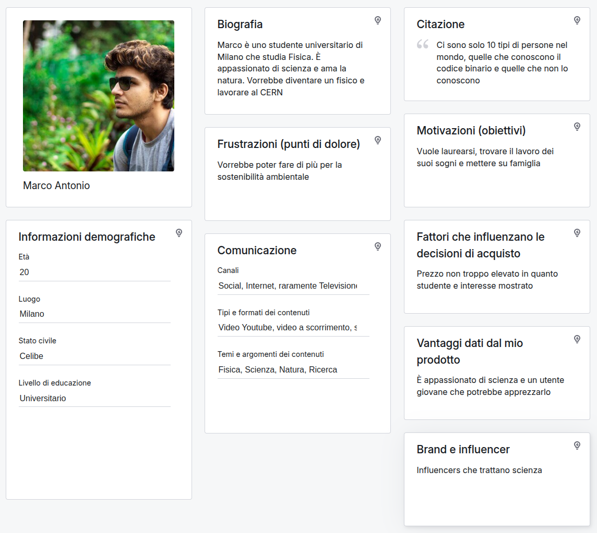{width=410px height=325px}
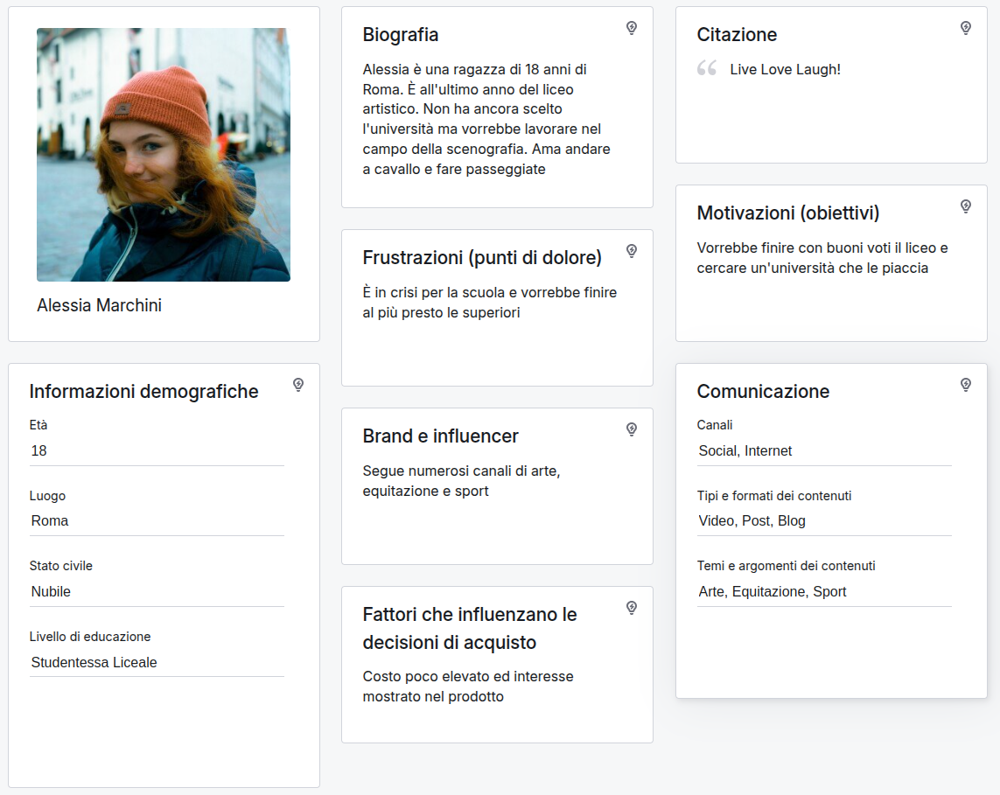{width=410px height=325px}
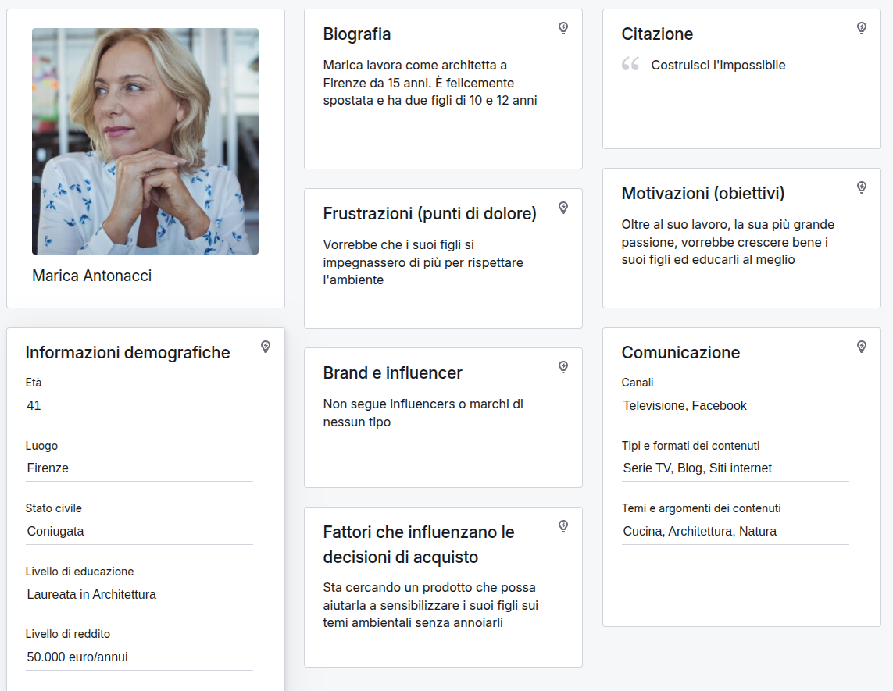
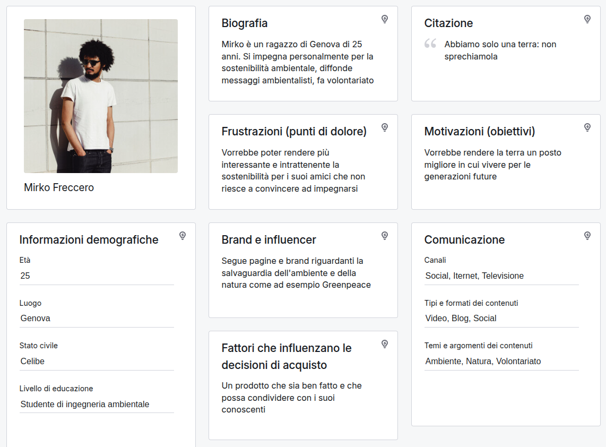

Come possiamo vedere dalle personas, sono diversi i tipi di persone o situazioni che potrebbero portare diverse persone ad utilizzare il prodotto:

* Marco ad esempio potrebbe imbattersi nel prodotto parlando con qualche suo amico in università oppure vendolo sui social, e potrebbe decidere di visualizzarlo per provare a impegnarsi di più a livello ambientale
* Alessia similmente a Marco potrebbe sentire parlare o vedere il prodotto in giro e potrebbe decidere di visualizzarlo visto il suo amore per la natura o per un consiglio di amici
* Marica invece nonostante non rientri nel target di riferimento del prodotto potrebbe comunque informarsi per la sensibilizzazione dei suoi figli e spingere loro a diventare utilizzatori del prodotto per impegnarsi maggiormente
* Mirko invece è l'utente perfetto per il prodotto: giovane, informato con social tramite internet, altamente interessato all'argomento e quindi non solo utilizzerebbe il prodotto ma lo consiglierebbe anche ad altri suoi amici

### Modello di fruizione

Il prodotto sviluppato utilizza diversi modelli di lettura. Si tratta di un prodotto anzitutto a lettura non lineare in quanto è possibile accedere ai contenuti in maniera non sequenziale ma in base alla scelta dell'utente utilizzando ad esempio l'indice

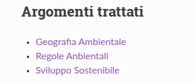{width=250px height=100px}

Per accedere alle varie sezioni del WebBook. Il prodotto utilizza anche lettura visuale in quanto una delle richieste dell'azienda era un prodotto con "Un design accattivante e possibilmente innovativo", infatti oltre allo stile grafico già presente nel WebBook è possibile facilmente anche inserire immagini, schemi o contenuti multimediali. Potrebbe essere interessante anche introdurre tecnologie quali strutture 3D o contenuti interattivi per aumentare ulteriormente l'aspetto innovativo e distanziarsi il più possibile da un libro statico classico, introducendo quindi la lettura interattiva

Vista la fascia d'età e il tipo di contenuto si presume che il WebBook sarà principalmente utilizzato sui dispositivi mobili, e il nostro prodotto si presta particolarmente a questo uso in quanto è facilmente sia accessibile che visualizzabile dallo schermo di un cellulare. Inoltre trattandosi il WebBook di un contenuto web si adatta facilmente allo schermo di tutti i dispositivi utilizzati

Si tratta inoltre di un contenuto che oltre ad essere portabile e adattabile è anche facilmente aggiornabile, lavorando con il sistema di versioning Git e con Gituhub, rendendolo un prodotto facilmente e spesso aggiornabile sempre come richiesto dalle specifiche fornite all'azienda

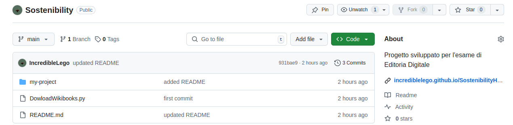

Il WebBook dunque oltre ad essere un contenuto dinamico e che attrae l'attenzione è anche facilmente fruibile e visualizzabile su ogni dispositivo utilizzato

|                |WebBook                          |
|----------------|-------------------------------|
|Formato | Testo + media ipertestuali|
|Accessibilità       |Alta|
|Leggibilità         |Alta (adatta a dispositivi mobili)|
|Interattività       |Alta (ipertesto)|
|Adattabilità       |Molto alta (web-based)|
|Aggiornabilità       |Continua utilizzando ad esempio git|

### Canali di distribuzione

Il prodotto sarà distribuito sotto forma di WebBook realizzato mediante MkDocs. Questo apre le porte a numerose modalità di fruizione: il WebBook sarà ovviamente accessibile via web ma può anche essere condiviso via social come richiesto dall'azienda. Non esistendo un vero e proprio standard per i WebBook non bisogna omologarsi a nessuno standard anzi questo premia l'innovazione del prodotto

Il fatto che il WebBook sia distribuito tramite internet permette infine anche la realizzazione di un'applicazione per mostrarlo direttamente dalla app, che può essere distribuita e anche sponsorizzata tramite i vari Marketplace come Google Play o App Store. Inoltre potrebbe essere inclusa la possibilità di salvare offline i dati del libro ad esempio scaricandolo all'interno dell'applicazione per averlo sempre a portata di mano

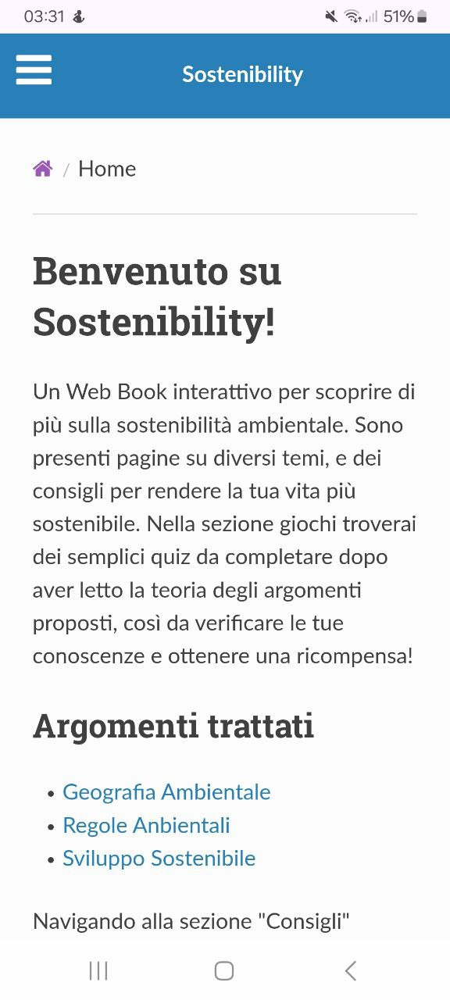{width=175px height=350px}
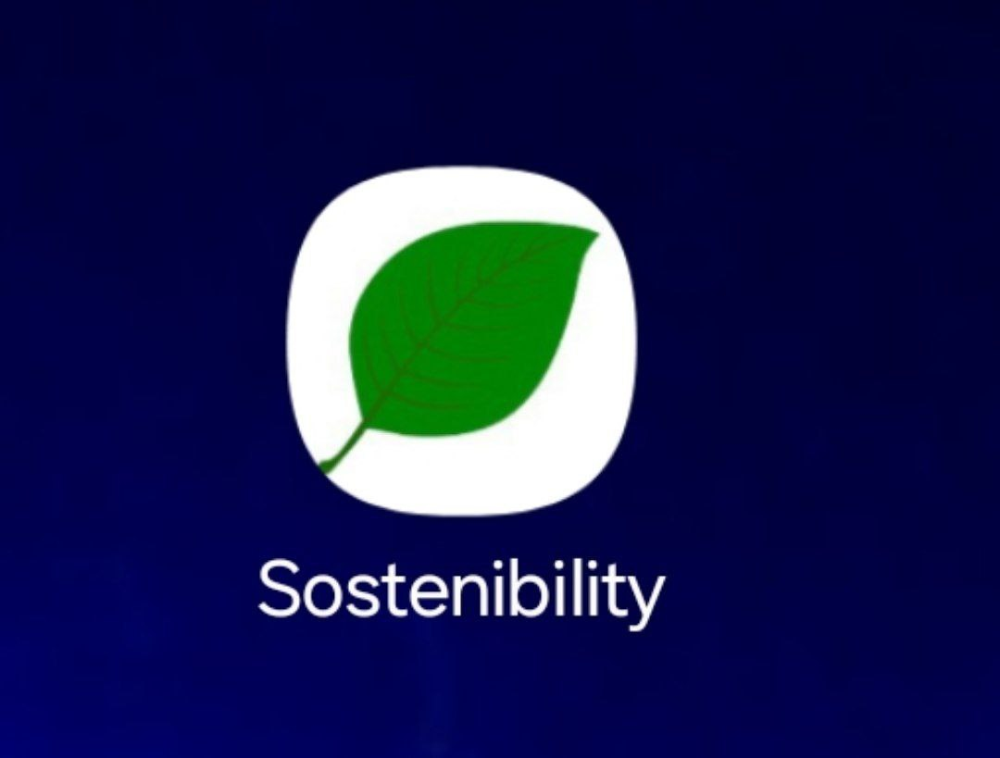{width=200px height=145px}

Trattandosi di un prodotto informativo ma destinato ad un pubblico giovane, i contenuti manterranno un tono serio e professionale mentre il WebBook in se può contenere menù e contenuti informali

## Processo di Produzione

### Acquisizione dei contenuti

La fonte documentale scelta per il prodotto è [WikiBooks](https://it.wikibooks.org/wiki/Pagina_principale) in quanto si tratta di una fonte libera contenente moltissimi libri e informazioni sugli argomenti scientifici e ambientali che sono richiesti al nostro WebBook. Dato che l'azienda è no-profit è decisamente meglio optare per utilizzare una fonte libera per non incorrere in problemi di diritti e copyright. È stato richiesto che le fonti delle informazioni siano attendibili e dettagliate, e WikiBooks è il perfetto compromesso tra contenuto open-source e affidabile, contenento libri pubblicati da fonti autorevoli e soprattuto tracciabili: a differenza di wikipedia dove è più difficile risalire all'origine di certe informazioni o contenuti magari anche frutto della modifica di più utenti, su Wikibooks è facilissimo risalire all'origine del libro per verificarne l'attendibilità.

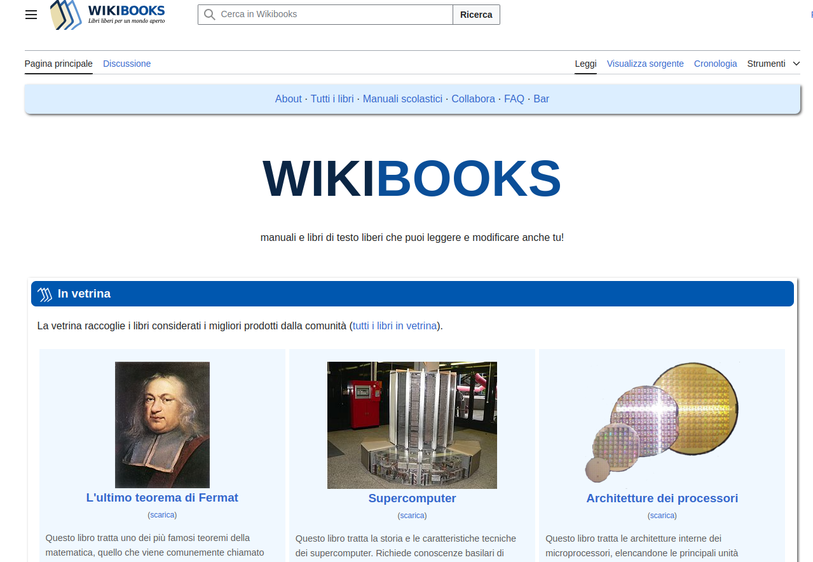

Sempre trattandosi di una azienda no-profit come già detto, il modello editoriale sarà minimale e richiederà l'uso di meno persone e risorse possbile: una eventuale redazione può valutare quali contenuti includere nel WebBook (anche grazie ai consigli degli utenti che possono mandare richieste come indicato in esso), e una volta scelti grazie a un semplice script Python è si può scaricare con contenuto ed aggiornare la repository del progetto, con un movimento minimo di risorse

### Gestione documentale

Il flusso di gestione documentale è gestito nel seguente modo:

* Viene scelto il tema della sezione o pagina da inserire, in seguito al suggerimento degli utenti (come indicato nella pagina principale del book) o scelta della/del relazione/relatore
* Generazione dei documenti delle pagine mediante uno script Python che le estrae da WikiBooks in formato Markdown, altamente portabile e resistente nel tempo. Usando come fonte una fonte libera come WikiBooks non c'è bisogno di fare un grande lavoro di controllo dei diritti in quanto i contenuti sono open-source
* Dopodichè si passa alla lavorazione del singolo documento
    * Modifica eventuale del file sorgente Markdown: se si vuole si può lavorare direttamente sul file per aggiungere/togliere sezioni o moficare delle parti rispetto al file estratto, oppure per aggiungere contenuti multimediali
    * Modifica dello stile grafico utilizzando il file mkdocs.yml tramite il quale è possibile modificare informazioni come lo stile del WebBook, il nome delle sezioni, l'ordine e la divisione delle sezioni
    * Utilizzando il server locale Mkdocs è possibile testare in locale il WebBook prima di compilarlo per vedere il risultato finale
* Una volta che la modifica del documento è terminata, utilizzando Mkdocs è possibile compilare ed ottenere i file sorgenti per generare la pagina
* Ottenuti i sorgenti essi possono essere caricati in qualsiasi hosting che permetta di caricare il sito, ad esempio tramite GitHub per aggiornare il sito

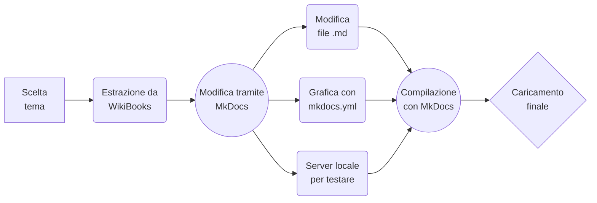

Grazie a questa gestione è facile aggiornare il documento per aggiungere nuove sezioni e modificare ogni aspetto del documento. Inoltre come descritto precedentemente il modello editoriale è estremamente ristretto trattandosi di una azienda no-profit: i temi possono essere scelti dal team che segue il progetto, mentre le modifiche e l'aggiornamento potenzialmente possono essere gestiti da un unico operatore. Una volta che i contenuti sono stati realizzati possono essere facilmente condivisi sui social, tramite link o in una applicazione come precedentemente descritto.

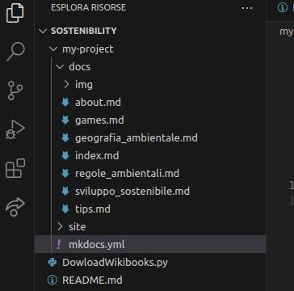{width=250px height=250px}

### Tecnologie adottate

Le tecnologie utilizzate sono le seguenti

|                |Dove è utilizzata|Scelta d'uso|
|----------------|-------------------------------|-----------------------------|
|Markdown |File sorgenti del WebBook|È facilmente estraibile con   python, portabile e longevo|
|Python |Web Scraper|Utilizzando la libreria   Beautiful Soup è possibile   fare Web Scraping|
|YAML |File mkdocs.yml per la   grafica della pagina|Tramite i documenti yaml è   possibile mofificare efficientemente   grafica e impaginazione del doc|
|HTML e CSS |File compilati del WebBook|Dopo la compilazione   tramite MkDocs la pagina   è in formato HTML,   facilmente caricabile in un   hosting come Github pages|
|Git e Github |File sorgenti del WebBook|Git è usato come sistema di   versioning del progetto, che   è caricato in una repository   su Github permettendo   l'aggiornamento e l'hosting|

Tutte le tecnologie utilizzate inoltre solo open-source o disponibili liberamente: questo permette di evitare formati proprietari e di mantenere gli obbiettivi della richiesta di un progetto per un azienda no-profit, avendo però alta qualità grafica/editoriale e facile aggiornamento.

### Esecuzione del flusso

Nella seguente repository https://github.com/IncredibleLego/Sostenibility è possibile visionare il flusso di esecuzione del prodotto, che invece è visitabile al seguente link https://incrediblelego.github.io/SostenibilityHost/

## Valutazione dei risultati raggiunti

### Valutazione del flusso di produzione

Il flusso di produzione è stato realizzato cercando di realizzare un processo che fosse il più possibile ottimizzato alle richieste e le possibilità delle specifiche. Ritengo quindi il flusso coerente e conforme alle richieste, e in futuro esso potrà essere ottimizzato ulteriormente per includere eventuali nuove tecnologie o canali: ad esempio utilizzando contenuti multimediali per rendere il progetto più coinvolgente (come la tecnologia 3D o di realtà aumentata), oppure per includere canali di comunicazione e media che si discostano da quelli già inclusi (come formati insoliti quali televisioni smart o smart cars)
 
### Confronto con lo stato dell'arte

La seguente tabella mostra un esempio di progettazione di un sistema attuale e il sistema futuro utilizzando le tecnologie proposte:

|                |AS-IS                         | TO-BE |
|----------------|-------------------------------|-------------------------------|
|Raccolta informazioni|Lento processo di approvazione|Al seguito delle richieste di utenti   o decisione dei pochi editori|
|Organizzazione informazioni|File vari scaricati|File markdown scaricati   ordinatamente|
|Modifiche|Gestione manuale tramite css   in html| Moficando la grafica con YAML|
|Generazione|Manuale file per file| Utilizzando Mkdocs per generare   automaticamente la pagina|
|Aggiornamento|Manuale| Utilizzando git per una   gestione semplice|

### Limiti emersi

Il prodotto presenta alcuni limiti che potrebbero essere ottimizzati in futuro come ad esempio

* Gestione automatica dello script Python: Si potrebbe modificare lo script per chiedere ad esempio da linea di comando url e nome della pagina web da scaricare anzichè modificare ogni volta il sorgente
* Automazione di modifica MarkDown: Sarebbe efficiente realizzare uno script che permetta di ad esempio modificare tutti i file Markdown nello stesso momento aggiungendo elementi comuni o formattandoli in una certa maniera
* Hosting: Al momento il WebBook è hostato tramite Github Pages, sarebbe sicuramente più pratico utilizzare un sito più professionale di hosting che però comporterebbe dei costi

## Conclusioni

Discutere i risultati ottenuti, verificando se gli obiettivi definiti dai casi d'uso siano pienamente o parzialmente raggiunti. Evidenziare gli aspetti nei quali si sono raggiunti i risultati più soddisfacenti e le limitazioni emerse.

Le richieste dell'azienda sono state tutte ampiamente realizzate:

* Target pubblico 18-25 anni: Il prodotto è sviluppato per essere condiviso e utilizzato un target giovane tramite social e App
* Facilmente accessibile, coinvolgente: Il WebBook è la soluzione ideale per unire accessibiità, coinvolgenza e dinamicità
* Informazioni scientifiche dettagliate: Grazie a WikiBooks si accede a moltissimi libri scientifici con preziose informazioni
* Esempi pratici di buone pratiche sostenibili: È presente la apposita sezione all'interno del WebBook
* Design accattivante: Grazie alla gestione tramite YAML è possibile modificare efficacemente la grafica del prodotto
* Condivisibile sui social: Un WebBook è facilmente condivisibile online tramite social o accesso diretto via Web o App
* Facilmente aggiornabile: Trattandosi di una repository Github utilizzando Git l'aggiornamento è semplice ed immediato

## Bibliografia e sitografia

[@ceravolo2024,@trends,@personas,@mkdocs,@wikibooks,@beautifulsoup4,@mermaid]