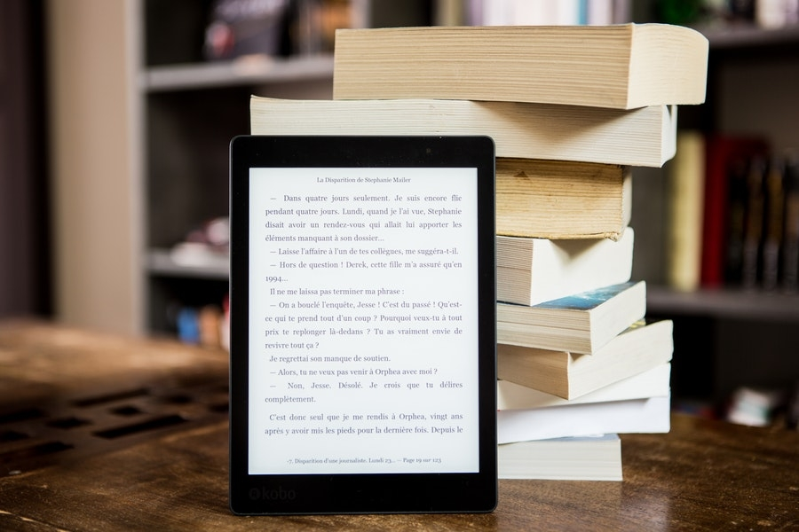

# Editoria Digitale 📰

| Nome corso         |Editoria Digitale   |
|--------------------|---|
| Semestre           |Primo   |
| Professore/i       |Paolo Ceravolo   |
| Crediti            |6   |
| Anno completamento |2024/2025   |
| Valutazione        |28   |

## Descrizione

Il corso di Editoria Digitale è un corso che esplora, oltre alla storia dell'editoria, l'uso di numerose tecnologie usate in questo ambito come Markdown, HTML, yaml, XML, XSTL, Latex o altre come ebook, oggetti 3D o Webbooks

## Struttura materiali

- `Dispense`: Contiene dispense del corso ottenute da [qui](https://github.com/paoloceravolo/Editoria-Digitale-Dispense-2022-2023-)
- `Editoria-Digitale-Relazione`: Contiene materiale per realizzare la relazione per il progetto del corso in Markdown e poi compilarla in `pdf` usando pandoc
- `Esami_Passati`: Contiene vecchi esami del corso
- `Esercizi`: Contiene alcuni esercizi svolti a lezione, altri esercizi possono essere trovati [al seguente link](https://github.com/paoloceravolo/Editoria-Digitale-Esercizi)
- `Lezioni_2024_2025`: Contiene le slide usate dal prof Ceravolo durante il corso dell'anno 2024/2025
- `Sostenibility`: Contiene il progetto realizzato per il corso, un Webbook per la sostenibilità ambientale. Il progetto è dettagliatamente spiegato [qui](https://github.com/IncredibleLego/Sostenibility) e consultabile [a questo link](https://incrediblelego.github.io/SostenibilityHost/)
- `RichiesteRelazione.pdf`: Pagine estratte dalle lezioni contenente le richieste da inserire nella relazione

*Francesco Corrado 2025*