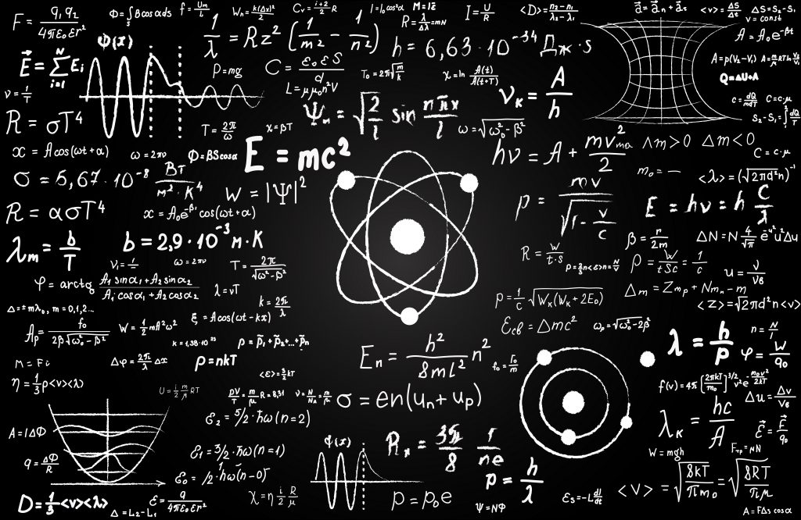

# Fisica ⚛️

| Nome corso         | Fisica  |
|--------------------|---|
| Semestre           | Primo  |
| Professore/i       | Alberto Stabile  |
| Crediti            | 6  |
| Anno completamento | 2025/2026  |
| Valutazione        | 30L  |

## Descrizione

Il corso non punta su apprendimento sistematico e memorizzazione estensiva di un corpus esteso di Fisica Generale ma sulla comprensione e dominio di un suo sottoinsieme. L'obiettivo principale è apprendere come analizzare un problema con gli approcci e gli strumenti della
fisica e la comprensione e utilizzo di un approccio fisico al problem solving e la capacità di usare di questi strumenti per realizzare piccoli progetti computazionali e/o apprendimento di argomenti più
avanzati.

## Struttura materiali

- `Esami`: Contiene esami e parziali del corso
- `Esercizi`: Contiene gli esercizi del corso forniti dal prof.
- `Formulari`: Contiene alcuni formulari
- `Lezioni`: Contiene le slide del corso del prof. Stabile per l'anno 2025/2026
- `Libri`: Contiene alcuni libri relativi al corso
- `Fisica.pdf` e `Fisica2.pdf`: PDF realizzati da me contenenti le informazioni prese dalle slide del prof ed unite in pdf
- `fisica_all_slides.pdf`: Tutte le slides del corso unite

*Francesco Corrado 2026*