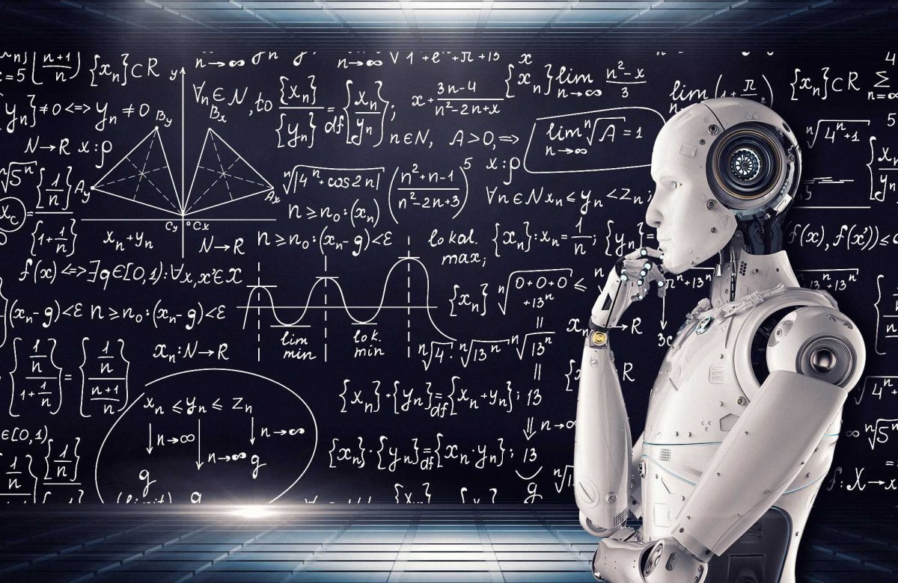

# Logica 🧠

| Nome corso         | Logica  |
|--------------------|---|
| Semestre           | Secondo  |
| Professore/i       | Stefano Aguzzoli  |
| Crediti            | 6  |
| Anno completamento | 2025/2026  |
| Valutazione        | 24  |

## Descrizione

Il corso di Logica matematica per la triennale si propone come corso introduttivo alla logica, e ai suoi rapporti con il linguaggio e la formalizzazione di concetti.
Il corso è naturalmente articolato in due parti principali: logica proposizionale e logica del primo ordine. Inoltre si approfondisce il tema del principio di induzione, in particolare nell'aritmetica di Peano. Vengono introdotte la sintassi e la semantica della logica a livello proposizionale e a livello del primo ordine, e l'uso di un calcolo di deduzione naturale.
Particolare attenzione è riservata all'uso effettivo della logica, a partire dalla traduzione e formalizzazione di enunciati in linguaggio naturale. Il corso è integrato da esercitazioni in laboratorio, effettuate tramite software didattico dedicato.

## Struttura materiali

- `Esami`: Contiene gli esami degli anni passati, divisi in cartelle e tra teoria e laboratorio. Gli esami sono quasi tutti completi e vanno da giugno 2017 a luglio 2026
- `EserciziSvolti`: Contiene esercizi vari svolti, le esercitazioni del prof. e una prova passata svolta dal prof (luglio 2017)
- `Laboratorio`: Contiene i materiali del laboratorio del corso, in particolare:
    - `FitchExerciseFiles`: Contiene i files di Fitch di LPL per svolgere gli esercizi
    - `TWExerciseFiles`: Contiene i mondi e le frasi necessari a svolgere gli es di LPL
    - `Laboratorio_...`: Laboratori vari svolti
- `Materiali`: Contiene materiali utili al corso, in particolare:
    - `LANGUAGE, PROOF AND LOGIC 2nd Edition - DAVE BARKER`: È il libro del corso
    - `LPL_Software.zip`: Zip contenente i software vari necessari al corso (Fitch, Tarski's World, Boole) + manuali e documentazione varia
- `Schemi`: Contiene schemi vari del corso recuperati su Telegram o fonti varie
- `Slide`: Contiene le slide del corso del prof. Aguzzoli per l'anno 2025/2026
- `AllEsami`, `AllLaboratorio`, `AllSlide`: PDF contenenti rispettivamente tutti gli esami dal 2017 al 2026, tutti gli esami di laboratorio e tutte le slide del corso
- `KER_LOGICA.pdf`: PDF riassuntivo del corso
- `RisposteLogica.pdf`: PDF realizzato da me con i metodi risolutivi di alcuni esercizi realizzato con l'aiuto di Claude e Gemini

Inoltre, altre risorse comode da utilizzare sono le seguenti:

- [Notion Appunti](https://georgiani.notion.site/Logica-67bb2a2a73a344f49e3b789cdda8c11f) Notion con appunti di teoria
- [Soluzioni Jumaruma](https://github.com/Jumaruba/LPL-solutions) soluzioni agli esercizi LPL
- [Soluzioni lbrame](https://github.com/lbrame/LPL-Solutions) soluzioni agli esercizi LPL

*Francesco Corrado 2026*
