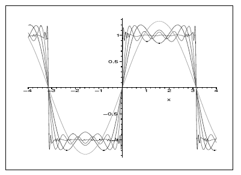

# Matematica del Continuo 📈

| Nome corso         |Matematica del Continuo   |
|--------------------|---|
| Semestre           |Primo   |
| Professore/i       |Cavaterra Cecilia, Gori Anna   |
| Crediti            |12   |
| Anno completamento |2023/2024   |
| Valutazione        |18   |

## Descrizione

Il corso di Matematica del Continuo tratta temi di matematica come numeri reali, interi, razionali, studio di funzione, successioni, integrali, sommatorie o teoremi di Lagrange, Weiestrass o Landau

## Struttura materiali

- `Esami_Passati`: Contiene prove passate del corso
- `Lezioni`: Contiene alcune delle lezioni della professoressa Cavaterra per l'anno 2023/2024
- `Appunti.pdf`: Appunti completi del corso
- `Dimostrazione_teoremi.pdf`: Dimostrazioni di tutti i teoremi necessari per il corso
- `Programma-Definitivo2023-24.pdf`: Programma definitivo del corso per l'anno 2023/2024

*Francesco Corrado 2025*
