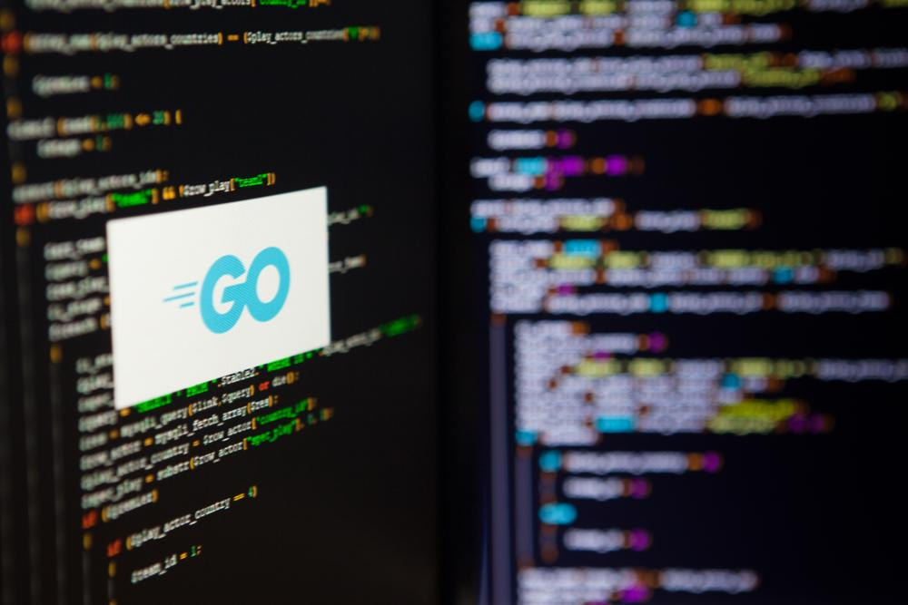

# Programmazione I 💻

| Nome corso         |Programmazione I   |
|--------------------|---|
| Semestre           |Primo   |
| Professore/i       |Boldi Paolo   |
| Crediti            |12   |
| Anno completamento |2023/2024   |
| Valutazione        |23   |

## Descrizione

Il corso di Programmazione I è un corso introduttivo alla programmazione, alla quale ci si approccia nel linguaggio Go, trattando argomenti di base come variabili, array, liste, puntatori, mappe

## Struttura materiali

- `C`: Contiene alcuni esercizi in C svolti alla fine del corso
- `GO`: Contiene tutti gli esercizi svolti in GO del corso, in particolare:
    - `Compiti_Casa`: Contiene esercizi assegnati come risoluzione a casa durante il corso
    - `Esercizi_Classe`: Contiene esercizi svolti in aula durante le lezioni del corso
    - `Laboratorio`: Contiene gli esercizi svolti durante le lezioni di laboratorio del corso. I testi degli esercizi possono essere trovati all'interno degli esercizi stessi o in altri casi [al seguente link](https://gitlab.di.unimi.it/laboratorio-di-programmazione/)
    - `Lezioni_Boldi`: Contiene tutte le lezioni e gli esercizi svolte dal professor Boldi durante l'anno accademico 2024/2025
    - `Appunti_Esame_Programmazione.pdf`: File da me creato contenente alcuni consigli su argomenti più complicati da tenere a mente durante l'esame orale del corso

*Francesco Corrado 2025*
