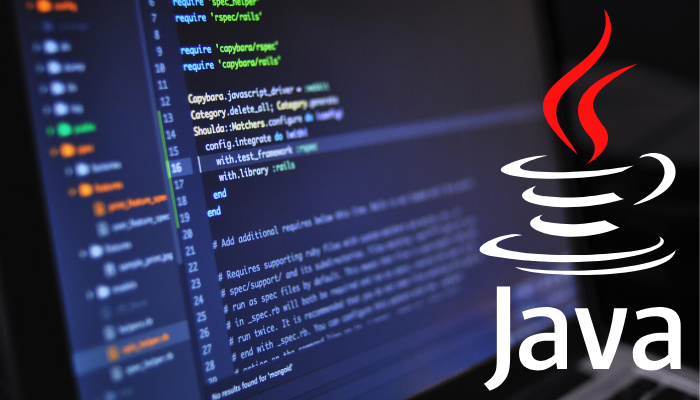

# Programmazione II 🖥️

| Nome corso         |Programmazione II   |
|--------------------|---|
| Semestre           |Primo   |
| Professore/i       |Santini Massimo   |
| Crediti            |6   |
| Anno completamento |2024/2025   |
| Valutazione        |21   |

## Descrizione

Il corso di Programmazione II è un corso avanzato di programmazione, alla quale ci si approccia nel linguaggio Java, trattando argomenti come astrazione procedurale, programmazione ad oggetti, classi e pacchetti, ereditarietà e polimorfismo

## Struttura materiali

- `Java`: Contiene i materiali prodotti in Java durante il corso, in particolare:
    - `handouts`: Contiene gli esercizi svolti a lezione o da svolgere a casa relativi al corso. All'interno sono presenti le descrizioni e tracce di tutti gli esercizi
    - `progetto-...`: Progetto realizzato come esame del corso per gestire una borsa e delle sue relative opzioni. Il progetto è interamente spiegato al suo interno dove è anche presente una relazione
    - `progetto-....zip`: La traccia del progetto
- `AppuntiProg2.pdf`: Appunti completi del corso
- `EffectiveJava.pdf`: Libro del corso "Effective Java" di Joshua Bloch
- `ProgramDevelopmentInJava.pdf`: Libro del corso "Program Development In Java" di Barbara Liskov e John Guttag
- `ProgramDevelopmentInJava(ITA).pdf`: Traduzione italiana del libro "Program Development In Java"

*Francesco Corrado 2025*
